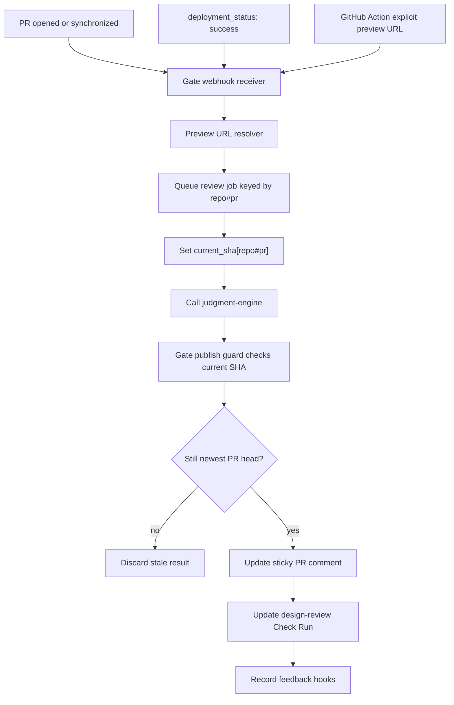
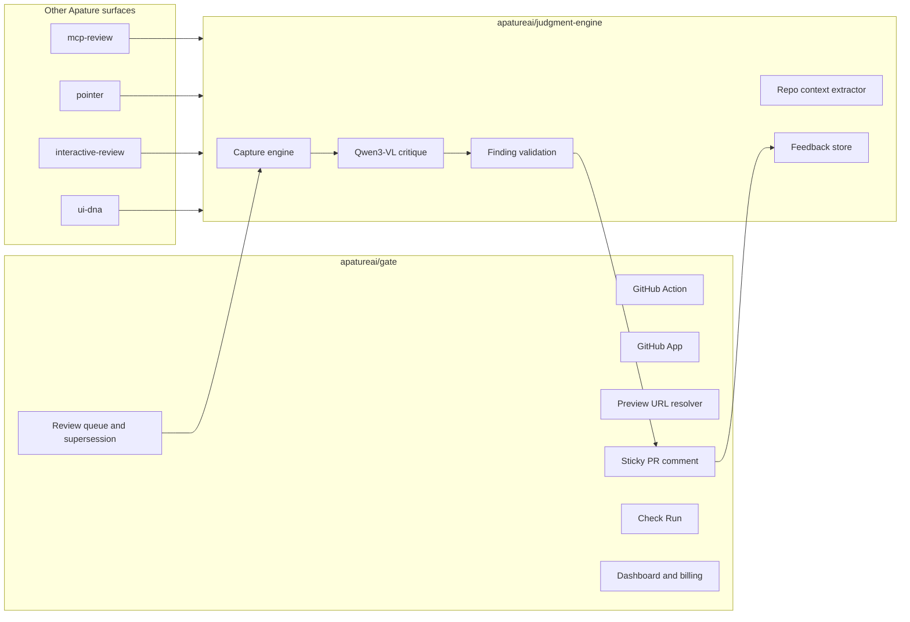
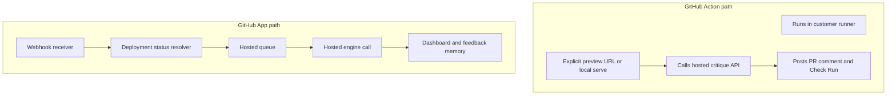
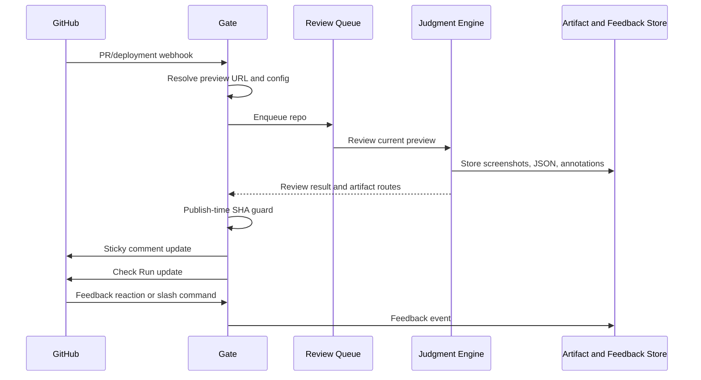

# Apature Gate Architecture

Created: 2026-06-15
Status: Gate-specific architecture record

## 1. Architecture Summary

Gate owns the GitHub product surface for Apature. It listens to PR and deployment signals, resolves a preview URL, schedules the current review, calls `judgment-engine`, and delivers the result back into GitHub.

Gate deliberately does not own model inference, screenshot capture internals, evaluation, or the preference dataset implementation. Those belong to `apatureai/judgment-engine`.

## 2. Request Flow



Key rule:

- Queue supersession key is `repo#pr`.
- Completed review identity is `(pr, head_sha)`.

## 3. System Boundaries



Gate calls the engine through a stable interface:

```ts
critique(images, context) -> Findings
```

In practice Gate may pass a higher-level `GateReviewRequest`; the engine remains the owner of capture, context, model, and validation details.

## 4. Deployment Modes



Action path:

- Best for adoption and OSS.
- Capture can happen inside the user's runner.
- Minimal persistent product state.

App path:

- Required for paid hosted usage.
- Enables durable feedback memory, dashboard, billing, and baseline comparison.

## 5. Data Flow



Queue payloads should carry IDs, URLs, and metadata, not large artifacts. Screenshots and JSON live in object storage owned by the shared platform.

## 6. Failure Modes

| Failure | Gate behavior |
|---|---|
| No preview URL found | Post neutral Check Run with setup guidance; do not fail the PR |
| Preview returns auth wall | Report not reviewed and link to bypass/auth setup |
| Older job finishes late | Discard at publish guard |
| Engine returns invalid element refs | Publish only validated findings; show model/capture warning if needed |
| Screenshot capture unstable | Surface confidence caveat from engine |
| GitHub comment update conflict | Re-read sticky comment and retry with newest node |
| Feedback GET prefetch | No mutation; require POST, reaction, or command |
| Blocking finding in advisory mode | Check Run remains neutral |

## 7. Issue Ownership

Gate issues:

- Orchestrator and queue behavior.
- GitHub Action/App delivery.
- Sticky comment and Check Run UX.
- Dashboard, billing, config UI, and GTM.

Judgment Engine issues:

- Capture, context extraction, model adapters, validation, eval, data store, and shared security.

UI DNA issues:

- Token extraction, design genome schema, and canonical design standard.

MCP Review, Pointer, and Interactive Review issues:

- Their respective delivery surfaces and session/tool behavior.

## 8. Architecture Poster

The poster source is `poster_gate.html`.

Rendered artifact:

```text
gate_architecture.png
```

Render rule:

- Open `poster_gate.html`.
- Render at a 3020px-wide viewport.
- Screenshot the `.poster` element.
- Regenerate the PNG whenever the poster HTML or referenced icons change.
