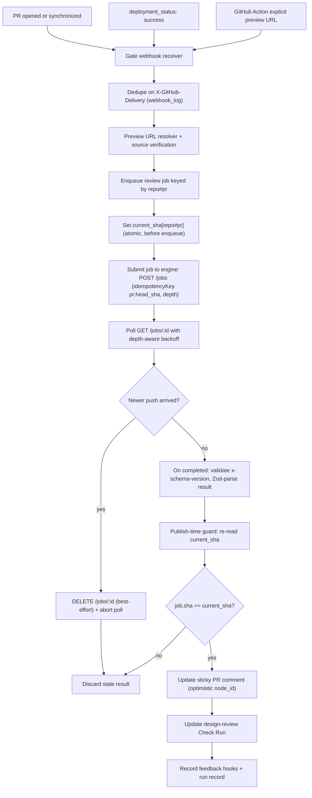
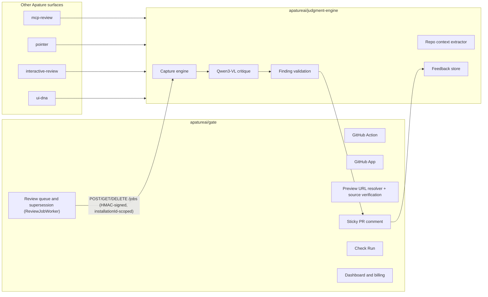

# Apature Gate Architecture

Created: 2026-06-15
Status: Gate-specific architecture record (architecture review applied 2026-06-15)

## 1. Architecture Summary

Gate owns the GitHub product surface for Apature. It listens to PR and deployment signals, resolves a preview URL, schedules the current review, submits it to `judgment-engine`, and delivers the result back into GitHub.

Gate deliberately does not own model inference, screenshot capture internals, evaluation, or the preference dataset. Those belong to `apatureai/judgment-engine`.

Two design choices drive everything below, both from the 2026-06-15 architecture review:

- Gate never holds a connection open for the length of a review. It submits an asynchronous job and polls (the App path runs behind the Fly proxy, whose idle timeout would drop a 90s synchronous call).
- Supersession correctness is enforced by a publish-time SHA guard that is independent of in-flight cancellation, so a stale review can never be posted even if cancellation loses the race.

## 2. Request Flow



Key rules:

- Webhook delivery is at-least-once. Gate dedupes on `X-GitHub-Delivery` before enqueue (`webhook_log` table).
- Queue supersession key is `repo#pr`. Completed-review identity is `(pr, head_sha)`, enforced by a `UNIQUE(pr, head_sha)` constraint on `runs`.
- The publish-time SHA guard is the correctness backstop and is independent of whether engine-side cancellation landed in time.

## 3. System Boundaries



The seam is an asynchronous job API, not a blocking call:

- `POST /jobs` (202 + `jobId`, `idempotencyKey = pr:head_sha`, `depth`), `GET /jobs/:id` (poll), `DELETE /jobs/:id` (cancel on supersession).
- Service-to-service auth: Gate HMAC-SHA256 signs every request body, with `installationId` in the signed payload; the engine verifies and scopes all tenant storage to that `installationId`.
- Schema safety: the engine returns an `x-schema-version` header; Gate validates it, then Zod-parses the body so a malformed result surfaces a typed error instead of a silent null-grade review. `packages/types` evolves additive-only.
- `engineEndpoint` is resolved per account (default hosted; enterprise points at an in-VPC engine). It is Gate-internal routing, not a field in `GateReviewRequest`.

## 4. Deployment Modes

```mermaid
flowchart TD
  subgraph Action["GitHub Action path"]
    A1["Runs in customer runner"]
    A2["Explicit preview URL or local serve"]
    A3["Submit + poll hosted engine /jobs"]
    A4["Posts PR comment and Check Run"]
  end

  subgraph App["GitHub App path"]
    B1["Webhook receiver + delivery dedup"]
    B2["Deployment status resolver"]
    B3["Hosted queue + supersession"]
    B4["Submit + poll engine /jobs"]
    B5["Dashboard and feedback memory"]
  end

  subgraph Ent["Enterprise in-VPC"]
    C1["Gate (hosted, thin)"]
    C2["engineEndpoint -> customer-VPC judgment-engine"]
    C3["Screenshots never leave customer cloud"]
  end

  A2 --> A3 --> A4
  B1 --> B2 --> B3 --> B4 --> B5
  C1 --> C2 --> C3
```



Action path: best for adoption and OSS; capture can run inside the user's runner; minimal persistent state. Note: on the Action path hostile PR code executes in the capturing browser inside the customer runner — documented as an untrusted-fork threat (the App path isolates this in the engine's sandbox).

App path: required for paid hosted usage; durable feedback memory, dashboard, billing, baseline comparison.

Enterprise in-VPC: Gate stays the same thin GitHub surface; only `engineEndpoint` changes so the customer runs `judgment-engine` in their own cloud. There is no silent fallback to the hosted engine if the in-VPC endpoint is unreachable.

## 5. Data Flow

```mermaid
sequenceDiagram
  participant GH as GitHub
  participant Gate as Gate
  participant Queue as ReviewJobWorker
  participant Engine as Judgment Engine
  participant Store as Artifact and Feedback Store

  GH->>Gate: PR/deployment webhook
  Gate->>Gate: Dedupe X-GitHub-Delivery; resolve + verify preview URL
  Gate->>Queue: Enqueue repo#pr; set current_sha (atomic)
  Queue->>Engine: POST /jobs (HMAC, idempotencyKey pr:head_sha, depth)
  Engine-->>Queue: 202 { jobId }
  loop Poll with depth-aware backoff (cap 10 min)
    Queue->>Engine: GET /jobs/{jobId}
    Engine-->>Queue: { status, result? }
  end
  Engine->>Store: Store screenshots, JSON, annotations
  Engine-->>Queue: completed { GateReviewResult, screenshotRetentionSeconds }
  Queue->>Queue: Validate x-schema-version; Zod-parse; record run + expiresAt
  Queue->>Queue: Publish-time SHA guard
  Queue->>GH: Sticky comment update (optimistic node_id)
  Queue->>GH: Check Run update
  GH->>Gate: Feedback reaction or slash command (POST-only)
  Gate->>Store: Feedback event (forwarded to shared store)
```

Queue payloads carry IDs, URLs, and the `jobId`, never large artifacts. Screenshots and JSON live in object storage owned by the shared platform; Gate stores the stable-route registry, run metadata, and `expiresAt`.

## 6. Failure Modes

| Failure | Gate behavior |
|---|---|
| No preview URL found | Neutral Check Run with setup guidance; do not fail the PR |
| Unverified preview source | Report "not reviewed (unverified preview source)"; never forward to engine |
| Preview returns auth wall | Report not reviewed; link to bypass/auth setup |
| Engine poll timeout (10 min) | Neutral Check Run, reason `review_timed_out`; do not retry |
| Engine 409 on submit (duplicate idempotency key) | Poll the existing job; do not re-run capture |
| Engine 429/503 | Honor `Retry-After` via delayed retry; if circuit open, neutral Check Run "engine temporarily unavailable, retrying" |
| Malformed engine result (schema/version mismatch) | Zod-parse fails -> do not publish; alert; never post a null-grade review |
| Invalid element refs in result | Publish only validated findings; show model/capture warning |
| Older job finishes late | Discard at publish-time SHA guard |
| Screenshot capture unstable | Surface engine confidence caveat |
| Redelivered webhook (duplicate X-GitHub-Delivery) | Dedupe at `webhook_log`; 200 + skip |
| GitHub comment update conflict | Re-read sticky comment, retry with newest node |
| GitHub secondary rate limit | Honor `Retry-After`; exponential backoff with jitter |
| Annotated artifact deleted (past retention) | `/i/<id>.png` returns 410 tombstone, not a broken 302 |
| Feedback GET prefetch | No mutation; require POST, reaction, or command |
| Blocking finding in advisory mode | Check Run remains neutral |

## 7. Issue Ownership

- Gate issues: orchestrator and queue behavior; the engine-job client and failure handling; GitHub Action/App delivery; sticky comment and Check Run UX; dashboard, billing, config UI, GTM; gate-side security (preview-source provenance, secret custody, tenant isolation).
- Judgment Engine issues: capture, context extraction, model adapters, validation, eval, data store, the async `/jobs` API, and deep shared security (SSRF, DNS rebind, egress, screenshot encryption, prompt-injection).
- UI DNA issues: token extraction, design genome schema, canonical standard.
- MCP Review, Pointer, Interactive Review issues: their respective delivery surfaces.

## 8. Architecture Decision Log

Decisions from the 2026-06-15 review. Each is phased: ship the MVP form, migrate on a named trigger.

| # | Decision | MVP | Migrate to | Trigger |
|---|---|---|---|---|
| D1 | Engine invocation | Async submit + poll (`POST/GET/DELETE /jobs`) | Completion webhook callback | Engine poll volume or callback need at scale |
| D2 | Orchestration durability | BullMQ behind a `ReviewJobWorker` interface; publish-guard backstop | Inngest (singleton cancel mode) | Stale-publish rate non-zero for two consecutive weeks, or AbortSignal/eviction bugs |
| D3 | Capture & data residency | Hosted engine + DPA template | Enterprise in-VPC via per-account `engineEndpoint` | Enterprise data-residency requirement |
| D4 | Contract & auth | Zod parse + `x-schema-version` + HMAC + circuit breaker | Pact consumer-driven contracts + JWT/JWKS | Engine team deploys independently / multiple engine clients |
| D5 | Delivery exactly-once | `webhook_log` dedup + `UNIQUE(pr, head_sha)` + secondary-rate-limit backoff | Transactional outbox + REST reconciliation sweep | Crash-window inconsistency observed in prod |
| D6 | Tenancy & secrets | Postgres RLS + tiered KMS (shared CMK free / per-tenant CMK paid / per-repo DEK) | Per-tenant CMK everywhere + crypto-shred offboarding + SOC2/EU-region | Enterprise/compliance contract |

Hard invariants that survive every migration: no `contents: write`; Qwen3-VL default (never hard-code Claude); supersession key `repo#pr`; completed-review identity `(pr, head_sha)`; publish-time SHA guard; feedback never mutates on GET; `stale_publish_rate = 0` treated as a P1 invariant, not a tunable SLO.

## 9. Architecture Poster

The poster source is `poster_gate.html`.

Rendered artifact:

```text
gate_architecture.png
```

Render rule:

- Open `poster_gate.html`.
- Render at a 3020px-wide viewport.
- Screenshot the `.poster` element.
- Regenerate the PNG whenever the poster HTML or referenced icons change. (The poster predates the 2026-06-15 review; regenerate to reflect the async `/jobs` seam and the decision log.)
