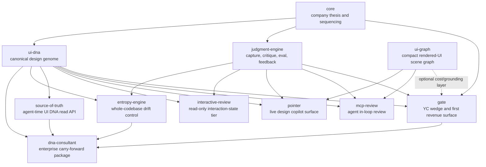

# Apature Gate - Ecosystem Placement

Created: 2026-06-16
Status: product ecosystem map for Gate's role in Apature

## 1. Short Answer

Gate is the main startup wedge.

It is the first product a YC reader, early customer, or builder should understand: GitHub-native design review for AI-generated frontend PRs. It has the clearest buyer, the clearest demo, the clearest urgency, and the first plausible revenue surface.

Gate is not the whole company. It is the first product surface over a shared Apature platform:

- `core` owns the thesis and company narrative.
- `judgment-engine` owns capture, model, validation, eval, and feedback substrate.
- `ui-dna` owns the canonical design genome.
- `ui-graph` owns compact rendered-UI representation.
- Gate owns PR delivery, review orchestration, comments, checks, dashboard, billing, and GTM.

## 2. Product Map

## 3. Role By Repo

| Repo | Role | Relationship To Gate | Timing |
|---|---|---|---|
| `apatureai/core` | Company thesis, strategy, historical decisions | Gate should cite it, not duplicate the whole thesis | Always canonical for company-level narrative |
| `apatureai/gate` | PR-native design judgment for AI-generated frontend work | Main wedge, first demo, first paid product | Build first |
| `apatureai/judgment-engine` | Shared capture, context, VLM critique, validation, eval, feedback | Hard dependency for every Gate review | Build alongside Gate M0/M1 |
| `apatureai/ui-dna` | Versioned design genome and canonical standard | Gate judges against it; early Gate can use `.designreview.yml` before full DNA extraction is ready | Useful in M1, stronger in M2+ |
| `apatureai/ui-graph` | Token-efficient rendered-UI scene graph | Optional accelerator for cheaper prompts and better element grounding | Do not block Gate M1 |
| `apatureai/mcp-review` | Agent-facing in-loop review/recheck tools | Growth channel and dense feedback data, but not the first revenue surface | After Gate review quality is trusted |
| `apatureai/pointer` | Live UI-DNA pointer/cursor surface | Live sibling of Gate; shares engine, DNA, and graph | Act 1.5 after Gate proof |
| `apatureai/interactive-review` | Read-only capture of hover, focus, modal, and flow states | Premium tier for states static Gate misses | V2 metered add-on |
| `apatureai/source-of-truth` | Read API/MCP surface for agents to fetch UI DNA before generation | Reduces bad UI before Gate catches it | After UI DNA has enough trust |
| `apatureai/entropy-engine` | Whole-codebase design drift and consolidation planner | Act-2 enforcement; Gate catches PR-level drift, Entropy cleans accumulated drift | Enterprise expansion |
| `apatureai/dna-consultant` | Enterprise package over UI DNA, Gate, Entropy, and Source Of Truth | Bundles Gate into a high-trust carry-forward product | Enterprise pilot layer |

## 4. Sequencing Principle

The ecosystem should be built as one platform with sequenced surfaces, not parallel products racing for attention.

Build order:

1. Gate vertical slice: preview URL -> engine job -> findings -> sticky comment -> Check Run.
2. Judgment Engine reliability: capture, validation, eval, feedback, and model contract.
3. UI DNA draft and approval loop: enough canonical context that Gate can be repo-specific.
4. Gate hosted path: GitHub App, dashboard, billing, durable feedback memory.
5. MCP Review and Pointer: in-loop/live surfaces once Gate's findings are trusted.
6. UI Graph: introduce when prompt cost, grounding quality, or agent repair loops need it.
7. Source Of Truth and Entropy Engine: upstream guidance and whole-codebase drift control.
8. DNA Consultant: enterprise packaging over the proven system.

## 5. Gate's Hard Boundaries

Gate must not absorb the platform.

Gate owns:

- GitHub Action and App product behavior.
- Preview-source provenance.
- Review orchestration and supersession.
- Sticky PR comments and Check Runs.
- Gate dashboard, billing, onboarding, and GTM.
- Gate-side issue backlog and customer-facing delivery quality.

Gate does not own:

- Browser capture internals.
- Model adapters or model selection.
- UI DNA extraction and approval.
- UI Graph schema or graph construction.
- MCP tool protocol UX.
- Live pointer overlay.
- Whole-codebase entropy analysis.
- Enterprise consultant orchestration.
- Code edits, commits, or autofix.

## 6. Why Gate Stays First

Gate is the right first product because it is where the pain is already organized:

- AI-generated UI arrives as PRs.
- Preview deploys already exist.
- GitHub comments and checks are already trusted workflow surfaces.
- The buyer can understand the value from one screenshot-grounded finding.
- Every review creates data for the moat: rendered UI, repo context, finding, team reaction, and later fix outcome.

The rest of Apature makes Gate more defensible. Gate makes the rest of Apature legible.

## 7. What Would Be A Mistake

- Building MCP Review, Pointer, Source Of Truth, Entropy Engine, or DNA Consultant as independent products before Gate proves trust.
- Moving capture/model/eval ownership into Gate.
- Making UI Graph a blocker for the first Gate demo.
- Treating UI DNA as optional forever; without team-specific context Gate becomes a generic VLM review bot.
- Letting Gate write code or request `contents: write`.
- Selling Gate as visual regression, source-code review, or browser automation.

## 8. UI DNA Grounding And Version Lineage

UI DNA is what makes a finding repo-specific instead of generic taste — *"this CTA uses #6c3ef0, not in your palette (closest token `primary-600`)"* is only possible because the judgment is grounded in this repo's versioned design genome.

How it flows, and the boundary Gate holds:

- **Gate does not extract or store UI DNA.** The engine resolves the repo's genome (from `source-of-truth` / `ui-dna`) when it grounds a critique. Gate only passes repo identity so the engine resolves the right genome.
- **Gate version-stamps the result.** `GateReviewResult.metadata.uiDnaVersion` (alongside `engineVersion` / `model` / `promptVersion` / `captureVersion`, see TRD §6) records the genome version a review was judged against. `null` is valid before a repo has extracted UI DNA — the engine falls back to repo context plus the `.designreview.yml` brand block.
- **Why the stamp matters.** It makes every published finding traceable to the exact genome it was judged against, and it keeps the feedback tuple's lineage clean (rendered UI, repo context, `uiDnaVersion`, finding, team verdict). That clean lineage is what lets the data moat train a judge and lets `entropy-engine` reason about drift over time.

Grounding in, signal out:

- **Grounding in (per review):** Gate -> engine (repo identity + preview + config) -> engine resolves UI DNA + repo context -> grounded critique -> versioned result.
- **Signal out (after review):** collaborator verdicts, ignore/suppress, recheck pass/fail, and later-diff adoption flow from Gate to the engine's shared feedback store. Gate is the highest-volume, cleanest source of these labels because it sits at the PR boundary where real teams accept or reject changes.
