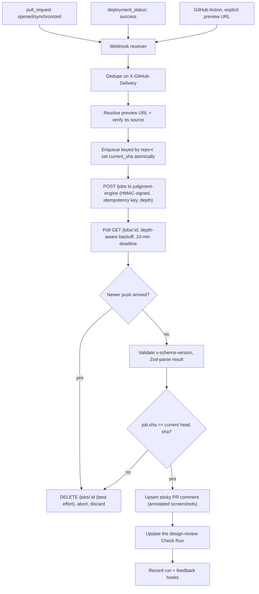

# Apature Gate

**Status: archived. This project is no longer actively developed.** Apature was wound down in 2026 and the
code is published as-is under the MIT License. It is a snapshot of a working system, not a maintained
product — issues and pull requests are unlikely to be reviewed, and there is no hosted service behind it.
Everything below describes what the code actually does; where something was never finished, it says so.

---

## What it is

Gate is the GitHub-facing half of an automated *design* reviewer. When a pull request opens, Gate finds the
URL of that PR's preview deployment (the temporary Vercel/Netlify/Cloudflare/Render URL where the branch is
already running), verifies that the URL came from a source it trusts, and hands it to a separate service —
[`judgment-engine`](https://github.com/apatureai/judgment-engine) — which loads the page in a real browser,
screenshots it, and critiques the rendered UI against the repo's own design system using a vision-language
model. Gate takes the findings that come back, draws boxes on the screenshots, and publishes them as one
sticky PR comment plus one GitHub Check Run: things like *"this CTA uses `#6c3ef0`, which isn't in your
palette (closest token `primary-600`)"* or *"the mobile viewport overflows at 375px"*.

The pitch was "Applitools checks pixels, we check judgment" — not a diff against a golden image, but an
opinion about the rendered result, formed against the repo's stated design intent.

The hard boundary, enforced in code rather than in docs: **Gate never writes code.** It never requests the
GitHub `contents: write` permission, never commits, never opens a fix PR, and never drives the UI. It reads,
judges, and comments. The `assertNoContentsWrite` guard in `@gate/service` throws if a permission set ever
tries to grant it.

**Gate is not usable standalone.** Every review requires a running `judgment-engine` instance to do the
capture and the model call; this repo contains the client for that service, not the service itself. See
[Running it for real](#running-it-for-real).

---

## Why it is technically interesting

Most of the difficulty here is not the model call. It is that a PR is a moving target, GitHub delivers
webhooks at-least-once, and a design review takes tens of seconds — long enough that the thing you reviewed
may no longer be the thing on the branch. The interesting engineering is in the invariants built to survive
that.

**Two different identities for the same review.** The queue supersession key is `repo#pr` — a newer push to
a PR replaces whatever is in flight. The durable identity of a *completed* review is
`(repo_owner, repo_name, pr_number, head_sha)`, enforced by a unique constraint. These are deliberately
different: one answers "is this work still wanted", the other answers "has this exact commit already been
reviewed". Conflating them either double-posts or drops reviews.

**A publish-time SHA guard that does not trust cancellation.** When a new push arrives, Gate aborts the poll
and best-effort `DELETE`s the engine job. That race can be lost. So immediately before writing to GitHub, the
publisher re-reads the current head SHA for the PR and discards the result if it no longer matches. Stale
publishing is treated as a correctness bug with a target rate of exactly zero, not a tunable SLO — the guard
is independent of whether cancellation landed in time.

**An async job seam instead of a long-held HTTP call.** Gate submits `POST /jobs`, gets a `202` and a job id,
and polls `GET /jobs/:id` with depth-aware backoff up to a 10-minute deadline. This exists because the hosted
service ran behind a proxy whose idle timeout would kill a 90-second synchronous request; it also means a
restart mid-review loses nothing but a poll loop. Requests carry a repository-scoped idempotency key
(`gate-review-v2:sha256:<digest>` over owner/name/PR/head SHA), so a retry resumes the existing job rather
than paying for a second capture.

**A cross-repo contract with a shared golden fixture.** The engine returns an `x-schema-version` header;
Gate checks it, then Zod-parses the body. A malformed or drifted response produces a typed error and *no*
published review, rather than a comment full of nulls. `packages/types` is the single source of truth for
that contract and evolves additive-only, and the golden fixture in it is the anchor shared with the engine
repo so neither side can silently break the other.

**Annotations from DOM geometry, not from the model's pixel guesses.** The boxes drawn on screenshots come
from recorded element rects in the engine's capture geometry map, composited as an SVG overlay with `sharp`.
A VLM asked to name pixel coordinates will confidently miss; asking it to name an element and then looking up
where that element actually was is the difference between an annotation that lands and one that embarrasses
you.

**A hostile-PR threat model with teeth on the Action path.** On the Action path, capture happens inside the
customer's own runner, which means attacker-authored code from a fork PR can execute on a network with
reachable internal services. The mitigations are all in this repo: preview URLs are only forwarded to the
engine when their provenance is verified (explicit input, `url_template`, `deployment_status`, or an
allowlisted provider-bot comment — free-text URLs are rejected as `unverified_preview_source`); auth
`storageState` and preview-bypass secrets are disabled on fork PRs *before* any handoff; the optional
local-serve supervisor runs the repo's dev-server command under an allowlisted environment (never the
runner's secrets), a hard `ulimit` process/address-space cap that a forked child cannot raise, and refuses a
server that redirects off loopback; and any command output that reaches the PR is secret-scrubbed and
length-capped first. [`docs/threat-model-action-path.md`](docs/threat-model-action-path.md) is honest that
this is mitigation, not isolation — the App path gets real sandboxing only because capture moves into the
engine.

**Exactly-once delivery on an at-least-once transport.** Webhooks are deduped on `X-GitHub-Delivery` in a
`webhook_log` table before enqueue; the PR comment is "sticky" (found and updated in place via a hidden HTML
marker, so a 30-push PR still has one comment); Check Run conclusions are advisory by default, so a design
opinion cannot block a merge unless the repo explicitly opts in.

**Failure is designed, not incidental.** [`ARCHITECTURE.md` §6](ARCHITECTURE.md) enumerates every failure
mode and its behavior. The through-line: no preview URL, an auth wall, an engine timeout, a 429, or a schema
mismatch all produce a *neutral* Check Run with an explanation. Nothing about a broken reviewer is allowed to
fail someone's PR.

---

## How a review flows



Review depth is chosen per push: at most one *deep* review per PR per 10 minutes, tracked durably in Postgres
(`runs.last_full_review_at`, not a Redis timer, so a restart cannot reset the cap); pushes inside that window
get the cheaper *triage* pass.

---

## The three surfaces

One engine contract, three ways to reach it.

1. **GitHub Action** (`@gate/action`, [`action.yml`](action.yml)) — runs inside the customer's own runner.
   Takes an explicit `preview-url`, or discovers one, or optionally runs a `preview-command` to build and
   serve the app locally under the supervisor described above. Needs no hosted install; requires only
   `checks: write` and `pull-requests: write` in the calling workflow.
2. **GitHub App** (`@gate/service`) — a Fastify webhook receiver in front of a BullMQ queue and an
   orchestrator. Reacts to `pull_request` and `deployment_status`, discovers previews from deployment
   events, and owns the durable state: run history, feedback, billing, tenant isolation. Requests exactly
   `checks: write`, `pull_requests: write`, `contents: read`, `deployments: read` — never `contents: write`.
3. **Dashboard** (`@gate/dashboard` + `apps/dashboard`) — OAuth, sessions, run history, a finding browser,
   feedback stats, config UI, and Stripe billing. The logic lives in a tested, UI-agnostic core package; the
   Next.js app-router shell in `apps/dashboard` only renders it.

---

## Configuration

A repo opts in with an optional `.designreview.yml`. Every field has a working default, and the schema is
strict — a typo like `viewport:` is a validation error, not a silently ignored key.

```yaml
preview:
  source: vercel          # vercel | netlify | cloudflare | render | explicit | local
  environment: Preview
  url_template: null      # e.g. https://myapp-pr-{pr}.example.dev
  wait_seconds: 0
  ready_selector: null    # wait for this selector before capture
  ready_path: null        # poll this path for readiness instead of the base URL
  ready_status: null      # acceptable readiness status codes
  protection_bypass: null # name of the stored Vercel bypass secret
  auth: null              # name of the stored auth storageState secret
  fork_preview: false     # run preview-command on fork PRs (off by default: it runs untrusted code)

routes:
  always: ["/"]
  max_per_pr: 5
  map: {}                 # glob -> route, to review the pages a diff actually touches

viewports: [mobile, desktop]   # mobile | tablet | desktop
dark_mode: false
brand: null

rules:
  gate: none                    # none | nits | blockers — merge-blocking is opt-in
  min_severity_to_comment: nit  # nit | minor | major | blocker
  suppress: []                  # finding ids or element selectors to mute (exact match, no globs)

tokens:
  source: null            # path to design tokens
  values: {}
```

Severity and suppression filter what the comment *lists*; they never change the grade or the Check Run
conclusion, which reflect the engine's holistic verdict.

---

## Quickstart

Requires **Node 24.x** (see `.node-version`) and **pnpm 10.34.3**.

```bash
pnpm install --frozen-lockfile
pnpm typecheck   # tsc -b across all project references
pnpm test        # vitest, 529 tests across 88 files
pnpm lint        # eslint --max-warnings=0
pnpm build       # same as typecheck: tsc -b, emits dist/
```

`apps/dashboard` is **not** part of this root gate — the Next.js shell keeps its own React/Next tree, its own
`package-lock.json`, and is built with its own isolated `next build` CI job:

```bash
pnpm build
cd apps/dashboard
npm ci
npm run build
```

**Verified on 2026-08-09** against this tree, on macOS with Node 24.14.0 and pnpm 10.34.3:
`pnpm install --frozen-lockfile`, `pnpm typecheck`, `pnpm lint` and `pnpm test` all pass — 88 test files,
529 tests, zero failures. The suites that boot PGlite (in-process WASM Postgres) are slow enough to have
raced vitest's default 5s/10s timeouts on a loaded machine, so `vitest.config.ts` raises `testTimeout` and
`hookTimeout` to 30s; don't lower them.

There are no live model calls and no live network in the test suite — the engine is always mocked, including
in the `@gate/e2e` acceptance harness. That was a deliberate rule; keep it if you fork this.

---

## Repo layout

pnpm workspace, TypeScript project references, Vitest, ESLint. ~9.5k lines of non-test TypeScript and ~8.6k
lines of tests across 12 packages.

| Package | What it is |
|---|---|
| `packages/types` | The boundary contract: `GateReviewRequest`/`GateReviewResult`, config types, feedback events, the golden fixture loader, `deriveArtifactId`. Carries no model-specific fields by design. |
| `packages/config` | `.designreview.yml` — Zod schema, validation, defaults, normalization. |
| `packages/engine` | Client for the judgment-engine async job API: submit/poll/cancel, HMAC signing, preview-handoff verification, `x-schema-version` parsing, rate limiting, per-account endpoint routing. |
| `packages/delivery` | Sticky comment upsert, Check Run conclusion mapping, finding validation and degradation decisions, SVG+sharp screenshot annotation, baseline before/after pairs. |
| `packages/service` | App path: Fastify server, GitHub App auth and webhook verification, permission assertions, deployment-preview discovery, BullMQ queue, supersession, orchestrator, fail-fast production env check. |
| `packages/action` | Action path: entrypoint, GitHub API client, preview discovery, dev-server output parsing into build facts, and the allowlisted/resource-capped local-serve supervisor. |
| `packages/dashboard` | Hosted-tier core logic, UI-agnostic and tested: OAuth, signed sessions, installation-scoped access, run history, finding browser, feedback stats, config UI, Stripe billing. |
| `packages/db` | Postgres: idempotent migrations, pg/PGlite executors, RLS tenant-isolation runners. Owns `installations`, `runs`, `feedback_events`, `billing_customers`, `webhook_log`, `screenshot_artifacts`, `feedback_consumed_tokens`. |
| `packages/redis` | Key namespaces (BullMQ, supersession, token buckets), connection handling, and a no-eviction assertion — evicting a supersession key would break the guard. |
| `packages/secrets` | KMS envelope encryption, app/tenant secret stores, the canonical secret→env-var map, log redaction and output scrubbing, fork-PR storageState handling. |
| `packages/observability` | OpenTelemetry spans and metrics for the review pipeline, including the stale-publish invariant. |
| `packages/e2e` | Acceptance harness asserting the Action-path criteria end to end against a mock engine. |

| App | What it is |
|---|---|
| `dashboard` | Next.js (app-router) shell over the `@gate/dashboard` core. Standalone: outside the root `tsc -b`/vitest/eslint harness, own lockfile, own CI job. |

Deeper documents, all written while the thing was being built:
[`ARCHITECTURE.md`](ARCHITECTURE.md) (diagrams, failure modes, decision log),
[`TRD.md`](TRD.md) (build-ready technical requirements),
[`PRD.md`](PRD.md) (product requirements),
[`CONTRIBUTING.md`](CONTRIBUTING.md) (build instructions and the conventions the codebase was built under),
[`docs/`](docs/) (go-live runbook, Action-path threat model, deferred-hardening register, queue migration
plan, in-VPC engine contract, golden-path demo),
[`spikes/elixir-supersession/`](spikes/elixir-supersession) (a property-tested BEAM model of the
supersession queue, with an honest "we are not adopting it" verdict).
[`PROGRESS.md`](PROGRESS.md) is the per-issue build log — the most accurate record of what was actually
implemented and why. It references this repository's issue numbers throughout.

---

## Where it sits in the stack

Gate was the product surface over a shared platform. It deliberately owns none of the capture, model, or
design-system machinery — it calls it. Several sibling surfaces described in the older planning docs were
never built; the ones below are the ones that exist.

- [`judgment-engine`](https://github.com/apatureai/judgment-engine) — browser capture, repo-context
  extraction, the VLM critique, finding validation, evaluation, and the feedback store. **Required for Gate
  to do anything.**
- [`ui-dna`](https://github.com/apatureai/ui-dna) — the versioned "design genome" of a repo: its extracted
  tokens, scales, and component conventions, with an approval state. Gate results carry a `uiDnaVersion`
  stamp so a finding is traceable to the exact genome it was judged against; `null` is valid for a repo that
  never had one extracted.
- [`ui-graph`](https://github.com/apatureai/ui-graph) — a compact scene-graph representation of a rendered
  page, intended as a cheaper and better-grounded prompt input than raw pixels. Optional; Gate never depended
  on it.
- [`mcp-review`](https://github.com/apatureai/mcp-review) — the same critique exposed over MCP so a coding
  agent could check its own UI in-loop.
- [`entropy-engine`](https://github.com/apatureai/entropy-engine) — whole-codebase design drift detection,
  where Gate catches drift one PR at a time.
- [`sigil`](https://github.com/apatureai/sigil) — also part of this archive; Gate has no dependency on it.

---

## Running it for real

Nothing here works without infrastructure that was never provisioned in public. The code seam is done — the
App path fails fast at boot with one aggregated error naming every missing variable — but the provisioning
was always an operator action.

The App path refuses to serve unless all of these are set (`PRODUCTION_ENV_VARS` in `@gate/service`):
`GITHUB_APP_ID`, `GITHUB_APP_PRIVATE_KEY`, `GITHUB_WEBHOOK_SECRET`, `JUDGMENT_ENGINE_ENDPOINT`,
`JUDGMENT_ENGINE_API_KEY`, `JUDGMENT_ENGINE_HMAC_SECRET`, `STRIPE_SECRET_KEY`, `STRIPE_WEBHOOK_SECRET`,
`DATABASE_URL`, `REDIS_URL`, `GATE_SCREENSHOT_OBJECT_URL_TEMPLATE`, `SCREENSHOT_CAPABILITY_SECRET`,
`FEEDBACK_TOKEN_SECRET`.

Beyond env vars you would need: a Postgres instance whose app role is a non-superuser without `BYPASSRLS`
(otherwise the row-level-security tenant isolation is decorative), a Redis with
`maxmemory-policy=noeviction`, an AWS KMS key bound to the secret store, an object store for screenshots, a
registered GitHub App pointed at your `/webhook`, and — above all — a reachable `judgment-engine`.
[`docs/go-live.md`](docs/go-live.md) is the full runbook.

The Action path is lighter: it still needs `JUDGMENT_ENGINE_ENDPOINT`, `JUDGMENT_ENGINE_API_KEY`, and
`JUDGMENT_ENGINE_HMAC_SECRET` pointed at an engine you run.

There is no `pnpm dev` and no demo target: the only executable path in this repository is `pnpm test`. The
closest thing to seeing a review happen is `packages/e2e/test/golden-path.test.ts`, which drives the entire
Action path against a ten-line mock engine and asserts an annotated review lands inside a 90-second budget.

---

## Limits and what never shipped

Being specific, because an archived repo that oversells itself wastes people's time:

- **It was never generally available.** No public GitHub App install, no Marketplace listing, no paying
  customers. The production deploy workflow was removed as part of the archive.
- **Half the system is in another repo.** Every claim about screenshot quality, model behavior, prompt
  design, or finding accuracy is a `judgment-engine` claim, not a Gate one. Gate's tests prove Gate's
  orchestration and delivery against a *mock* engine. They prove nothing about review quality.
- **The screenshot object store was never provisioned.** The finding browser loads stored results through a
  `GATE_SCREENSHOT_OBJECT_URL_TEMPLATE` signer; the bucket behind it was left as a go-live seam.
- **Billing is wired, not exercised.** Stripe customer/subscription plumbing and tier limits exist and are
  tested; no real money ever moved through them.
- **The Action path cannot sandbox hostile PR code**, only constrain it. `ulimit` caps, an env allowlist,
  loopback-redirect refusal, and fork gating are real mitigations, but the aggregate cgroup-v2 caps
  (`pids.max`/`memory.max`) needed host setup and were deferred. If you run untrusted fork PRs through the
  Action path, read [`docs/threat-model-action-path.md`](docs/threat-model-action-path.md) first.
- **Deferred by design, with named triggers:** completion webhooks instead of polling, Inngest instead of
  BullMQ, Pact contract tests instead of a golden fixture, JWT/JWKS instead of a shared HMAC secret,
  per-tenant CMKs everywhere. [`docs/deferred-hardening.md`](docs/deferred-hardening.md) lists each with the
  condition that would have forced it.
- **The docs describe intent as well as reality.** `PRD.md` and `TRD.md` are the specifications the build was
  aimed at, and they describe milestones (baseline comparison, Marketplace listing, a live scheduled smoke
  test) that were specified but never shipped. Treat `PROGRESS.md` and the code as the record of what
  exists. Issue numbers referenced throughout the source and docs point at this repository's tracker.
- **The `apps/dashboard` dependency tree carries known npm advisories** (Next.js, postcss, nanoid, sharp via
  libvips) that were not patched before the archive cut. The root pnpm workspace is clean. Update before
  running the dashboard anywhere real.

---

## License

MIT. See [`LICENSE`](LICENSE). Contributor guidance and build notes are in
[`CONTRIBUTING.md`](CONTRIBUTING.md); read [`SECURITY.md`](SECURITY.md) before running this against anything
you care about.
