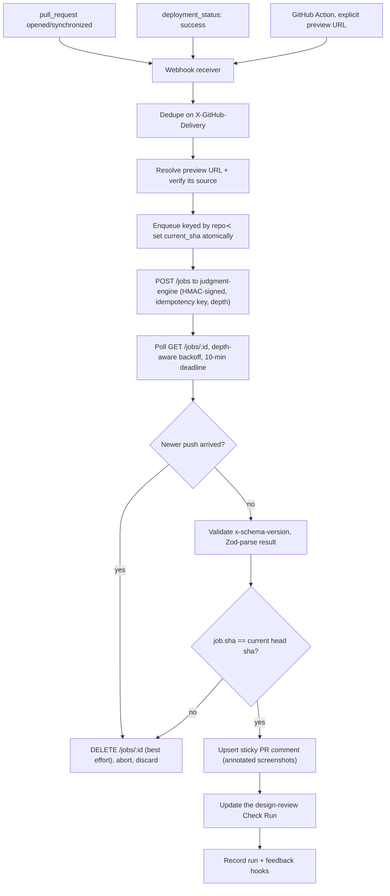

# gate

**Archived. Provided as-is, with no updates expected.** Issues and pull requests are not monitored. Last verified working 2026-08-09 on macOS 15.6 with Node 24.14.0 and pnpm 10.34.3, and on Linux via Docker `node:24-slim`.

Gate is the GitHub-facing half of an automated *design* reviewer: it resolves a pull request's preview URL, has a separate vision-model service critique the rendered UI, and publishes the findings as one sticky PR comment plus a Check Run.

## Why this exists

Apature was a design reviewer for AI-generated frontend PRs: "Applitools checks pixels, we check judgment". Gate was its product surface; the capture and the model call lived in a separate `judgment-engine` service that was never open-sourced. The company wound down in 2026 and this repository is published as a snapshot. Two parts need no model endpoint: the sandbox supervisor that runs an untrusted `preview-command` in a CI runner, and the whole review-delivery path. Both run today, from a clean clone, with no credentials.

## What it does

Runnable from this repository, right now:

- **Supervises an untrusted `preview-command`** in its own process group: allowlisted environment, `ulimit` caps, loopback-only readiness probing, off-loopback redirect refusal, and guaranteed teardown of the whole process tree. `pnpm demo` demonstrates all four against a fixture app.
- **Produces a real design-review comment**: findings validation, severity filtering, suppression, sticky-comment rendering, Check Run mapping, and SVG-over-PNG screenshot annotation via `sharp`. `pnpm demo:review` writes the comment, the Check Run payload and annotated PNGs to `out/`.
- **Speaks the judgment-engine job protocol**: submit/poll/cancel with depth-aware backoff, HMAC request signing, repository-scoped idempotency keys, `x-schema-version` checking and Zod parsing of every response.
- **Seals a preview login** so an auth-gated preview can be captured without storing raw cookies: `node packages/secrets/dist/cli/auth.js` origin-scopes a Playwright `storageState` and envelope-encrypts it. An example `storageState` ships in `packages/secrets/fixtures/`, so this is runnable without Playwright.
- **Orchestrates the Action path end to end** (`runAction`): preview resolution and provenance verification, fork gating, local serve, publish-time SHA guard, sticky comment, advisory Check Run.
- **Ships the App-path server**: Fastify webhook receiver, GitHub App auth, delivery dedupe, BullMQ queue with `repo#pr` supersession, Postgres migrations with row-level tenant isolation, and a dashboard core.

## What it does not do

- **It never edits code.** No `contents: write`, no commits, no fix PRs, no driving the UI. `assertNoContentsWrite` throws if a permission set ever tries to grant it. The customer's coding agent was the hands; Gate was the eyes.
- **It does not capture screenshots or call a model.** Both live in `judgment-engine`, which is not in this repository and was never published. Every claim about review *quality* is an engine claim; Gate's tests prove Gate's orchestration against a mock engine.
- **There is no hosted service.** No GitHub App installation, no Marketplace listing, no endpoint to point at. A live review needs infrastructure you provision yourself; see [Running a live review](#running-a-live-review).
- **Windows is out of scope.** The supervisor relies on POSIX process groups.

## Requirements

| Need | Check | Notes |
|---|---|---|
| Node 24 or newer | `node -v  # need v24 or above` | `.node-version` pins `24` and `engines` requires `>=24`; verified on v24.14.0 |
| pnpm 10.34.3 | `pnpm -v  # need 10.34.3` | install with `corepack enable && corepack prepare pnpm@10.34.3 --activate` |
| macOS or Linux | n/a | verified on macOS 15.6 and on Linux (Docker `node:24-slim`); Windows is out of scope |
| Docker (optional) | `docker --version` | only for the Linux resource-cap check at the end of the quickstart |

No credentials, API keys or network access are needed for anything in the Quickstart or the worked example. Dependencies are pinned, `pnpm-lock.yaml` is committed, and everything below was run with `--frozen-lockfile`.

## Install

From a clean clone, at the repository root:

```bash
git clone https://github.com/apatureai/gate.git
cd gate
pnpm install --frozen-lockfile
```

```
Scope: all 13 workspace projects
Lockfile is up to date, resolution step is skipped

 WARN  Failed to create bin at .../packages/action/node_modules/.bin/designreview.
 ENOENT: no such file or directory, open '.../packages/secrets/dist/cli/auth.js'
 WARN  Failed to create bin at .../packages/action/node_modules/.bin/designreview.
 ENOENT: no such file or directory, open '.../packages/action/node_modules/@gate/secrets/dist/cli/auth.js'
Done in 1.5s using pnpm v10.34.3
```

Exactly **eight** `designreview` bin warnings are expected on a fresh clone: two each for `packages/action`, `engine`, `service` and `dashboard`, because `@gate/secrets` declares a workspace bin (`dist/cli/auth.js`) that only exists after a build, and pnpm tries both the workspace path and the linked copy. They disappear after `pnpm build` and nothing below depends on that bin.

The demo commands below compile what they need (`tsc -b packages/action`) before running, so there is no separate build step. To build everything: `pnpm build`.

## Quickstart: the sandbox supervisor

The reusable piece of this repository is the supervisor that runs a pull request's own `preview-command` inside a CI runner. `pnpm demo` points it at a fixture app in `packages/action/fixtures/` that forks two child workers, one of which traps `SIGTERM` and refuses to die, and then reports what the supervisor did to it.

```bash
pnpm demo
```

```
> @gate/monorepo@0.0.0 demo /path/to/gate
> tsc -b packages/action && node packages/action/dist/supervisor-demo-cli.js

Gate sandbox supervisor demo
platform darwin · node v24.14.0 · shell /bin/sh (platform default)

[1/4] supervised start and process-group teardown
  command       node "./packages/action/fixtures/preview-app.mjs" serve
  ready         http://127.0.0.1:57869 in 121 ms (pid 89368, process group 89368)
  GET /         200 · Gate fixture preview app
  build facts   1 parsed from the dev-server log
                hydration: preview-app: Warning: Hydration failed because the server-rendered HT…
  process group 3 processes before stop()
                  89368  node ./packages/action/fixtures/preview-app.mjs serve
                  89369  node ./packages/action/fixtures/preview-worker.mjs well-behaved
                  89370  node ./packages/action/fixtures/preview-worker.mjs stubborn
  stop()        SIGTERM to the group → 2000 ms grace → SIGKILL to whatever survived
                +    0 ms  3 left  (preview-app.mjs serve; preview-worker.mjs well-behaved; preview-worker.mjs stubborn)
                +   52 ms  1 left  (preview-worker.mjs stubborn)
                + 2067 ms  0 left
  result        group gone after 2067 ms · orphans: 0

[2/4] environment allowlist
  offered       GITHUB_TOKEN, JUDGMENT_ENGINE_API_KEY, JUDGMENT_ENGINE_HMAC_SECRET (fake runner secrets)
  passed in     HOME, LANG, PATH, TERM, TMPDIR
  child saw     HOME, LANG, PATH, PORT, PWD, SHLVL, TERM, TMPDIR, _, __CF_USER_TEXT_ENCODING  (PORT comes from the supervisor caller, PWD/SHLVL/_ from the shell)
  leaked        none

[3/4] resource cap
  limits        512 processes, 4096 MiB address space
  spawned as    node "./packages/action/fixtures/preview-app.mjs" serve
  applied       no — the ulimit prologue is Linux-only, this is darwin
  on Linux      ulimit -u 512 2>/dev/null; ulimit -v 4194304 2>/dev/null; node "./packages/action/fixtures/preview-app.mjs" s…
  child reports max processes:   soft 2666, hard 4000
                address space:  soft unlimited, hard unlimited

[4/4] off-loopback redirect refused
  fixture       302 → https://preview.attacker.example/pwn
  supervisor    redirected_off_loopback: preview redirected to preview.attacker.example

PASS — fixture app served, contained, and torn down with no orphaned processes.
```

**Success looks like:** the last line reads `PASS`, the teardown census ends in `0 left`, `orphans: 0`, and `leaked  none`. The exit code is 0. Ports, pids and timings will differ from the transcript.

If it fails: `Error: Cannot find module` means the build did not run; use `pnpm demo` rather than `node …/dist/…` directly. A `not_ready` failure means something else holds the port the fixture picked; rerun.

### Seeing the resource cap actually bite (optional, needs Docker)

The `ulimit` prologue only applies on Linux (`ulimit -v` is unsupported on macOS), so on a Mac the demo honestly reports `applied  no`. To watch the kernel enforce it, run the same built CLI on Linux (`pnpm demo` above already produced `dist/`; Docker must be allowed to share the repository's path):

```bash
docker run --rm -v "$PWD":/repo -w /repo node:24-slim \
  node packages/action/dist/supervisor-demo-cli.js
```

```
Gate sandbox supervisor demo
platform linux · node v24.19.0 · shell /bin/bash

[1/4] supervised start and process-group teardown
  ...
  process group 3 processes before stop()
                     14  node ./packages/action/fixtures/preview-app.mjs serve
                     23  node ./packages/action/fixtures/preview-worker.mjs well-behaved
                     24  node ./packages/action/fixtures/preview-worker.mjs stubborn
  stop()        SIGTERM to the group → 2000 ms grace → SIGKILL to whatever survived
                +    0 ms  3 left  (preview-app.mjs serve; preview-worker.mjs well-behaved; preview-worker.mjs stubborn)
                +   53 ms  1 left  (preview-worker.mjs stubborn)  +1 zombie
                + 2080 ms  0 left  +2 zombie
  result        group gone after 2082 ms · orphans: 0
                2 zombie pid(s) await reaping — this process is PID 1 here and reaps nothing;
                a CI runner's init does. They run no code.
  ...
[3/4] resource cap
  limits        512 processes, 4096 MiB address space
  spawned as    ulimit -u 512 2>/dev/null; ulimit -v 4194304 2>/dev/null; node "./packages/…
  applied       yes
  child reports max processes:   soft 512, hard 512
                address space:  soft 4294967296, hard 4294967296
```

Two things to read there. The child's own rlimits now match the cap, so the kernel is enforcing it, and the shell line says `/bin/bash`, which is what makes `ulimit -u` take effect at all. And the killed processes linger as zombies, because in a bare container this process is PID 1 and reaps nothing; a zombie holds a pid but runs no code, so it is reported separately from an orphan. (`node:24-slim` ships no `ps`; the census falls back to reading `/proc`.)

## Worked example: a design review, end to end

`pnpm demo:review` runs the Action path's review orchestration against a **recorded** engine response (the golden fixture in `packages/types/fixtures/`) and writes what a pull request would have received.

```bash
pnpm demo:review
```

```
> @gate/monorepo@0.0.0 demo:review /path/to/gate
> tsc -b packages/action && node packages/action/dist/review-demo-cli.js

Gate review demo (recorded engine response, no model call, no network)

  PR              example-org/gate-demo#7 @ 0123456
  engine result   needs_work · 3 findings · 2 areas not reviewed
  action status   reviewed · comment created
  check run       neutral — Needs work

  wrote
    ./out/review-comment.md  (1186 bytes — the sticky PR comment, verbatim)
    ./out/check-run.json  (the Check Run payload)
    ./out/annotated-f_001.png  (26154 bytes — finding f_001 boxed on the fixture page)
    ./out/annotated-f_002.png  (26878 bytes — finding f_002 boxed on the fixture page)

  Open the PNGs to see the annotation boxes; read review-comment.md as GitHub would render it.
```

**Success looks like:** four files in `out/`. `out/review-comment.md` opens with the hidden sticky marker `<!-- apature-gate:sticky -->` and lists *"Primary CTA uses an off-brand color on mobile"*; `out/annotated-f_001.png` is a 390×844 fixture pricing page with a red box drawn around the call-to-action button and the label `f_001 CTA off-palette`.

What is real in that run: `runAction`, the engine client and its schema checking, finding validation and degradation, the sticky-comment renderer, the Check Run mapping, and `annotateScreenshot`'s SVG compositing. What is substituted: the engine's HTTP responses (replayed), the base screenshot (drawn locally from an SVG), and the element geometry the boxes come from (a real run gets it from the engine's capture geometry map). Nothing in the demo judges a UI; it replays a recorded judgment through the real delivery path.

Both demos are covered by the test suite (`packages/action/test/supervisor-demo.test.ts`, `packages/action/test/review-demo.test.ts`), so they cannot rot silently while the tests stay green.

## Usage

### The three surfaces

One engine contract, three ways to reach it, all behind `critique(images, context) → Findings`.

1. **GitHub Action** (`@gate/action`, [`action.yml`](action.yml)) runs inside the customer's own runner. Takes an explicit `preview-url`, discovers one, or runs a `preview-command` under the supervisor. Needs no hosted install; requires only `checks: write` and `pull-requests: write` in the calling workflow.
2. **GitHub App** (`@gate/service`): a Fastify webhook receiver in front of a BullMQ queue and an orchestrator. Reacts to `pull_request` and `deployment_status`, and owns the durable state: run history, feedback, billing, tenant isolation. Requests exactly `checks: write`, `pull_requests: write`, `contents: read`, `deployments: read`, and never `contents: write`.
3. **Dashboard** (`@gate/dashboard` + `apps/dashboard`) covers OAuth, sessions, run history, a finding browser, feedback stats, config UI, Stripe billing. The logic lives in a tested, UI-agnostic core package; the Next.js app-router shell only renders it.

### Using the Action in a workflow

```yaml
permissions:
  contents: read        # NEVER contents: write
  pull-requests: write  # post the sticky comment
  checks: write         # post the Check Run

on: pull_request        # NOT pull_request_target — see the threat model below

jobs:
  design-review:
    runs-on: ubuntu-latest
    steps:
      - uses: apatureai/gate@v1
        with:
          preview-url: ${{ steps.deploy.outputs.preview-url }}
          # or: preview-command: "pnpm build && pnpm preview"
          config-path: .designreview.yml
          gate-mode: none   # none | nits | blockers
```

The Action is a Docker action ([`Dockerfile.action`](Dockerfile.action)); `apatureai/gate@v1` was never published to the Marketplace, so a fork must reference its own repository.

### Running the Action locally

The Action's entrypoint (`packages/action/src/main.ts`) reads its inputs from the runner environment, so it can be driven by hand: build the image and give it an event payload.

Write the payload **inside the repository working directory**, not `/tmp`. Docker Desktop on macOS shares only a fixed set of host paths (`/Users` among them, `/tmp` and `/private/tmp` not). A bind mount of an unshared path silently becomes an empty *directory* inside the container, and the Action then dies on `EISDIR`. If your clone is under your home directory, `$PWD` is shared; if you cloned somewhere exotic, add that path under Docker Desktop → Settings → Resources → File sharing. One command tells you which you have; it must print a file, not a directory listing:

```bash
docker run --rm -v "$PWD/README.md":/tmp/probe node:24-slim ls -la /tmp/probe
```

```bash
docker build -f Dockerfile.action -t gate-action .
cat > ./event.json <<'JSON'
{"pull_request":{"number":7,"title":"Refresh the pricing page","body":null,
 "head":{"sha":"0123456789abcdef0123456789abcdef01234567","repo":{"full_name":"acme/web"}},
 "base":{"sha":"fedcba9876543210fedcba9876543210fedcba98","repo":{"full_name":"acme/web"}}}}
JSON
docker run --rm -v "$PWD/event.json":/tmp/event.json \
  -e GITHUB_REPOSITORY=acme/web \
  -e GITHUB_EVENT_PATH=/tmp/event.json \
  -e INPUT_PREVIEW_URL=https://acme-web-pr7.vercel.app \
  -e INPUT_GITHUB_TOKEN=<a token with checks:write and pull-requests:write> \
  -e JUDGMENT_ENGINE_ENDPOINT=<your engine base URL> \
  -e JUDGMENT_ENGINE_API_KEY=<your engine key> \
  -e JUDGMENT_ENGINE_HMAC_SECRET=<your engine HMAC secret> \
  gate-action
```

**What you actually get depends on the token.** The angle-bracketed values above are placeholders, so the command is not runnable as printed.

- **With no valid `INPUT_GITHUB_TOKEN`** (the common case for a reader with no `acme/web`), the first GitHub call fails and you see one line, then exit 0:

  ```
  Apature Gate action error: list comments failed: 401
    GitHub rejected the token. Set INPUT_GITHUB_TOKEN (or GITHUB_TOKEN) to a token with checks:write and pull-requests:write. Nothing was published; the run still exits 0 so the pull request is not failed.
  ```

  GitHub is contacted before the engine, so no Check Run is published and the engine is never reached. Exit 0 still holds (a broken reviewer never fails someone's pull request), but nothing is delivered.
- **With a real token on a real pull request and no reachable engine**, the run exits 0 after logging an engine error and publishing a neutral Check Run.

That is the honest local story for the full Action: it is a thin wrapper whose two dependencies (GitHub and the engine) are both remote, so running it by hand needs at least one of them for real. To exercise the orchestration itself with neither, use `pnpm demo:review`, which drives the same `runAction` function.

### The sandbox supervisor

`packages/action/src/local-serve.ts` and `resource-cap.ts`. Used when a repository has no hosted preview and sets `preview-command`; also the piece most worth lifting into another project.

```
startLocalServer(command, { url, cwd, env, readyPath, readyStatus, resourceLimits })
  → { ok: true, server: { url, pid, output(), stop() } }
  | { ok: false, reason: "spawn_failed" | "early_exit" | "not_ready" | "redirected_off_loopback", detail, tail }
```

- **Process group, not process.** The child is spawned `detached`, so it owns a process group; teardown is `process.kill(-pid, SIGTERM)`, a grace window, then `SIGKILL` to whatever is left. Liveness is gated on the *group*, not on the direct child: with `shell: true` the direct child is the shell, which can exit while a trapped grandchild survives. That is exactly what the quickstart's stubborn worker demonstrates.
- **Environment allowlist, default-deny.** `buildAllowlistedEnv` passes only `PATH`, `HOME`, `LANG`, `LC_ALL`, `TMPDIR`, `TERM`, `CI`, `NODE_ENV`, `GITHUB_WORKSPACE`, `RUNNER_OS`, `RUNNER_TEMP` (plus a `PORT` derived from the target URL). Runner secrets never reach pull request code.
- **Resource cap.** `buildResourceCappedCommand` prepends `ulimit -u <procs>; ulimit -v <kb>` as a hard cap (no `-S`, so hostile child code cannot raise it), inherited by everything the dev server forks. Linux only: `ulimit -v` (`RLIMIT_AS`) does not apply on macOS, and the command is returned unchanged there. The capped command runs under `/bin/bash` when it exists, because `/bin/sh` on Debian and Ubuntu is dash, whose `ulimit` has no `-u`. Without that, the pids half of the cap silently does nothing on the exact runners it was written for.
- **Readiness, bounded.** Polls the base URL (or `ready_path`) until an accepted status, with a 120 s ceiling and early abort if the command exits. The accepted set is Playwright's `webServer` set (2xx/3xx plus 400/401/402/403), because an auth-gated dev server is still "up".
- **Off-loopback redirect refusal.** The probe uses `redirect: "manual"`; a 3xx whose `Location` leaves loopback is refused (`redirected_off_loopback`), never followed.
- **Output as evidence, not as an echo.** stdout and stderr are drained into a bounded ring buffer. `parsePreviewBuildFacts` turns known patterns (compile errors, hydration mismatches, chunk 404s, deprecations) into structured facts for the critique; anything surfaced on the pull request is secret-scrubbed and length-capped first.

### Sealing a preview login (`designreview auth`)

A repository whose preview deployment sits behind a login supplies a Playwright `storageState` JSON: the file `browserContext.storageState({ path })` writes, or `npx playwright open --save-storage=storageState.json <url>` after logging in by hand. It is never stored raw: the CLI in `@gate/secrets` origin-scopes it and seals it under a tenant key (envelope encryption; production resolves a managed KMS key, the CLI uses a passphrase-derived local key).

You do not need Playwright to try it: `packages/secrets/fixtures/storageState.example.json` is a minimal, made-up one. This runs offline, after `pnpm build`:

```bash
node packages/secrets/dist/cli/auth.js \
  --input packages/secrets/fixtures/storageState.example.json \
  --origins https://app.acme.com \
  --out storageState.sealed.json
```

```
Sealed storageState -> storageState.sealed.json (1 cookies, 1 origins, origin-scoped).
```

**Success looks like:** `storageState.sealed.json` exists, contains `keyId`, `wrappedDek`, `iv`, `authTag` and `ciphertext`, and does **not** contain the fixture's cookie value:

```bash
grep -c example-not-a-real-session-value storageState.sealed.json  # 0
```

Cookies and localStorage outside `--origins` are dropped before sealing. Pass `--origins https://other.example` instead and the CLI seals `0 cookies, 0 origins` and warns. `--help` prints the full flag list. Set `GATE_KMS_PASSPHRASE` to control the local key; on fork pull requests the sealed state is dropped before any handoff regardless.

### Threat model: Action-path hostile-PR capture

On the Action path, capture runs inside **your** runner, which means attacker-authored code from a fork pull request executes on a network with reachable internal services. This is the same class of risk as any "build untrusted PR code in CI" step, but rendering a page makes it explicit.

**Why the App path differs.** On the App path, capture does not run in the customer runner: Gate hands the verified preview URL to `judgment-engine`, which captures inside a Firecracker microVM with an egress policy, internal-IP deny, and DNS-rebind rechecks. The Action path cannot offer that isolation, because the runner is the customer's.

**Gate-owned (this repository):**

- **Provenance.** A preview URL is forwarded only from a verified origin: `deployment_status`, explicit input, `url_template`, an allowlisted provider-bot comment, or local serve. Free-text URLs are rejected as `unverified_preview_source` (`verifyPreviewHandoff`).
- **Fork gating.** `storageState`/auth and preview-bypass secrets are disabled on fork pull requests *before* any capture or handoff. Local serve is disabled on forks unless the repository opts in with `preview: { fork_preview: true }`.
- **Least privilege.** The Action requests no `contents: write` (`GATE_GITHUB_PERMISSIONS`); it posts comments and Check Runs only.
- **Containment of the local server.** Environment allowlist, `ulimit` caps, loopback-only, redirect refusal, guaranteed teardown. The quickstart above demonstrates every one of them live.

**Engine-owned (`judgment-engine`):** sandbox egress policy, internal-IP egress deny, SSRF protection, DNS-rebind rechecks, screenshot encryption and retention, prompt-injection controls. Gate does not duplicate these; on the Action path they are simply unavailable, which is why the residual risk is gated and documented rather than eliminated.

**Operator guidance.** Do not run capture on `pull_request_target` (or a fork-triggered `workflow_run`) with repository secrets in scope: it runs in the base repository's context, with secrets, while checking out fork code, which is the worst combination. Use the default `pull_request` trigger. For untrusted forks prefer the App path, where capture happens in the engine sandbox. Treat the runner as compromisable and minimise what it can reach.

### The engine contract

- **Async jobs, not a long-held call.** `POST /jobs` → `202` + job id, then `GET /jobs/:id` with depth-aware backoff to a 10-minute deadline. The hosted service sat behind a proxy whose idle timeout would kill a 90-second synchronous request; the seam also means a restart mid-review loses only a poll loop.
- **Idempotency.** Requests carry a repository-scoped key (`gate-review-v2:sha256:<digest>` over owner, name, PR number and head SHA), so a retry resumes the existing job instead of paying for a second capture.
- **Versioned and parsed.** The engine returns `x-schema-version`; Gate checks it, then Zod-parses the body. A drifted or malformed response produces a typed error and *no* published review, rather than a comment full of nulls. `packages/types` is the single source of that contract and evolves additive-only; its golden fixture is the anchor shared with the engine repository.
- **Two identities, deliberately different.** The queue supersession key is `repo#pr` (a newer push replaces whatever is in flight). The durable identity of a *completed* review is `(repo_owner, repo_name, pr_number, head_sha)`, enforced by a unique constraint. Conflating them either double-posts or drops reviews.
- **A publish-time SHA guard that does not trust cancellation.** On a new push Gate aborts the poll and best-effort `DELETE`s the engine job; that race can be lost. So immediately before writing to GitHub, the publisher re-reads the current head SHA and discards the result if it no longer matches. Stale publishing is a correctness bug with a target rate of exactly zero, not a tunable SLO.
- **Depth.** At most one *deep* review per PR per 10 minutes, tracked in Postgres (`runs.last_full_review_at`, not a Redis timer, so a restart cannot reset the cap); pushes inside that window get the cheaper *triage* pass.

### Failure modes

Nothing about a broken reviewer is allowed to fail someone's pull request: every row below ends in a neutral Check Run with an explanation.

| Failure | Behaviour |
|---|---|
| No preview URL found | Neutral Check Run with setup guidance |
| Unverified preview source | "not reviewed (unverified preview source)"; never forwarded to the engine |
| Preview returns an auth wall | Not reviewed; link to bypass/auth setup |
| Engine poll timeout (10 min) | Best-effort `DELETE`, then neutral Check Run, reason `review_timed_out` |
| Engine 409 on submit (duplicate idempotency key) | Poll the existing job; never re-run capture |
| Engine 429/503 | Honour `Retry-After`; if the circuit is open, neutral "engine temporarily unavailable" |
| Malformed engine result (schema or version mismatch) | Zod parse fails → do not publish; never post a null-grade review |
| Invalid element refs in a result | Publish only validated findings; show a capture warning |
| An older job finishes late | Discarded by the publish-time SHA guard |
| Redelivered webhook (duplicate `X-GitHub-Delivery`) | Deduped in `webhook_log`; 200 and skip |
| Comment update conflict | Re-read the sticky comment, retry against the newest node id |
| GitHub secondary rate limit | Honour `Retry-After`; exponential backoff with jitter |
| Annotated artifact past retention | `/i/<id>.png` returns a 410 tombstone, not a broken redirect |
| Blocking finding while in advisory mode | Check Run stays neutral |

### Repository configuration (`.designreview.yml`)

A repository opts in with an optional `.designreview.yml`. Every field has a working default and the schema is strict, so a typo like `viewport:` is a validation error rather than a silently ignored key.

```yaml
preview:
  source: vercel          # vercel | netlify | cloudflare | render | explicit | local
  environment: Preview
  url_template: null      # e.g. https://myapp-pr-{pr}.example.dev
  wait_seconds: 0
  ready_selector: null    # wait for this selector before capture
  ready_path: null        # poll this path for readiness instead of the base URL
  ready_status: null      # acceptable readiness status codes
  protection_bypass: null # name of the stored Vercel bypass secret
  auth: null              # name of the stored auth storageState secret
  fork_preview: false     # run preview-command on fork PRs (off by default: it runs untrusted code)

routes:
  always: ["/"]
  max_per_pr: 5
  map: {}                 # glob -> route, to review the pages a diff actually touches

viewports: [mobile, desktop]   # mobile | tablet | desktop
dark_mode: false
brand: null

rules:
  gate: none                    # none | nits | blockers — merge-blocking is opt-in
  min_severity_to_comment: nit  # nit | minor | major | blocker
  suppress: []                  # finding ids or element selectors to mute (exact match, no globs)

tokens:
  source: null            # path to design tokens
  values: {}
```

Severity and suppression filter what the comment *lists*; they never change the grade or the Check Run conclusion, which reflect the engine's holistic verdict.

## Configuration (environment variables)

Every variable the code actually reads, by path. Neither demo needs any of them.

| Variable | Required | Default | Effect |
|---|---|---|---|
| `JUDGMENT_ENGINE_ENDPOINT` | Action + App | none | Engine `/jobs` base URL. Unset → every review ends in a neutral "engine unavailable" Check Run. |
| `JUDGMENT_ENGINE_API_KEY` | Action + App | none | Engine auth. Unset → engine rejects the job. |
| `JUDGMENT_ENGINE_HMAC_SECRET` | Action + App | none | Signs job requests. Unset → requests are unsigned and refused. |
| `GITHUB_TOKEN` / `INPUT_GITHUB_TOKEN` | Action | none | Posts the sticky comment and Check Run. Unset → nothing is published. |
| `GITHUB_REPOSITORY`, `GITHUB_EVENT_PATH` | Action | none | Runner-supplied context. Missing → the entrypoint throws `missing GitHub Action context`. |
| `GITHUB_DEFAULT_BRANCH` | Action | `main` | Default branch reported to the engine. |
| `GATE_LOCAL_SERVE_URL` | Action | `http://127.0.0.1:3000` | Where the `preview-command` server is expected to listen. |
| `GITHUB_APP_ID`, `GITHUB_APP_PRIVATE_KEY`, `GITHUB_WEBHOOK_SECRET` | App | none | GitHub App identity and webhook verification. |
| `DATABASE_URL` | App | none | Postgres: runs, findings, feedback, billing. |
| `REDIS_URL` | App | none | Redis: supersession keys, token buckets, quotas. |
| `STRIPE_SECRET_KEY`, `STRIPE_WEBHOOK_SECRET` | App | none | Billing API and webhook verification. |
| `GATE_SCREENSHOT_OBJECT_URL_TEMPLATE` | App | none | Signed-read template containing `{objectKey}`, used by the `/i/:artifactId.png` redirect. |
| `SCREENSHOT_CAPABILITY_SECRET` | App | none | Verifies private screenshot capability tokens. |
| `FEEDBACK_TOKEN_SECRET` | App | none | Verifies one-time feedback POST tokens. |
| `GATE_KMS_PASSPHRASE` | App | none | Local key-provider passphrase for the secret store. |
| `GATE_ARTIFACT_BASE_URL`, `GATE_RESULT_OBJECT_URL_TEMPLATE`, `DASHBOARD_BASE_URL`, `PORT` | App | see code | Artifact and dashboard URL construction; server port. |
| `OTEL_EXPORTER_OTLP_ENDPOINT` | optional | none | OpenTelemetry export target. |

The App path fails fast at boot: `assertProductionEnv` throws one aggregated error naming *every* missing required variable, rather than failing deep inside a request.

## How it works


*(The poster's editable source is [`poster_gate.html`](poster_gate.html), which loads the logos in [`icons/`](icons).)*



pnpm workspace, TypeScript project references, Vitest, ESLint. Roughly 10k lines of non-test TypeScript and 9k lines of tests across 12 packages.

| Package | What it is |
|---|---|
| `packages/types` | The boundary contract: `GateReviewRequest`/`GateReviewResult`, config types, feedback events, the golden fixture loader, `deriveArtifactId`. Carries no model-specific fields by design. |
| `packages/config` | `.designreview.yml`: Zod schema, validation, defaults, normalization. |
| `packages/engine` | Client for the judgment-engine async job API: submit/poll/cancel, HMAC signing, preview-handoff verification, `x-schema-version` parsing, rate limiting, per-account endpoint routing. |
| `packages/delivery` | Sticky comment upsert, Check Run conclusion mapping, finding validation and degradation decisions, SVG+sharp screenshot annotation, baseline before/after pairs. |
| `packages/service` | App path: Fastify server, GitHub App auth and webhook verification, permission assertions, deployment-preview discovery, BullMQ queue, supersession, orchestrator, fail-fast production env check. |
| `packages/action` | Action path: entrypoint, GitHub API client, preview discovery, dev-server output parsing into build facts, the resource-capped local-serve supervisor, and both demos. |
| `packages/dashboard` | Hosted-tier core logic, UI-agnostic and tested: OAuth, signed sessions, installation-scoped access, run history, finding browser, feedback stats, config UI, Stripe billing. |
| `packages/db` | Postgres: idempotent migrations, pg/PGlite executors, RLS tenant-isolation runners. Owns `installations`, `runs`, `feedback_events`, `billing_customers`, `webhook_log`, `screenshot_artifacts`, `feedback_consumed_tokens`. |
| `packages/redis` | Key namespaces (BullMQ, supersession, token buckets), connection handling, and a no-eviction assertion, because evicting a supersession key would break the guard. |
| `packages/secrets` | KMS envelope encryption, app/tenant secret stores, the canonical secret→env-var map, log redaction and output scrubbing, fork-PR storageState handling. |
| `packages/observability` | OpenTelemetry spans and metrics for the review pipeline, including the stale-publish invariant. Ships `observability/alerts.yaml` and `observability/dashboard.json`. |
| `packages/e2e` | Acceptance harness asserting the Action-path criteria end to end against a mock engine. |

| App | What it is |
|---|---|
| `dashboard` | Next.js (app-router) shell over the `@gate/dashboard` core. Standalone: outside the root `tsc -b`/vitest/eslint harness, own lockfile, own CI job. |

`spikes/elixir-supersession/` is a property-tested BEAM model of the supersession queue, kept for its verdict ("we are not adopting it"). It is an Elixir mix project, outside this workspace's toolchain, and nothing in the build references it.

## Development

```bash
pnpm install --frozen-lockfile
pnpm lint        # eslint --max-warnings=0
pnpm typecheck   # tsc -b across all project references
pnpm test        # vitest
pnpm build       # tsc -b, emits dist/
```

`pnpm test` on 2026-08-09, macOS 15.6, Node 24.14.0:

```
 Test Files  92 passed (92)
      Tests  573 passed (573)
   Duration  22.18s
```

One file at a time: `pnpm exec vitest run packages/action/test/local-serve.test.ts`.

There are no live model calls and no live network in the suite; the engine is always mocked, including in the `@gate/e2e` acceptance harness. Keep that rule if you fork this. The suites that boot PGlite (in-process WASM Postgres) are slow enough to race vitest's default 5s/10s timeouts on a loaded machine, so `vitest.config.ts` raises `testTimeout` and `hookTimeout` to 30s; do not lower them.

`packages/e2e/test/golden-path.test.ts` is the demo-as-test: the full Action path against a mock engine, asserting an annotated, screenshot-grounded review in under 90 seconds and a green Check Run after the fix. A scheduled live-pipeline version of that smoke test was specified but is an ops wiring step that never ran.

`apps/dashboard` is **not** part of this root gate. The Next.js shell keeps its own React/Next tree, its own `package-lock.json`, and is built with its own isolated `next build` CI job:

```bash
pnpm build
cd apps/dashboard
npm ci
npm run build
```

`next build` rewrites `apps/dashboard/next-env.d.ts` and reformats `apps/dashboard/tsconfig.json` (it adds the generated route types and flips `jsx` to `react-jsx`). Both files are committed **in their post-build form**, so a build on a clean tree leaves `git status` clean; if you upgrade Next, expect one commit of regenerated churn.

## Status

| Component | Status | Notes |
|---|---|---|
| Sandbox supervisor | Working | `pnpm demo`; resource cap applies on Linux only |
| Review delivery (comment, Check Run, annotation) | Working | `pnpm demo:review` |
| Engine client (jobs, HMAC, schema checks) | Working | Against a mock engine; no public engine exists |
| Action path orchestration | Working | `runAction`, covered end to end in `@gate/e2e` |
| GitHub Action, live | Partial | Code complete; needs a reachable `judgment-engine` and a published action reference |
| App path (webhooks, queue, Postgres, RLS) | Partial | Tested against PGlite and mocks; never provisioned in public |
| Dashboard | Partial | Core logic tested; the Next.js shell has its own toolchain and unpatched advisories |
| Billing | Partial | Stripe plumbing and tier limits tested; no real money ever moved |
| Screenshot capture, model critique | Not implemented | Lives in `judgment-engine`, not published. The seam is `createHttpEngineTransport` in `packages/engine`; implement that HTTP contract to plug in your own. |
| Screenshot object store | Not implemented | The finding browser signs URLs through `GATE_SCREENSHOT_OBJECT_URL_TEMPLATE`; no bucket was ever provisioned. |
| Baseline before/after comparison | Partial | `packages/delivery/src/baseline.ts` builds the pairs; nothing calls it on the review path. |

## Running a live review

The code seam is done; provisioning was always an operator action and none of it exists publicly. Beyond the environment variables above you would need: a Postgres instance whose app role is a non-superuser without `BYPASSRLS` (otherwise the row-level-security tenant isolation is decorative), a Redis with `maxmemory-policy=noeviction`, an AWS KMS key bound to the secret store, an object store for screenshots, a GitHub App created from `buildAppManifest` with its webhook pointed at your `/webhook`, and, above all, a reachable `judgment-engine` implementing the job protocol described above.

Enterprise accounts could route to an in-VPC engine instead: each account has an optional KMS-encrypted `engineEndpoint`, and `createAccountEngineTransport` targets **only** that endpoint. There is no fallback path to the hosted engine, so an in-VPC outage surfaces as `not_reviewed` rather than sending screenshots to a third party.

## Limitations

- **It was never generally available.** No public GitHub App install, no Marketplace listing, no paying customers. The production deploy workflow was removed before archiving.
- **Half the system is in another repository.** Every claim about screenshot quality, model behaviour, prompt design or finding accuracy belongs to `judgment-engine`. Gate's tests prove Gate's orchestration and delivery against a *mock* engine; they prove nothing about review quality.
- **The Action path constrains hostile pull request code; it does not sandbox it.** The `ulimit` caps, environment allowlist, loopback-redirect refusal and fork gating are real mitigations. The aggregate cgroup-v2 caps (`pids.max`, `memory.max`) that would make them airtight need host setup and are out of scope. Read the threat model before running the Action path on a repository that accepts fork pull requests.
- **The resource cap is Linux-only, and one half of it depends on the shell.** `ulimit -v` does not apply on macOS; `ulimit -u` does not exist in dash, so Gate runs the capped command under `/bin/bash` when present and falls back to the memory cap alone when it is not.
- **The dashboard's dependency tree carries known npm advisories** (Next.js, postcss, nanoid, sharp via libvips) that were not patched before the archive cut. The root pnpm workspace is clean. Update before running the dashboard anywhere real.
- **Source comments cite documents that are not in this repository.** Issue numbers (`#70`, `#79`, …) point at this repository's tracker, and section references like `TRD §7` or `ARCHITECTURE §6` point at internal specifications that were not published. The load-bearing parts of both are absorbed above; the citations are left in place as the historical record of why each piece exists.

### Deferred by design

Each of these was a considered decision with a named trigger, not an oversight. The hard invariants that hold across every one of them: Gate is judgment-only (no `contents: write`), the supersession identity `repo#pr` and the durable completed-review identity `(repo_owner, repo_name, pr_number, head_sha)`, the publish-time SHA guard, and `stale_publish_rate = 0`.

- **A completion-webhook callback instead of polling.** Today Gate polls with depth-aware backoff to a 10-minute deadline. **Trigger:** poll cost or time-to-first-comment regresses at scale.
- **Pact consumer-driven contract tests instead of a shared golden fixture.** Today a golden fixture plus `x-schema-version` plus a Zod runtime parse keeps the two repositories from drifting. **Trigger:** the engine starts deploying independently of Gate.
- **Short-lived JWT and a JWKS endpoint instead of a shared HMAC secret.** Today requests are HMAC-SHA256 signed and scoped to `installationId`. **Trigger:** more than one independent service calls the engine.
- **Inngest `singleton: { key: "repo#pr", mode: "cancel" }` instead of BullMQ.** Today BullMQ sits behind a `ReviewJobWorker` interface with cooperative cancellation; BullMQ cannot preempt an active job, which is why the publish-time guard exists. **Trigger:** stale-publish rate non-zero for two consecutive weeks.
- **Transactional outbox plus a REST reconciliation sweep.** Today delivery is at-least-once webhook dedupe on `X-GitHub-Delivery` plus rate-limit backoff. **Trigger:** an observed crash-window inconsistency (a delivered review with no database record, or the reverse).
- **Engine-side request-digest validation on idempotency conflicts.** Today Gate domain-separates its caller key (`gate-review-v2`) and refuses a mismatched client-outcome identity before publication. **Trigger:** a second independently deployed caller, or enabling blocking mode in production.

## Contributing

This repository is archived. Pull requests are not accepted and issues are not monitored; forking is the intended path. [`CONTRIBUTING.md`](CONTRIBUTING.md) documents the conventions the code was built under, which are worth reading before changing it in a fork.

## Security

There is no security support and no supported versions. [`SECURITY.md`](SECURITY.md) explains what to check before pointing this at anything real; start with the threat model above if you plan to run the Action path on untrusted forks.

## License

MIT. See [`LICENSE`](LICENSE).
