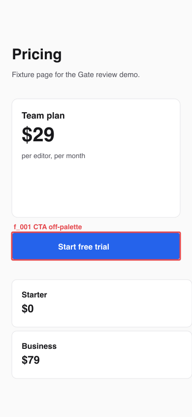
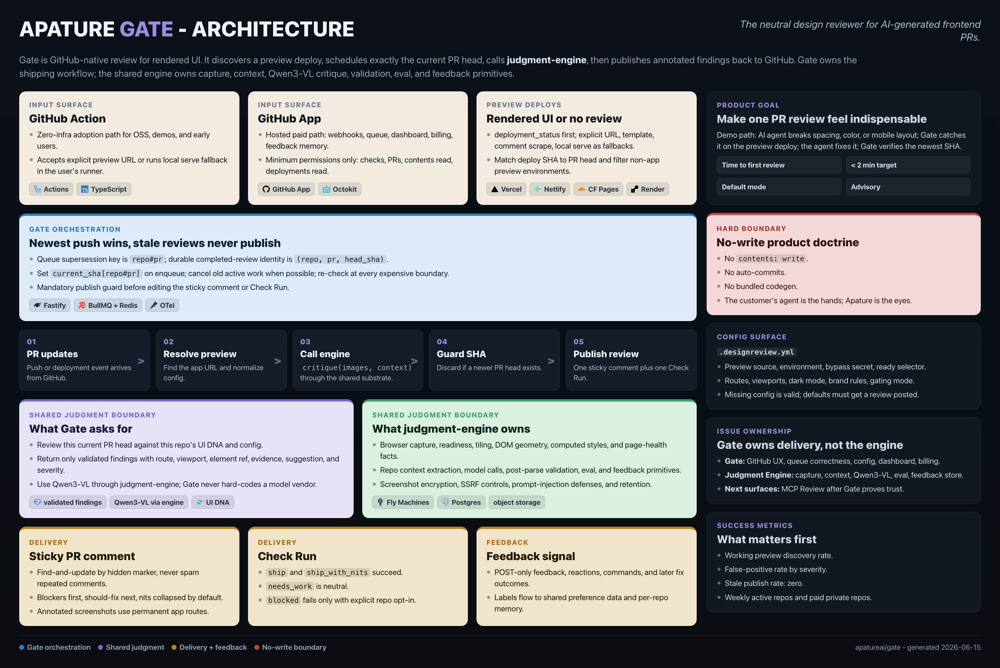
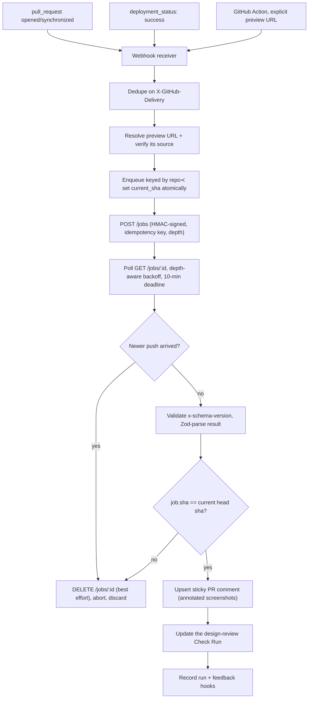

# Gate

[](https://github.com/apatureai/gate/actions/workflows/ci.yml) [](LICENSE) [](.node-version)

**Gate runs a pull request's preview build inside a hardened sandbox, hands the verified preview URL to a critique service you supply, and publishes that service's design review back to GitHub as one sticky comment plus a Check Run.**

**Gate does not screenshot the page and does not run the vision model.** Both sit behind an HTTP contract (`packages/types`), and no implementation of that contract ships in this repository. The public [`verdict`](https://github.com/apatureai/verdict) is one, and [one section below](#running-your-own-critique-service-and-pointing-gate-at-it) is the exact commands to run it and point Gate at it; writing your own is [roadmap item 1](#roadmap). With no critique service configured, every review ends in a neutral Check Run naming the variables you have to set, and nothing else is published. Read that as the shape of the project rather than a gap discovered later: Gate is the GitHub-facing half of a two-part system, and this repository is only that half.

**Gate never shows a passing review for a page nothing judged.** A critique service with no model configured still returns a complete, well-formed result with a grade in it. Gate reads the service's own judgment stamp and, unless it says a model judged the capture, withholds the grade: the Check Run goes neutral and titled *Not judged*, and the comment says so instead of showing a green badge. The same rule covers the other half of the question: the service also reports which routes and viewports it actually reviewed, and a run that reviewed **none** of them gets a neutral Check Run titled *Nothing reviewed* rather than the `ship` grade an empty result always carries. A partial review stays green and names what it skipped, on the Check Run as well as in the comment, so the two surfaces can never disagree. That rule is the one thing this repository will not trade away for a nicer-looking demo.

**The half it does own, it owns end to end.** A sandbox that executes untrusted pull request code and cleans up after it, preview-URL discovery with provenance checks, fork gating, queue supersession, a publish-time SHA guard, version- and schema-checked results, annotated screenshots, sticky-comment upsert, and Check Run mapping. Every one of those runs from a clean clone with no credentials, and the demos below prove it on your machine.

**The strongest single piece is the sandbox supervisor** in `packages/action`, and it stands alone: no credentials, no network, no critique service, and no dependency on the rest of Gate. If you are writing any GitHub Action that has to execute untrusted pull request code inside a runner, that is the part worth stealing, and `pnpm demo` runs it against a fixture that actively fights teardown.

Gate judges and reports. It never edits code, never commits, never opens fix PRs, and never requests `contents: write`.

```bash
git clone https://github.com/apatureai/gate.git && cd gate
pnpm install --frozen-lockfile
pnpm demo          # the sandbox supervisor, live, against a hostile fixture app
pnpm demo:review   # a full design review comment, from a recorded critique, written to ./out
pnpm demo:live     # the whole chain against a critique service you are running (see below)
```



That second command writes this file, `out/annotated-f_001.png`, on your machine in about a second, with no credentials and no network. It is the real annotation path, not a mockup: the box and label are composited by `annotateScreenshot` from a recorded critique. The full transcript, and the sticky comment that ships alongside it, are [further down](#a-design-review-end-to-end). The image here is a committed copy of that output, so you can diff your run against it.

<br clear="right">



*The green panel, "What verdict owns", is the half this repository does not implement. Everything else on the poster is here. Editable source: [`poster_gate.html`](poster_gate.html).*

## Why it is interesting

**Supervising untrusted preview code is harder than `spawn()`, and there is no good public reference for it.** `packages/action/src/local-serve.ts` is that reference:

- **Process group, not process.** The child is spawned `detached` so it owns a process group; teardown is `process.kill(-pid, SIGTERM)`, a grace window, then `SIGKILL` to the survivors. Liveness is gated on the *group*, because with `shell: true` the direct child is the shell, and the shell can exit while a trapped grandchild lives on. The demo's fixture forks a worker that traps `SIGTERM` and refuses to die, so you watch this happen rather than take it on faith.
- **Default-deny environment.** Only `PATH`, `HOME`, `LANG`, `LC_ALL`, `TMPDIR`, `TERM`, `CI`, `NODE_ENV`, `GITHUB_WORKSPACE`, `RUNNER_OS`, `RUNNER_TEMP` and a derived `PORT` cross the boundary. Runner secrets never reach pull request code.
- **`ulimit` caps that hostile code cannot raise.** `ulimit -u` and `ulimit -v` are set hard (no `-S`) and inherited by everything the dev server forks. The capped command runs under `/bin/bash` when it exists, because `/bin/sh` on Debian and Ubuntu is dash, whose `ulimit` has no `-u`; without that detail the pids half of the cap silently does nothing on the exact runners it was written for.
- **Loopback-only readiness with redirect refusal.** The probe uses `redirect: "manual"`, and a 3xx whose `Location` leaves loopback is refused, never followed.

Three more ideas earn their keep beyond the sandbox:

- **Two identities, deliberately different.** The queue supersession key is `repo#pr` (a newer push replaces whatever is in flight). The durable identity of a *completed* review is `(repo_owner, repo_name, pr_number, head_sha)`, enforced by a unique constraint. Conflating them either double-posts or drops reviews.
- **A publish-time SHA guard that does not trust cancellation.** On a new push Gate aborts the poll and best-effort cancels the remote job, but that race can be lost. So immediately before writing to GitHub the publisher re-reads the current head SHA and discards the result if it no longer matches. Stale publishing is a correctness bug with a target rate of exactly zero, not a tunable SLO.
- **Fail closed, never fail the PR.** Every remote response is version-checked and Zod-parsed; a drifted or malformed result publishes *nothing* rather than a comment full of nulls. And no failure mode is allowed to red a pull request: every one of them ends in a neutral Check Run with an explanation.

## Quickstart

### Requirements

| Need | Check | Notes |
|---|---|---|
| Node 24 or newer | `node -v` | `.node-version` pins `24`, `engines` requires `>=24`; verified on v24.14.0 |
| pnpm 10.34.3 | `pnpm -v` | `corepack enable && corepack prepare pnpm@10.34.3 --activate` |
| macOS or Linux | n/a | verified on macOS 15.6 and Linux (`node:24-slim`); Windows is not supported yet |
| Docker (optional) | `docker --version` | only for the Linux resource-cap check below |

No credentials, API keys or network access are needed for anything in this section, with one stated exception: `pnpm demo:live` needs a critique service, and the section that introduces it shows you how to run one locally.

### Install

```bash
git clone https://github.com/apatureai/gate.git
cd gate
pnpm install --frozen-lockfile
```

On a fresh clone you will see exactly **eight** `gate` bin warnings: two each for `packages/action`, `engine`, `service` and `dashboard`, because `@gate/secrets` declares a workspace bin (`dist/cli/auth.js`) that only exists after a build, and pnpm tries both the workspace path and the linked copy. They disappear after `pnpm build` and nothing below depends on that bin.

Both demos compile what they need (`tsc -b packages/action`) before running, so no separate build step is required. To build everything: `pnpm build`.

### The sandbox supervisor

`pnpm demo` points the supervisor at a fixture app in `packages/action/fixtures/` that forks two child workers, one of which traps `SIGTERM` and refuses to die, then reports what the supervisor did to it.

```bash
pnpm demo
```

```
Gate sandbox supervisor demo
platform darwin · node v24.14.0 · shell /bin/sh (platform default)

[1/4] supervised start and process-group teardown
  command       node "./packages/action/fixtures/preview-app.mjs" serve
  ready         http://127.0.0.1:63725 in 181 ms (pid 14814, process group 14814)
  GET /         200 · Gate fixture preview app
  build facts   1 parsed from the dev-server log
                hydration: preview-app: Warning: Hydration failed because the server-rendered HT…
  process group 3 processes before stop()
                  14814  node ./packages/action/fixtures/preview-app.mjs serve
                  14815  node ./packages/action/fixtures/preview-worker.mjs well-behaved
                  14816  node ./packages/action/fixtures/preview-worker.mjs stubborn
  stop()        SIGTERM to the group → 2000 ms grace → SIGKILL to whatever survived
                +    0 ms  3 left  (preview-app.mjs serve; preview-worker.mjs well-behaved; preview-worker.mjs stubborn)
                +   54 ms  1 left  (preview-worker.mjs stubborn)
                + 2106 ms  0 left
  result        group gone after 2106 ms · orphans: 0

[2/4] environment allowlist
  offered       GITHUB_TOKEN, GATE_ENGINE_API_KEY, GATE_ENGINE_HMAC_SECRET (fake runner secrets)
  passed in     HOME, LANG, PATH, TERM, TMPDIR
  child saw     HOME, LANG, PATH, PORT, PWD, SHLVL, TERM, TMPDIR, _, __CF_USER_TEXT_ENCODING  (PORT comes from the supervisor caller, PWD/SHLVL/_ from the shell)
  leaked        none

[3/4] resource cap
  limits        512 processes, 4096 MiB address space
  spawned as    node "./packages/action/fixtures/preview-app.mjs" serve
  applied       no — the ulimit prologue is Linux-only, this is darwin
  on Linux      ulimit -u 512 2>/dev/null; ulimit -v 4194304 2>/dev/null; node "./packages/action/fixtures/preview-app.mjs" s…
  child reports max processes:   soft 2666, hard 4000
                address space:  soft unlimited, hard unlimited

[4/4] off-loopback redirect refused
  fixture       302 → https://preview.attacker.example/pwn
  supervisor    redirected_off_loopback: preview redirected to preview.attacker.example

PASS — fixture app served, contained, and torn down with no orphaned processes.
```

**Success looks like:** the last line reads `PASS`, the teardown census ends in `0 left`, `orphans: 0`, and `leaked  none`. Exit code 0. Ports, pids and timings will differ.

If it fails: `Error: Cannot find module` means the build did not run, so use `pnpm demo` rather than invoking `dist/` directly. A `not_ready` failure means something else grabbed the port the fixture picked; rerun.

### Seeing the resource cap actually bite (optional, needs Docker)

The `ulimit` prologue is Linux-only (`ulimit -v` is unsupported on macOS), so on a Mac the demo honestly reports `applied  no`. To watch the kernel enforce it, run the same built CLI on Linux. `pnpm demo` above already produced `dist/`, and Docker must be allowed to share the repository's path:

```bash
docker run --rm -v "$PWD":/repo -w /repo node:24-slim \
  node packages/action/dist/supervisor-demo-cli.js
```

```
Gate sandbox supervisor demo
platform linux · node v24.19.0 · shell /bin/bash
...
  stop()        SIGTERM to the group → 2000 ms grace → SIGKILL to whatever survived
                +    0 ms  3 left  (preview-app.mjs serve; preview-worker.mjs well-behaved; preview-worker.mjs stubborn)
                +   56 ms  1 left  (preview-worker.mjs stubborn)  +1 zombie
                + 2076 ms  0 left  +2 zombie
  result        group gone after 2086 ms · orphans: 0
                2 zombie pid(s) await reaping — this process is PID 1 here and reaps nothing;
                a CI runner's init does. They run no code.
...
[3/4] resource cap
  limits        512 processes, 4096 MiB address space
  spawned as    ulimit -u 512 2>/dev/null; ulimit -v 4194304 2>/dev/null; node "./packages/…
  applied       yes
  child reports max processes:   soft 512, hard 512
                address space:  soft 4294967296, hard 4294967296
```

Two things to read there. The child's own rlimits now match the cap, so the kernel is enforcing it, and the shell line says `/bin/bash`, which is what makes `ulimit -u` take effect at all. And the killed processes linger as zombies, because in a bare container this process is PID 1 and reaps nothing; a zombie holds a pid but runs no code, so it is reported separately from an orphan. (`node:24-slim` ships no `ps`; the census falls back to reading `/proc`.)

### A design review, end to end

`pnpm demo:review` runs the Action path's review orchestration against a **recorded** critique (the golden fixture in `packages/types/fixtures/`) and writes what a pull request would have received.

```bash
pnpm demo:review
```

```
Gate review demo (recorded engine response, no model call, no network)

  PR              example-org/gate-demo#7 @ 0123456
  engine result   needs_work · 3 findings · 2 areas not reviewed
  action status   reviewed · comment created
  check run       neutral — Needs work

  wrote
    ./out/review-comment.md  (1186 bytes — the sticky PR comment, verbatim)
    ./out/check-run.json  (the Check Run payload)
    ./out/annotated-f_001.png  (26154 bytes — finding f_001 boxed on the fixture page)
    ./out/annotated-f_002.png  (26878 bytes — finding f_002 boxed on the fixture page)
```

**Success looks like:** four files in `out/`. `out/review-comment.md` opens with the hidden sticky marker `<!-- apature-gate:sticky -->` and lists *"Primary CTA uses an off-brand color on mobile"*. It shows a grade because the golden fixture carries `provenance.model_backed: true`, which is what a critique service stamps on a result a model actually produced; strip that block out of the fixture and the same command writes a *Judgment not stated* Check Run with no grade instead. `out/annotated-f_001.png` is a 390x844 fixture pricing page with a red box drawn around the call-to-action button and the label `f_001 CTA off-palette`, byte-identical to [the image at the top of this file](gate_review_demo.png). Regenerate that committed copy with `cp out/annotated-f_001.png gate_review_demo.png`.

What is real in that run: `runAction`, the engine client and its schema checking, finding validation and degradation, the sticky-comment renderer, the Check Run mapping, and `annotateScreenshot`'s SVG compositing. What is substituted: the engine's HTTP responses (replayed), the base screenshot (drawn locally from an SVG), and the element geometry the boxes come from (a real run gets it from the engine's capture geometry map). Nothing in the demo judges a UI; it replays a recorded judgment through the real delivery path.

Both demos are covered by the test suite (`packages/action/test/supervisor-demo.test.ts`, `packages/action/test/review-demo.test.ts`), so they cannot rot silently while the tests stay green.

### Running your own critique service, and pointing Gate at it

The previous demo replays a recorded critique. This one runs the whole chain against a critique service that is genuinely running on your machine: real HMAC signing, a real `POST /jobs`, a real headless-Chromium capture of a page the sandbox supervisor really started, and the real schema check on the way back. Only GitHub is substituted, because publishing to a pull request needs an account and proves nothing about whether the two halves agree.

**One terminal for the engine.** [`verdict`](https://github.com/apatureai/verdict) is the reference implementation of the contract:

```bash
git clone https://github.com/apatureai/verdict.git && cd verdict
pnpm install --frozen-lockfile
pnpm browser:install          # downloads the Chromium the capture needs
pnpm build

export ENGINE_HMAC_SECRET="$(openssl rand -hex 32)"   # required; never defaulted
node packages/serve/dist/main.js --port 8791 --model mock
```

```
judgment-engine-serve listening on http://127.0.0.1:8791
  MOCK model client — deterministic, empty critique. No network call.
  no model is configured, so every result will carry provenance saying nothing judged the page
  artifacts: out/serve
  POST /jobs to submit, GET /jobs/:id to poll, DELETE /jobs/:id to cancel
```

**A second terminal for Gate**, with the same secret:

```bash
cd gate
export GATE_ENGINE_ENDPOINT=http://127.0.0.1:8791
export GATE_ENGINE_HMAC_SECRET=<the same value you exported above>
export GATE_LOCAL_SERVE_URL=http://127.0.0.1:3311
pnpm demo:live
```

```
Gate live review (real engine, real capture, GitHub substituted)

  engine          http://127.0.0.1:8791
  preview         http://127.0.0.1:3311  (fixture app, started by the supervisor)
  action status   not_judged · comment created
  check run       neutral, Not judged
  judgment        unjudged: NOTHING judged the page; the engine has no model configured, and Gate withheld the grade
  coverage        full: every requested route and viewport was reviewed

  wrote
    ./out/live-review-comment.md  (the sticky PR comment, verbatim)
    ./out/live-check-run.json  (the Check Run payload)
```

`GATE_ENGINE_API_KEY` is optional and left unset above: a self-hosted engine authenticates on the HMAC signature alone. Set it if your service also wants a bearer token.

**That "Not judged" is the point, not a failure.** The engine above has no model key, so it captured the page for real, measured contrast, overflow and touch targets for real, and then filled the critique from a deterministic stand-in. The result it returned still carries `grade: "ship"`, because a wire result always carries a grade. Gate reads the engine's `provenance` stamp, sees `model_backed: false`, and refuses to let that grade speak: the Check Run is neutral and titled *Not judged*, and the comment leads with the disclosure instead of a green badge. Nothing in this repository will show you a ✅ for a page nothing looked at.

Give the engine a model and the same command produces a review:

```bash
# in the engine's terminal
export MODEL_BASE_URL=https://dashscope-intl.aliyuncs.com/compatible-mode/v1   # or your vLLM/SGLang endpoint
export MODEL_API_KEY=<your key>
node packages/serve/dist/main.js --port 8791 --model live
```

```
  action status   reviewed · comment created
  check run       neutral, Needs work
  judgment        model_backed: a model judged the page; the grade above is a review
  coverage        full: every requested route and viewport was reviewed
```

and `out/live-review-comment.md` is a real review of the fixture page, with each finding linked to the screenshot region it came from:

```markdown
## Apature Gate: design review

**⚠️ Needs work** · reviewed `0123456`

The page has one heading and no visual hierarchy below it.

<details>
<summary>Should fix (1)</summary>

- **Heading sits at default browser size** (`/`, desktop). Apply the design system's display type token to the h1. · [Evidence](http://127.0.0.1:8791/artifacts/jobs/.../screenshots/index/desktop.png?token=...)

</details>
```

With no engine configured at all, `pnpm demo:live` refuses before touching the network and exits 2:

```
No engine to review against. Set GATE_ENGINE_ENDPOINT and GATE_ENGINE_HMAC_SECRET.
```

**With the wrong shared secret**, which is the mistake to expect, the same command reaches the service, is rejected, and says which variable is wrong:

```
[gate] engine call failed (engine_rejected): engine submit failed: 401 (signature_mismatch)

  action status   engine_rejected · comment none
  check run       neutral, Review not submitted
```

`out/live-check-run.json` carries what the pull request would have shown:

```
Gate reached the critique service, and the service rejected the request. No review was
submitted and the PR is not blocked.

The critique service answered `HTTP 401 signature_mismatch`.

`GATE_ENGINE_HMAC_SECRET` does not match the critique service's own `ENGINE_HMAC_SECRET`.
The two values have to be identical.

This one does not clear by itself: the next push sends the same request to the same
endpoint with the same credentials, so Gate is not promising a retry that would fix it.
```

**With a preview that redeployed at a new URL under an unchanged head SHA**, the idempotency key for that `(pr, head_sha)` has already been spent on a different request body, so the service answers `409 idempotency_conflict` and Gate gives it its own Check Run rather than calling it an outage:

```
[gate] engine call failed (idempotency_conflict): engine submit conflict: idempotency_conflict (the idempotency key is already in use by a different request)

  action status   idempotency_conflict · comment none
  check run       neutral, Review not submitted (duplicate key)
```

Its summary names the cause and the remedy: push a commit, or re-run once the preview URL has settled. Neither of these two ever fails the pull request, and neither pretends a retry will help.

Once that command works, the same two variables are what the workflow needs; see [Using the Action in a workflow](#using-the-action-in-a-workflow). `demo:live`'s refusal path and its transcript are covered by `packages/action/test/live-review.test.ts`; its happy path needs a running engine and a browser, so it is exercised by hand and the transcripts above are from those runs.

## Who this is for

- **Anyone writing a GitHub Action that executes untrusted pull request code.** Preview builds, e2e suites, benchmark harnesses, screenshot jobs. Lift `local-serve.ts` and `resource-cap.ts`, or just read them before writing your own `spawn()`.
- **Platform and DevEx teams** who want design and UI regressions caught in CI without a reviewer having to click through a preview deploy by hand.
- **People building GitHub Apps.** The App path is a worked example of webhook dedupe on `X-GitHub-Delivery`, a BullMQ queue with supersession, Postgres row-level tenant isolation actually tested against a non-superuser role, least-privilege permission assertions, and sticky-comment upsert with conflict retry.
- **Contributors** who want a well-tested TypeScript monorepo (project references, ESM, 1120 tests, no live network anywhere in the suite) with clearly marked unfinished seams. See the roadmap below.

## Status

What runs today, from a clean clone, with no credentials:

| Component | Status | Notes |
|---|---|---|
| Sandbox supervisor | **Works** | `pnpm demo`; resource cap applies on Linux only |
| Review delivery (comment, Check Run, annotation) | **Works** | `pnpm demo:review` |
| Engine client (async jobs, HMAC, schema checks) | **Works** | Driven against a real `verdict` over HTTP; `pnpm demo:live` |
| Action path orchestration (`runAction`) | **Works** | Covered end to end in `@gate/e2e` |
| Preview login sealing (`gate auth`) | **Works** | Runs offline against a bundled fixture |
| GitHub Action, live | **Needs an endpoint** | Code complete and proven against a locally run `verdict`; `Dockerfile.action` builds and the image has been driven against a running service. Needs a critique service you host; `apatureai/gate@v1` resolves |
| App path (webhooks, queue, Postgres, RLS) | **Needs provisioning** | Tested against PGlite and in-memory fakes |
| Dashboard | **Builds** | Core logic tested; the Next.js shell is a thin renderer over it |
| Billing | **Untested against Stripe** | Stripe plumbing and tier limits are unit-tested; no real charge has ever run |
| Screenshot capture and model critique | **Not implemented here** | Lives behind the HTTP contract in `packages/types`; run [`verdict`](https://github.com/apatureai/verdict) or write your own, see roadmap item 1 |
| Screenshot object store | **Not implemented** | The finding browser signs URLs through `GATE_SCREENSHOT_OBJECT_URL_TEMPLATE`; no adapter ships |
| Baseline before/after screenshot comparison | **Built, unwired** | `packages/delivery/src/baseline.ts` builds the capture pairs; nothing on the review path calls it. Unrelated to the measurement baseline below, which is wired |
| Measurement baselines (scoping `block` to what a PR introduced) | **Works, needs a baseline on record** | Stored per repository and commit in `measurement_baselines` on the App path. A set is recorded for each reviewed commit, and a pull request is scoped only when its BASE commit is one of them, which today means stacked pull requests. Nothing records the default branch after a merge yet, so on most repositories `block` will report and fail nothing until that lands. The Action path has no database and binds no store, so it classifies nothing and gates nothing, and says so on every run |

Verified on 2026-08-16, macOS 15.6, Node 24.14.0, pnpm 10.34.3:

```
pnpm install --frozen-lockfile   lockfile up to date, exit 0
pnpm build                       tsc -b, clean, exit 0
pnpm lint                        eslint . --max-warnings=0, exit 0
pnpm typecheck                   tsc -b, exit 0
pnpm test                        Test Files  121 passed (121)
                                       Tests  1120 passed (1120)
                                    Duration  82.81s
pnpm audit                       No known vulnerabilities found
```

And in `apps/dashboard`, which is built separately with npm:

```
npm ci                           49 packages, 0 vulnerabilities
npm run build                    next build, 12 routes, exit 0
npm run typecheck                tsc --noEmit, exit 0
npm audit                        found 0 vulnerabilities
```

All three demos were re-run against this revision, and the transcripts above are from those runs. `pnpm demo:live` was run against a `verdict` built from its `f387f15` and served on `127.0.0.1:8791`.

## Roadmap

Concrete, pickup-able work. Each one names the seam it plugs into.

1. **A reference critique service.** This is the biggest single unlock. Gate calls out over HTTP for browser capture and the model critique; the transport seam is `createHttpEngineTransport` in `packages/engine/src/http.ts`, the wire contract is `packages/types` (`GateReviewRequest` / `GateReviewResult`), and `packages/types/fixtures/` holds the golden fixture that anchors both sides. A minimal implementation is Playwright capture plus one vision-model call returning a `GateReviewResult`. Nothing else on this list matters as much.
2. **A fixture-backed transport people can import.** The review demo replays a recorded response, but that replay lives inside the demo CLI rather than being exported. A `createFixtureEngineTransport` on `@gate/engine`'s public surface would let anyone run the whole Action path against their own repository with no endpoint at all. Small, high leverage, good first issue.
3. **Wire up baseline before/after SCREENSHOT comparison.** `packages/delivery/src/baseline.ts` already builds `ComparisonPair`s and `BeforeAfterArtifact`s behind a `BaselineStore` interface, and it is tested, but no caller exists on the review path. Deciding where the base capture comes from is the interesting half. (The measurement baseline is a different thing and is wired: see [Scoped to what the pull request introduced](#scoped-to-what-the-pull-request-introduced).)
3b. **Give the Action path somewhere to keep a measurement baseline.** `runAction` accepts a `measurementBaselines` store and the App path binds a Postgres one, but a GitHub-hosted runner has no database, so the stock Action can never scope `rules.measurements: block` and correctly refuses to gate. A store backed by the Actions cache or by a committed lockfile-style artifact, implementing the same two-method `MeasurementBaselineStore` interface, would close that.
4. **Ship an object-store adapter for screenshots.** `GATE_SCREENSHOT_OBJECT_URL_TEMPLATE` expects a `{objectKey}` template today, and `packages/dashboard` already mints short-lived capability tokens. An S3 or R2 signed-GET signer implementing the same interface would close the loop.
5. **Keep the dependency tree clean.** Both trees audit clean as of 2026-08-10, and staying there is the ongoing job. The eleven advisories that were open the day before are cleared in [SECURITY.md](SECURITY.md#dependency-advisories), which also records the one pinned override holding a fix in place. Dependabot opens the bumps; what is missing is a CI job that fails on a new advisory rather than leaving it to whoever next runs `pnpm audit` by hand. That job is the pickup-able piece, and it wants the same drift policy as item 10.
6. **Aggregate cgroup-v2 caps for the supervisor.** The `ulimit` caps are per-process. `pids.max` and `memory.max` on a cgroup would make containment aggregate rather than per-process, which is the difference between a mitigation and a sandbox. Needs host setup, so it wants a design discussion first.
7. **Windows support.** The supervisor relies on POSIX process groups. A Job Object based implementation behind the same `startLocalServer` signature would be a substantial and self-contained contribution.
8. **List the Action on the Marketplace.** The moving major tag `v1` is cut and pushed, so `uses: apatureai/gate@v1` resolves and the Docker action (`action.yml` + `Dockerfile.action`) builds and runs. What is left is the Marketplace listing itself, which is a repository-owner step from the Releases page.
9. **A scheduled live-pipeline smoke test.** `packages/e2e/test/golden-path.test.ts` asserts the full Action path against a mock engine. The scheduled variant that runs it against a real deployment was specified and never wired.
10. **Restore the image-and-SBOM CI job.** Both Dockerfiles build today, but the job that built them, generated SBOMs and failed on fixable medium-or-higher vulnerabilities is not in `.github/workflows/ci.yml`. It needs a policy for base-image CVE drift so it does not go permanently red.

Longer-horizon design changes, each with the trigger that would justify it, are in [Deferred by design](#deferred-by-design).

## Usage

### Naming

One product, one word: **Gate**. The repository is `apatureai/gate`, the packages are `@gate/*`, the config file is `.gate.yml`, the CLI bin is `gate`, and the environment variables are `GATE_*`.

Three of those are renames landed on 2026-08-09, deliberately taken while this has no users and the change is therefore free rather than left to break someone later. The deprecated names are still read, with a warning, as of 2026-08-10. If you saw an earlier revision of this repository, translate:

| Was | Is now | Why |
|---|---|---|
| `.designreview.yml` | `.gate.yml` | The config file named a category, not the tool reading it. |
| bin `designreview` | bin `gate` | Same, and `gate auth` matches how every other surface is spelled. |
| `JUDGMENT_ENGINE_ENDPOINT` / `_API_KEY` / `_HMAC_SECRET` | `GATE_ENGINE_ENDPOINT` / `_API_KEY` / `_HMAC_SECRET` | These configure *Gate's* client for whatever critique service you point it at. `verdict` is one such service, not the only one, so it should not own the variable names. The rest of the App's variables were already `GATE_*`. |

**The old names still work, and say so.** If `.gate.yml` is absent and `.designreview.yml` is present, Gate reads the old file and logs `Apature Gate: .designreview.yml is the pre-rename config filename and will be dropped; rename it to .gate.yml.` Each `JUDGMENT_ENGINE_*` variable is read the same way when its `GATE_ENGINE_*` counterpart is unset, with the same one-line warning naming both variables and never the value. The new name always wins when both are set, and a named `config-path` that does not exist never silently falls back to the repository root. This is a deprecation, not a supported alias: migrating is renaming one file and three variables, and the fallback goes away once it has nothing left to catch. Behaviour is pinned by `packages/config/test/config-path.test.ts` and `packages/secrets/test/engine-env.test.ts`.

The reason to have a fallback at all is that the failure it replaces was silent. A leftover `.designreview.yml` used to be simply not found, so Gate ran on default config and reviewed the wrong thing without ever saying that it had ignored your settings.

One deliberate exception, so it does not read as drift: what Gate publishes into *your* repository is titled **"Apature Gate"**, not "Gate". That is the Check Run name, the sticky comment heading, the `user-agent`, and the prefix on the Action's error lines. In a checks list next to twenty other entries, a bare "Gate" says nothing about who published it. The publisher name is qualified on purpose; everything you type stays short.

### The three surfaces

One contract, three ways to reach it, all behind `critique(images, context) → Findings`.

1. **GitHub Action** (`@gate/action`, [`action.yml`](action.yml)) runs inside your own runner. Takes an explicit `preview-url`, discovers one, or runs a `preview-command` under the supervisor. Needs no hosted install; requires only `checks: write` and `pull-requests: write` in the calling workflow.
2. **GitHub App** (`@gate/service`): a Fastify webhook receiver in front of a BullMQ queue and an orchestrator. Reacts to `pull_request` and `deployment_status`, and owns the durable state: run history, feedback, billing, tenant isolation. Requests exactly `checks: write`, `pull_requests: write`, `contents: read`, `deployments: read`, and never `contents: write`.
3. **Dashboard** (`@gate/dashboard` + `apps/dashboard`) covers OAuth, sessions, run history, a finding browser, feedback stats, config UI, Stripe billing. The logic lives in a tested, UI-agnostic core package; the Next.js app-router shell only renders it.

### Using the Action in a workflow

```yaml
permissions:
  contents: read        # NEVER contents: write
  pull-requests: write  # post the sticky comment
  checks: write         # post the Check Run

on: pull_request        # NOT pull_request_target, see the threat model below

jobs:
  design-review:
    runs-on: ubuntu-latest
    steps:
      # Required whenever you use config-path or preview-command: both read
      # files from the workspace, and without a checkout the workspace is empty
      # and .gate.yml is silently ignored. It is also what lets Gate read your
      # package.json and tell the engine which component library to judge
      # against; without it the review runs, one rubric note lighter.
      - uses: actions/checkout@v5

      # Your own deploy step, whatever it is. It has to expose the preview URL
      # as an output for the next step to read.
      - id: deploy
        run: echo "preview-url=https://your-preview-host" >> "$GITHUB_OUTPUT"

      - uses: apatureai/gate@v1
        with:
          preview-url: ${{ steps.deploy.outputs.preview-url }}
          # or: preview-command: "pnpm build && pnpm preview"
          config-path: .gate.yml
          gate-mode: none   # none | nits | blockers
        env:
          # Where your critique service listens, and the secret it verifies
          # signatures with (the same value as its own ENGINE_HMAC_SECRET).
          # Both are required. Without them the step publishes a neutral
          # "Engine not configured" Check Run and reviews nothing.
          GATE_ENGINE_ENDPOINT: ${{ secrets.GATE_ENGINE_ENDPOINT }}
          GATE_ENGINE_HMAC_SECRET: ${{ secrets.GATE_ENGINE_HMAC_SECRET }}
```

`apatureai/gate@v1` is a moving major tag, per the Actions convention: it is re-pointed at each `v1.x` release rather than pinned to one. Pin a commit SHA instead if you want the reference to be immutable.

**Before you add this to CI, run [`pnpm demo:live`](#running-your-own-critique-service-and-pointing-gate-at-it) against the same endpoint and secret.** It exercises the identical client, signing and parsing on your machine in about a minute, and tells you in one line whether a model actually judged the page. A workflow is a slow place to discover a wrong shared secret.

### Running the Action locally

The Action's entrypoint (`packages/action/src/main.ts`) reads its inputs from the runner environment, so it can be driven by hand: build the image and give it an event payload.

Write the payload **inside the repository working directory**, not `/tmp`. Docker Desktop on macOS shares only a fixed set of host paths (`/Users` among them, `/tmp` and `/private/tmp` not). A bind mount of an unshared path silently becomes an empty *directory* inside the container, and the Action then dies on `EISDIR`. If your clone is under your home directory, `$PWD` is shared; if you cloned somewhere exotic, add that path under Docker Desktop → Settings → Resources → File sharing. One command tells you which you have, and it must print a file, not a directory listing:

```bash
docker run --rm -v "$PWD/README.md":/tmp/probe node:24-slim ls -la /tmp/probe
```

```bash
docker build -f Dockerfile.action -t gate-action .
cat > ./event.json <<'JSON'
{"pull_request":{"number":7,"title":"Refresh the pricing page","body":null,
 "head":{"sha":"0123456789abcdef0123456789abcdef01234567","repo":{"full_name":"acme/web"}},
 "base":{"sha":"fedcba9876543210fedcba9876543210fedcba98","repo":{"full_name":"acme/web"}}}}
JSON
docker run --rm -v "$PWD/event.json":/tmp/event.json \
  -e GITHUB_REPOSITORY=acme/web \
  -e GITHUB_EVENT_PATH=/tmp/event.json \
  -e INPUT_PREVIEW_URL=https://acme-web-pr7.vercel.app \
  -e INPUT_GITHUB_TOKEN=<a token with checks:write and pull-requests:write> \
  -e GATE_ENGINE_ENDPOINT=<your critique service base URL> \
  -e GATE_ENGINE_API_KEY=<your key> \
  -e GATE_ENGINE_HMAC_SECRET=<your HMAC secret> \
  gate-action
```

**What you get depends on the token.** The angle-bracketed values are placeholders, so the command is not runnable as printed.

- **With no valid `INPUT_GITHUB_TOKEN`**, the first GitHub call fails and you see one line, then exit 0:

  ```
  Apature Gate action error: list comments failed: 401
    GitHub rejected the token. Set INPUT_GITHUB_TOKEN (or GITHUB_TOKEN) to a token with checks:write and pull-requests:write. Nothing was published; the run still exits 0 so the pull request is not failed.
  ```

  GitHub is contacted before the critique service, so no Check Run is published and the service is never reached. Exit 0 still holds (a broken reviewer never fails someone's pull request), but nothing is delivered.
- **With a real token on a real pull request and no reachable service**, the run exits 0 after logging an error and publishing a neutral Check Run.

That is the honest local story for the full Action: it is a thin wrapper whose two dependencies (GitHub and the critique service) are both remote, so running it by hand needs at least one of them for real. To exercise the orchestration itself with neither, use `pnpm demo:review`, which drives the same `runAction` function.

### The sandbox supervisor API

`packages/action/src/local-serve.ts` and `resource-cap.ts`. Used when a repository has no hosted preview and sets `preview-command`; also the piece most worth lifting into another project.

```
startLocalServer(command, { url, cwd, env, readyPath, readyStatus, resourceLimits })
  → { ok: true, server: { url, pid, output(), stop() } }
  | { ok: false, reason: "spawn_failed" | "early_exit" | "not_ready" | "redirected_off_loopback", detail, tail }
```

The four containment properties are described under [Why it is interesting](#why-it-is-interesting). Two more details:

- **Readiness, bounded.** Polls the base URL (or `ready_path`) until an accepted status, with a 120 s ceiling and early abort if the command exits. The accepted set is Playwright's `webServer` set (2xx/3xx plus 400/401/402/403), because an auth-gated dev server is still "up".
- **Output as evidence, not as an echo.** stdout and stderr drain into a bounded ring buffer. `parsePreviewBuildFacts` turns known patterns (compile errors, hydration mismatches, chunk 404s, deprecations) into structured facts for the critique; anything surfaced on the pull request is secret-scrubbed and length-capped first.

### Sealing a preview login (`gate auth`)

A repository whose preview deployment sits behind a login supplies a Playwright `storageState` JSON: the file `browserContext.storageState({ path })` writes, or `npx playwright open --save-storage=storageState.json <url>` after logging in by hand. It is never stored raw. The CLI in `@gate/secrets` origin-scopes it and seals it under a tenant key (envelope encryption; a deployment resolves a managed KMS key, the CLI uses a passphrase-derived local key).

`@gate/secrets` declares that CLI as the `gate` bin, so a published install spells it `gate auth`. From a clone the bin is only linked into workspace packages once `dist/` exists, so call the built file directly, as below.

You do not need Playwright to try it. `packages/secrets/fixtures/storageState.example.json` is a minimal, made-up one. This runs offline, after `pnpm build`:

```bash
node packages/secrets/dist/cli/auth.js \
  --input packages/secrets/fixtures/storageState.example.json \
  --origins https://app.acme.com \
  --out storageState.sealed.json
```

```
Sealed storageState -> storageState.sealed.json (1 cookies, 1 origins, origin-scoped).
```

**Success looks like:** `storageState.sealed.json` exists, contains `keyId`, `wrappedDek`, `iv`, `authTag` and `ciphertext`, and does **not** contain the fixture's cookie value:

```bash
grep -c example-not-a-real-session-value storageState.sealed.json  # 0
```

Cookies and localStorage outside `--origins` are dropped before sealing. Pass `--origins https://other.example` instead and the CLI seals `0 cookies, 0 origins` and warns. `--help` prints the full flag list. Set `GATE_KMS_PASSPHRASE` to control the local key; on fork pull requests the sealed state is dropped before any handoff regardless.

### Threat model: Action-path hostile-PR capture

On the Action path, capture runs inside **your** runner, which means attacker-authored code from a fork pull request executes on a network with reachable internal services. This is the same class of risk as any "build untrusted PR code in CI" step, but rendering a page makes it explicit.

**Why the App path differs.** On the App path, capture does not run in your runner: Gate hands the verified preview URL to the critique service, which is where the isolation belongs. The companion `verdict` service is specified to capture inside a Firecracker microVM with an egress policy, internal-IP deny and DNS-rebind rechecks. The Action path cannot offer that isolation, because the runner is yours.

**Gate-owned (this repository):**

- **Provenance.** A preview URL is forwarded only from a verified origin: `deployment_status`, explicit input, `url_template`, an allowlisted provider-bot comment, or local serve. Free-text URLs are rejected as `unverified_preview_source` (`verifyPreviewHandoff`).
- **Fork gating.** `storageState`/auth and preview-bypass secrets are disabled on fork pull requests *before* any capture or handoff. Local serve is disabled on forks unless the repository opts in with `preview: { fork_preview: true }`.
- **Least privilege.** The Action requests no `contents: write` (`GATE_GITHUB_PERMISSIONS`); it posts comments and Check Runs only.
- **Containment of the local server.** Environment allowlist, `ulimit` caps, loopback-only, redirect refusal, guaranteed teardown. The quickstart demonstrates every one of them live.

**Engine-owned (whatever critique service you wire in):** sandbox egress policy, internal-IP egress deny, SSRF protection, DNS-rebind rechecks, screenshot encryption and retention, prompt-injection controls. Gate does not duplicate these; on the Action path they are simply unavailable, which is why the residual risk is gated and documented rather than eliminated.

**Operator guidance.** Do not run capture on `pull_request_target` (or a fork-triggered `workflow_run`) with repository secrets in scope: it runs in the base repository's context, with secrets, while checking out fork code, which is the worst combination. Use the default `pull_request` trigger. For untrusted forks prefer the App path, where capture happens outside your runner. Treat the runner as compromisable and minimise what it can reach.

### The critique service contract

`packages/types` is the single source of this contract and evolves additive-only; its golden fixture is the anchor shared with the service implementation.

- **Async jobs, not a long-held call.** `POST /jobs` → `202` + job id, then `GET /jobs/:id` with depth-aware backoff to a 10-minute deadline. A proxy's idle timeout would kill a 90-second synchronous request, and the seam also means a restart mid-review loses only a poll loop.
- **Idempotency.** Requests carry a repository-scoped key (`gate-review-v2:sha256:<digest>` over owner, name, PR number and head SHA), so a retry resumes the existing job instead of paying for a second capture.
- **Versioned and parsed.** The service returns `x-schema-version`; Gate checks it, then Zod-parses the body. A drifted or malformed response produces a typed error and *no* published review. The schema is intentionally not strict, so an additive field from a newer service is tolerated; that also means an unnamed field is *stripped*, which is why `provenance` is named explicitly below.
- **Judgment provenance, in the payload.** A result may carry `provenance: { model_backed, source, engine, model, detail }`. Gate treats anything other than `model_backed: true` as "not judged" and withholds the grade, **and that includes a result that omits the field**. Silence is read as "not stated", not as "probably fine": the older rule let an unstamped result keep its grade, which meant the no-green-Ship guarantee held only for the one service that stamps, and inverted for every third-party service implementing the same published contract. A service that judges with a model states so with `provenance.model_backed: true`, and the neutral Check Run names that field. The prose form (`notReviewed` lines beginning `[verdict] no model judged this page`) is honoured too, so a service that discloses in only one of the two places is still believed; it is a refinement of the disclosure, never the thing that catches a silent service.
- **Error envelopes.** Every non-2xx carries `{"error": "<code>"}`; Gate puts that code on the thrown error and then **on the Check Run**, so a wrong shared secret reads `Review not submitted ... HTTP 401 signature_mismatch` on the pull request rather than a bare `401` in a log nobody opened. A 4xx that is not a 429 is reported as a rejection, which does not promise a retry, because nothing about the next push would be different.
- **Two identities, deliberately different.** See [Why it is interesting](#why-it-is-interesting).
- **A publish-time SHA guard that does not trust cancellation.** Same.
- **Depth.** At most one *deep* review per PR per 10 minutes, tracked in Postgres (`runs.last_full_review_at`, not a Redis timer, so a restart cannot reset the cap); pushes inside that window get the cheaper *triage* pass.

### Failure modes

Nothing about a broken reviewer is allowed to fail someone's pull request: every row below ends in a neutral Check Run with an explanation.

| Failure | Behaviour |
|---|---|
| No critique service configured | Neutral "Engine not configured" Check Run naming `GATE_ENGINE_ENDPOINT` / `GATE_ENGINE_HMAC_SECRET`; the review is never attempted, and the summary says in words that this is not a pass |
| `GATE_ENGINE_ENDPOINT` set to something that is not a URL | Neutral "Engine endpoint invalid" Check Run showing the value it could not parse and a corrected form; no promise of a retry, because a bare hostname does not become a URL on the next push |
| Service returned a result nothing judged | Neutral "Not judged" Check Run; the grade, the narrative and any findings are withheld, and the comment leads with the service's own disclosure |
| Service returned a result with no judgment stamp at all | Neutral "Judgment not stated" Check Run; same withholding, and the summary names `provenance.model_backed` as the field that would restore the grade |
| Service rejected the request (wrong shared secret, unknown installation, wrong endpoint) | Neutral "Review not submitted" Check Run carrying the service's own `HTTP <status> <code>`, what to check for that code, and no promise of a retry |
| No preview URL found | Neutral Check Run with setup guidance |
| Unverified preview source | "not reviewed (unverified preview source)"; never forwarded |
| Preview returns an auth wall | Not reviewed; link to bypass/auth setup |
| Poll timeout (10 min) | Best-effort `DELETE`, then neutral Check Run, reason `review_timed_out` |
| 409 on submit, with a job id (exact retry) | Poll the existing job; never re-run capture |
| 409 on submit, with no job id (the key was reused by a *different* request) | Typed conflict error naming the caller's mistake; never a poll of `/jobs/undefined`. Neutral "Review not submitted (duplicate key)" Check Run whose remedy is a push, not a wait: the usual cause is a preview redeploying at a new URL under an unchanged head SHA, and the key stays spent until the SHA changes |
| 429/503 | Honour `Retry-After`; if the circuit is open, neutral "temporarily unavailable" |
| Malformed result (schema or version mismatch) | Zod parse fails → do not publish; never post a null-grade review |
| Invalid element refs in a result | Publish only validated findings; show a capture warning |
| An older job finishes late | Discarded by the publish-time SHA guard |
| Redelivered webhook (duplicate `X-GitHub-Delivery`) | Deduped in `webhook_log`; 200 and skip |
| Comment update conflict | Re-read the sticky comment, retry against the newest node id |
| GitHub secondary rate limit | Honour `Retry-After`; exponential backoff with jitter |
| Annotated artifact past retention | `/i/<id>.png` returns a 410 tombstone, not a broken redirect |
| Blocking finding while in advisory mode | Check Run stays neutral |

### Repository configuration (`.gate.yml`)

A repository opts in with an optional `.gate.yml`. Every field has a working default and the schema is strict, so a typo like `viewport:` is a validation error rather than a silently ignored key.

```yaml
preview:
  source: vercel          # vercel | netlify | cloudflare | render | explicit | local
  environment: Preview
  url_template: null      # e.g. https://myapp-pr-{pr}.example.dev
  wait_seconds: 0
  ready_selector: null    # wait for this selector before capture
  ready_path: null        # poll this path for readiness instead of the base URL
  ready_status: null      # acceptable readiness status codes
  protection_bypass: null # name of the stored Vercel bypass secret
  auth: null              # name of the stored auth storageState secret
  fork_preview: false     # run preview-command on fork PRs (off by default: it runs untrusted code)

routes:
  always: ["/"]
  max_per_pr: 5           # cost ceiling; routes over it are reported as skipped, never silently dropped
  map: {}                 # glob -> route, to review the pages a diff actually touches

viewports: [mobile, desktop]   # mobile | tablet | desktop
dark_mode: false
verify_stability: false # capture every page twice and compare the bytes, so the review can say the
                        # capture was verified deterministic instead of merely uncontradicted.
                        # Doubles the screenshot work per route and viewport, so it is opt-in.
brand: null

rules:
  gate: none                    # none | nits | blockers, merge-blocking is opt-in
  min_severity_to_comment: nit  # nit | minor | major | blocker
  suppress: []                  # finding ids or element selectors to mute (exact match, no globs)
  measurements: advisory        # off | advisory | block, what the engine's MEASURED facts may do
  measurement_suppress: []      # a kind ("contrast"), an element ("#hero"), or "contrast:#hero",
                                # to mute (exact match, no globs)

tokens:
  source: null            # path to design tokens
  values: {}
```

Severity and suppression filter what the comment *lists*; they never change the grade or the Check Run conclusion, which reflect the holistic verdict.

### The measured half

The engine produces two independent things, and only one of them is a judgment. Text contrast against
WCAG AA, horizontal overflow and touch-target sizes are **computed from the captured DOM with no
model involved**. Gate renders them inside the same "Apature Gate" check it already publishes, under
their own heading, on **every** path: graded, unjudged, nothing-reviewed and no-grade alike. That is
deliberate. The grade, the narrative and the findings are withheld on those paths because nothing
established them; a measurement needs nothing to establish it, and on an unjudged run it is the only
thing on the check a reader can act on.

`rules.measurements` is what a repository lets them do:

| Value | Effect |
|---|---|
| `off` | The measured block is not rendered. Gate still prints one line saying measurements arrived and are not being shown, because a setting that makes a surface quietly drop evidence is worse than a noisy surface. |
| `advisory` (default) | Rendered, never changes the Check Run conclusion. |
| `block` | An engine-marked block-eligible violation **that this pull request introduced, or that it moved into a worse severity band**, makes the check fail, titled *Measured violations*. With no stored baseline for the pull request's base commit, nothing can be shown to be either and nothing fails. |

`block` is opt-in and will stay opt-in, exactly like `rules.gate: blockers` and for the same reason:
the engine does not block on its own authority, and neither does the vendor default. It acts only on
violations the **engine** marked `blockEligible`, which it does not do lightly: a `<pre>` with
`overflow-x: auto` is content wider than its box on purpose, 44px is WCAG 2.5.5 at level AAA rather
than the 24px AA line, and a flattened background colour cannot see a background image. Those
measurements are still reported; what they do not carry is permission to fail somebody's build. Gate
never computes that flag and never overrides it.

#### Scoped to what the pull request introduced

`block` acts on **new** violations only. Gate stores the measurement set it observed for a repository
at each commit it reviews, and on a pull request it compares this run against the set stored for the
pull request's **base** commit:

| Placement | Rendered | Gates |
|---|---|---|
| Already on the base | Yes, marked *Already on the base* | Never, under any mode |
| Already on the base, in a worse severity band | Yes, listed under *Made worse by this pull request*, with the band before and after | Yes, if the mode is `block`, the engine marked it `blockEligible`, and the band is known on both sides |
| Introduced by this pull request | Yes, listed under *New in this pull request* | Yes, if the mode is `block` and the engine marked it `blockEligible` |
| Not classifiable | Yes, marked *Not classified* with the reason | Never |

Without this, the first pull request opened after installation inherits every pre-existing contrast
failure in the repository. As advisory output that is noise; as a merge gate it is unusable, and the
predictable response is to switch the tool off, after which it reviews nothing forever.

**No baseline never gates, and never reads as a clean result.** A repository Gate has never run on its
base branch has no stored set for that base commit. Gate says so, in as many words, on both the Check
Run and the sticky comment: *no baseline. Gate has never recorded a measurement set for base commit
`abc1234`, so none of the violations above can be shown to be new and none of them are gating.* That
is deliberately not the same sentence as "this pull request introduced no violations". Treating "I
have never looked" as "there was nothing there" is exactly how a team gets handed the back catalogue
this exists to prevent. Three other answers behave identically and each names itself: no baseline
store bound on this path, a store that could not be read, and a set recorded under an older
measurement-identity version.

**A page the base run never captured cannot be classified**, and neither can a check the base run
never executed. Both are reported as *Not classified* with the reason, and neither gates. Gate does
not guess which side of a pull request an unplaceable violation came from. **A renamed route lands
here on purpose.** `/` becoming `/home` is, to Gate, a page it has never measured, because nothing
matches a violation across two routes; the old page's violations are not counted as fixed either,
since a page this run never captured was not fixed. A route matched loosely would let a genuinely new
page inherit an old page's clean bill of health without a word, and that is the one error nobody ever
sees.

**Where the baselines come from, and the gap you need to know about.** A completed review records the
set for its own head commit, and a pull request is scoped only when its BASE commit is one Gate has
already reviewed.

On the hosted **App path** that recording is automatic, but it only ever happens for a pull request's
head. Gate subscribes to `pull_request` and `deployment_status`, and nothing reviews the default
branch. Every merge strategy GitHub offers puts a commit on the base branch that was never any pull
request's head, so the next pull request's base is a commit Gate has never seen: the lookup comes back
`no baseline`, nothing is classified as introduced, and **`rules.measurements: block` fails nothing.**
It bites in the safe direction and every run says which of the two happened, but a team that reads a
permanently green check as "no regressions" is reading it wrong. Today the case where it does scope is
a stacked pull request, whose base branch tip really is another pull request's head. Carrying a
measurement set forward onto the merge commit is the fix and is not built yet.

The **Action
path** runs inside a GitHub-hosted runner with no database, so it binds no store: `rules.measurements:
block` on the stock Action reports its measurements and fails nothing, and says which of those two
things happened on every run. A self-hosted operator with a database can pass a store into `runAction`
and get the App path's behaviour.

**Identity is deliberately hard to move.** A violation is the same violation across two runs when its
check, its route, its element and the substance of the engine's sentence match. Structural-position
pseudo-classes are stripped from the selector (`li:nth-child(3)` and `li:nth-child(4)` are one place,
as are `:first-child` and its `nth-child` spelling), and every number in the engine's sentence is
replaced before hashing, so a contrast ratio that drifts from 3.23 to 3.19 is one defect measured
twice rather than one fixed and one introduced. Viewports and the engine's `blockEligible` flag are
not part of the identity: both move for reasons that are not the defect. Stripping position merges
genuine siblings, which can hide a newly added third copy of an existing violation; that is the safe
direction of the trade, and the only one available, since the other direction reports an untouched
back catalogue as this pull request's fault. The normalization is versioned, and a set recorded under
a different version is refused rather than compared.

**A markup refactor is not a new violation either.** Normalizing the selector is not enough on its
own, because a pull request can move the whole selector path without touching the defect underneath
it: wrapping the element in a div (`#hero .tagline` becomes `#hero .inner .tagline`), tightening a
descendant combinator into a child one (`#hero > .tagline`), or renaming the class
(`#hero .subtitle`). Each of those used to read as one violation resolved plus one introduced, which
under `block` failed a pull request that changed no colour at all, on exactly the mature repositories
a baseline is for. So a violation that matches neither selector key gets one last comparison against a
third and much weaker key: **same check, same page, same stated defect, no selector at all.**

That key is too weak to be an identity, so it is **spent rather than matched**. A match may claim one
stored violation, and only one that nothing else accounts for: a stored violation whose element is
still present in this run is already spoken for, and a claimed one is gone. **The number of
same-defect violations on a page therefore cannot grow without something being called introduced**,
which is what keeps this from turning `block` off in the other direction. A new low-contrast element
added beside an existing one is introduced even when the engine's sentence about it is identical,
word for word.

The cost is on the record: a pull request that fixes one violation and adds a like one on the same
page reads as one fixed and one carried over, rather than one fixed and one introduced. That is the
cheaper of the two errors and it is chosen knowingly. A false *already on the base* is a violation
Gate still renders, still counts and still shows the reader; a false *introduced* is a red check on
unrelated work whose only escape hatch, `measurement_suppress`, would hide the real defect too. Rows
carried over this way are marked as such on the pull request rather than folded silently into the
count.

**One stored violation answers for one violation here**, whichever of the three keys reached it. All
of them draw on the same budget, and they are applied in tiers, every key finished across all
violations before the next one begins. A key that merely *matched* would let one stored violation
absolve every violation on its element, so an element that already had a defect could take on a
second one and still report as unchanged. Placing violations one at a time instead would let one
reach a weak key and spend the entry that a later violation matches exactly, making the strength of a
match depend on the order the engine happened to report things in.

**Every key is blind to magnitudes and thresholds**, because every number in the engine's sentence is
replaced before hashing. So "contrast 2.91:1" and "contrast 1.02:1" on one element are one violation
whose measurement moved rather than two, and a normal-text contrast failure can claim the entry of a
deleted large-text one on the same page. Keeping the numbers would put every re-measured ratio on the
gate, which is the failure the baseline exists to prevent, so the blindness is chosen.

#### A violation that was already there can still be made worse

The blindness above is the right call and it used to have a silent cost: a pull request could take an
element from **2.91:1 to 1.02:1**, the fingerprint matched exactly, and Gate reported it as
pre-existing and unchanged. A real regression, on markup that already had a defect, went through a
`block` gate without a word.

Gate cannot close that on its own, and the shape of the fix follows from why. Gate stores hashes:
selectors and engine sentences derive from the customer's page and are never kept, so there are no
numbers here to compare. And Gate cannot tell from prose which **direction** is worse, since lower is
worse for contrast, larger for overflow and smaller for a touch target; deriving that from the
engine's wording would be Gate computing a judgment the engine owns. So the **engine** states an
ordinal severity band per violation, Gate stores it beside the keys, and Gate compares bands and
nothing else. Raw magnitudes still never cross the boundary.

The bands are the engine's, and they are coarse on purpose, so ordinary re-measurement noise cannot
move one:

| Check | Band 1 | Band 2 | Band 3 |
|---|---|---|---|
| `contrast` | ratio >= 3.0 (WCAG AA for large text) | >= 1.5 | < 1.5, which is near-invisible |
| `touch_target` | smallest dimension >= 24px (SC 2.5.8, level AA; 44px is SC 2.5.5, level AAA) | >= 10px | < 10px |
| `overflow` | excess <= 10% of the viewport width | <= 50% | more |

A band is **ordinal**: higher is worse, it is comparable only within one check, and it is never a
magnitude and never arithmetic. It answers "which band of badness", not "how bad".

A pre-existing violation whose band is **higher** than the band stored for the base is **worsened**.
It is not called introduced, because it was already here, and a reader who is told it is new goes
looking for markup they never wrote. It gets its own count and its own section, *Made worse by this
pull request*, with the band before and after on the row. Under `block` it fails the check on the
same terms an introduced violation does: the engine must have marked it `blockEligible`, and the
comparison must be strictly greater, so a band that did not move is never a regression.

**A band that moved is not automatically a merge blocker, and one check is excluded by name.** The
`contrast` and `touch_target` landmarks are WCAG's own, so crossing one is material by a definition
nobody here invented. The `overflow` cuts at 10% and 50% of the viewport are proportions Gate chose,
and they sit close enough to ordinary layout that an unrelated edit crosses one: a single pixel of
body padding was enough to move a measured overflow past the 10% mark. So **an overflow that deepened
is reported and never fails a check**, while an overflow this pull request introduced gates exactly
as before. The exclusion is about a band moving, not about the check.

**The viewport rule is per row, not per run.** A band is the worst measurement across the viewports
its row covers, so a row is compared only against stored rows measured somewhere it was, and only
when every viewport it covers was measured before. A row covering desktop and a newly added tablet
is not comparable to a stored row that only ever saw desktop, because the band may have risen on the
breakpoint nobody had measured. An earlier version of this rule was a single run-wide switch, and it
was worse than the problem: one new viewport anywhere discarded every band comparison on every route
and every check, so widening `viewports:` (or a base run that simply lost a capture) silently turned
regression detection off for a whole run and still printed a check promising it was on.

**A band is compared against the viewport it was measured at.** Each stored row records the
viewports its violation was found at, and a band is only compared against stored rows measured
somewhere this one was too. Comparing against the whole identity instead let a mobile row that was
already in the worst band hide a desktop regression from `3.40:1` to `1.02:1`, which crosses WCAG's
own landmark on the only rendering that changed. When no stored row was measured where this one was,
there is nothing to compare and nothing gates: that is "nobody looked there", not "it was fine".

**A claim never reaches across viewports.** Stored rows of one identity are interchangeable
claimants only while nothing tells them apart, and the viewport does. When a base that measured
mobile alone meets a pull request that widened `viewports:`, the untouched markup produces two rows
of that identity, and letting the desktop row take the mobile row's stored entry left the mobile row
with nothing to claim: byte for byte what the base recorded, reported as introduced, failing the
check. Whether it went green or red depended on the order the engine listed two rows in. A claim now
skips a stored row measured nowhere this violation was, and when either side records no viewports
the claim goes ahead on identity alone.

**A violation is not "gone" from a viewport nobody measured.** The resolved counter is scoped by
route, by check and by viewport, all for one reason: it is the only line here that speaks in the
flattering direction, so every coordinate nobody looked at has to silence it.

**A violation found only where the base never looked is not new.** Widening `viewports:` renders the
same markup at a size nobody measured before, and the engine reports a row for it that matches no
stored row, because there was never one to match. That row is reported as not classified rather than
introduced, alongside `route_not_measured` and `check_not_run`, which say the same thing about a
different coordinate. A row seen at a measured viewport as well is still answerable there, so this
never excuses a genuinely new violation.

**The comparison asks the whole group when a stored row predates viewports.** Several stored violations can share one
identity, because identity excludes the viewport: one element measured at mobile and at desktop is
one identity and two stored rows, and a colour token behind a media query gives them different
bands. Asking one arbitrary row made the answer depend on which row a violation happened to be
paired with, and a page compared against itself reported one violation improved and one made worse.
A baseline recorded before rows carried viewports cannot be placed at one, so its whole identity is
taken as a single group and the worst band in it answers. That is order-independent, and it errs
away from calling something worse.

**An unknown band never gates, on either side.** An engine that does not state one, a baseline
recorded before the field existed, and a check that computes no band all leave one side unknown, and
an unknown is not a comparison. This is the rule `blockEligible` already follows, and it is what lets
the field ship without a stored baseline anywhere in the field becoming untrustworthy. Absence is
stored as absence rather than as `0`: zero is the bottom of the scale, so reading it as a band would
turn every banded violation on an old baseline into a regression the next pull request caused.

**Identity does not move.** A band is a fact about a violation, not what makes two violations the same
one, so it is in no key and `MEASUREMENT_IDENTITY_VERSION` is unchanged. Entries are stored as
`jsonb`, so there is no migration either: every baseline already recorded keeps comparing, without a
band, exactly as it did.

**An engine upgrade is the one time the engine's sentence lies.** The detail is the engine's own
wording, and a new engine version can reword it while the page holds still. A reword on its own is
absorbed, since the element key does not include the detail. A reword on a violation whose markup
*also* moved misses all three keys at once, and an untouched defect would read as introduced. So the
engine version that recorded a baseline is compared, not merely stored. When it differs from the
engine running now, a violation that matched nothing may spend an unaccounted-for entry recorded for
the same page and check, and is then reported as **not classified**: never gated, and never called
pre-existing either, because nothing has shown it is the same violation. The entry is spent, so two
new violations cannot both shelter behind one that went missing, and a violation on a page where
nothing went missing gates as usual. Under skew the second key is also matched rather than spent,
because a new engine may report as two rows what the old one reported as one, and budgeting that
would call the second row new on a page nobody edited. The pull request says which two engine
versions were involved. An unknown version on either side is **not** treated as skew: Gate cannot
show two engines differ from a missing field. The next run on the base branch re-records the baseline
and restores the normal rule.

Gate stores only what it needs to answer "is this the same violation": the check and the route in the
clear, and the element, the detail and the defect as SHA-256 digests. Selectors and engine sentences
derive from the customer's page and are never kept.

**Every row says which one it is**, under `advisory` as well as under `block`. A measured row ends in
`_[block-eligible]_` or `_[advisory only]_`, and the line above the list counts the split, so a reader
who did not build this engine can tell a contrast failure it will stand behind from a `<pre>` that is
wide on purpose without reading this file first. Block-eligible rows sort first: the list is capped at
twelve, and an unsorted block could push the one violation the engine stands behind past the cut in
favour of twelve it does not. The tag is a disclosure, not a policy: under `advisory` it changes
nothing about the conclusion.

**The summary names the mode that produced the outcome.** A failing check leads with *Failed by
measurement*, how many block-eligible measurements were enough to do it, whether they were introduced
here or moved into a worse severity band here, the `rules.measurements: block` line that chose it, and
the setting to write instead to keep seeing them without failing on
them. Under `off` the one line that replaces the block names `off`; under `advisory` the sentence
above the rows says in as many words that `advisory` is what stops the engine acting on them. The
Check Run and the sticky comment derive that from the same predicate, so the two surfaces published
on one pull request cannot name different modes.

A measurement is never a finding. Its severity band is an ordinal band the engine computes from a
threshold, not a judged `Severity`, so `min_severity_to_comment` does not filter one and
`rules.suppress` does not reach one: muting a judgment and muting a ruler are different acts, and
one key doing both would hide the second by accident. `measurement_suppress` is the second key. It
matches exactly, never as a glob, against any one of three forms:

| Entry | Mutes |
|---|---|
| `contrast` | every contrast measurement on this repository |
| `#hero-subtitle` | that element, whatever was measured on it |
| `contrast:#hero-subtitle` | that kind on that element |

The kind form is the one a reader reaches for first, because every rendered row leads with
`[contrast]`, and a repository that has decided its palette is a deliberate choice should be able to
say that once rather than once per selector. Kinds are matched against the violation's own `kind`
string rather than a list Gate keeps, so a kind the engine adds later is mutable the day it ships.
Suppression removes a violation from rendering and from block eligibility together: mute the last
block-eligible violation and a `block` repository's check goes back to whatever the grade said. It
cannot reach the engine's own grade retraction, which is computed engine-side and reads no
repository configuration.

**Upgrading is one-directional.** `.gate.yml` is a closed schema, on purpose: a typo like `viewport:`
is a validation error rather than a silently ignored key. The cost of that is that a Gate build
predating `rules.measurements` rejects the whole file when it sees the key, rather than ignoring the
line. Adding `rules.measurements` (or `rules.measurement_suppress`) to a repository raises that
repository's minimum Gate version; pin the Action to a tag that has them before you write them, and
if you run the App path and the Action path against the same repository, upgrade both.

**What this still does not close.** The grade remains a pure function of the model's surviving
findings. A judge that returns one unrelated nit while saying nothing about a measured 3.23:1
contrast failure grades `ship_with_nits`, and Gate publishes a green tick with the violation printed
underneath it. Under `advisory`, which is the default, that is what you get. A repository whose
honest goal is "never merge a WCAG AA contrast failure" wants `measurements: block`, and should read
the baseline section above before turning it on: `block` acts only on violations Gate can show this
pull request introduced, so on the App path it needs a review of the base branch on record, and on the
stock Action it has no store to record one in.

**How often that actually happens, and how you read it.** Leaving the hole open is only defensible if
the size of it is measured, so Gate counts it. Every published review writes one line to the log the
Action or the service already produces, with a stable prefix and stable `key=value` fields:

```
[gate.metric] gate.review.published conclusion=success graded=true green_over_measured=true measured=contrast:1,overflow:1,touch_target:1 measured_suppressed= repo=acme/web pr=42 sha=0123456789abcdef0123456789abcdef01234567
```

`green_over_measured=true` is a green check published over an unsuppressed violation the engine marked
block-eligible. It is deliberately narrow: a model really judged the page, really produced findings,
and the engine really stood behind at least one measurement the repo did not mute. `graded=true` is the
denominator, meaning the grade reached the conclusion at all, so unjudged, nothing-reviewed and
grade-retracted runs stay out of it. Two commands, no observability vendor:

```bash
grep -c 'green_over_measured=true' gate.log   # numerator
grep -c 'graded=true' gate.log                # denominator
```

Above roughly **5% of graded runs**, the retraction predicate is too narrow to be the whole answer and
flooring the grade on measurements is the right reversal. `measured_suppressed` is what stops a healthy
zero from being read the wrong way: a repository that muted every contrast violation reports no green
checks over a measured one because there is nothing left to be green over, and above roughly 15% of what
is published for a kind, the fix is to stop emitting that kind rather than to add more configuration.

The same three counters go to OpenTelemetry as `gate.review.green_over_measured`,
`gate.review.measurements_published` and `gate.review.measurement_suppressed` when
`OTEL_EXPORTER_OTLP_ENDPOINT` is set and a MeterProvider is registered. With no collector they bind to
the API's no-op meter, which is why the Action path can record inside a customer's runner without any
telemetry configured. Attributes stay low-cardinality; repository and PR number appear on the log line
only, never as a metric label.

Two things Gate sends the engine come from the repository rather than from this file. `verify_stability` above rides along inside the config; alongside it, Gate reads the repository's `package.json` at the PR's head and names the component libraries it finds (`shadcn/ui`, `radix`, `mui`, `chakra`, `mantine`) so the engine can append that library's rubric note to its own prompt. Ids only, never prose: the note is the engine's text, so nothing in a pull request's own manifest is written into a model prompt. Both fields are additive and optional in both directions. A repository that opted into nothing and uses none of those libraries produces exactly the request Gate sent before either existed, an engine that has never heard of them ignores them, and a manifest that is missing, private or malformed costs a review its rubric addenda and nothing else.

### Configuration (environment variables)

Every variable the code actually reads, by path. Neither demo needs any of them.

| Variable | Required | Default | Effect |
|---|---|---|---|
| `GATE_ENGINE_ENDPOINT` | Action + App | none | Critique service base URL, scheme included: Gate appends `/jobs` to it. Unset → a neutral "Engine not configured" Check Run naming what to set. Set but not an absolute http/https URL (a bare `verdict-acme.fly.dev`, the form a hosting dashboard shows you) → a neutral "Engine endpoint invalid" Check Run showing the value and a corrected one. Either way the review is not attempted and neither is called an outage. Deprecated alias: `JUDGMENT_ENGINE_ENDPOINT`. |
| `GATE_ENGINE_HMAC_SECRET` | Action + App | none | Signs job requests; must equal the service's own `ENGINE_HMAC_SECRET`. Unset → same "Engine not configured" Check Run, because an unsigned job is refused with `401 signature_mismatch`. Deprecated alias: `JUDGMENT_ENGINE_HMAC_SECRET`. |
| `GATE_ENGINE_API_KEY` | optional | none | Bearer token, when the service wants one on top of the signature. A self-hosted `verdict` authenticates on the HMAC alone, so this stays unset. Deprecated alias: `JUDGMENT_ENGINE_API_KEY`. |
| `GITHUB_TOKEN` / `INPUT_GITHUB_TOKEN` | Action | none | Posts the sticky comment and Check Run. Unset → nothing is published. |
| `GITHUB_REPOSITORY`, `GITHUB_EVENT_PATH` | Action | none | Runner-supplied context. Missing → the entrypoint throws `missing GitHub Action context`. |
| `GITHUB_DEFAULT_BRANCH` | Action | `main` | Default branch reported with the request. |
| `GATE_LOCAL_SERVE_URL` | Action | `http://127.0.0.1:3000` | Where the `preview-command` server is expected to listen. |
| `GITHUB_APP_ID`, `GITHUB_APP_PRIVATE_KEY`, `GITHUB_WEBHOOK_SECRET` | App | none | GitHub App identity and webhook verification. |
| `DATABASE_URL` | App | none | Postgres: runs, findings, feedback, billing. |
| `REDIS_URL` | App | none | Redis: supersession keys, token buckets, quotas. |
| `STRIPE_SECRET_KEY`, `STRIPE_WEBHOOK_SECRET` | App | none | Billing API and webhook verification. |
| `GATE_SCREENSHOT_OBJECT_URL_TEMPLATE` | App | none | Signed-read template containing `{objectKey}`, used by the `/i/:artifactId.png` redirect. |
| `SCREENSHOT_CAPABILITY_SECRET` | App | none | Verifies private screenshot capability tokens. |
| `FEEDBACK_TOKEN_SECRET` | App | none | Verifies one-time feedback POST tokens. |
| `GATE_KMS_PASSPHRASE` | App | none | Local key-provider passphrase for the secret store. |
| `GATE_ARTIFACT_BASE_URL`, `GATE_RESULT_OBJECT_URL_TEMPLATE`, `DASHBOARD_BASE_URL`, `PORT` | App | see code | Artifact and dashboard URL construction; server port. |
| `OTEL_EXPORTER_OTLP_ENDPOINT` | optional | none | OpenTelemetry export target. |

The App path fails fast at boot: `assertProductionEnv` throws one aggregated error naming *every* missing required variable, rather than failing deep inside a request.

## How it works

The [architecture poster](#gate) is at the top of this file. Its editable source is [`poster_gate.html`](poster_gate.html), which loads the logos in [`icons/`](icons); regenerating `gate_architecture.png` after editing it is one command, in [Development](#development). The request path in detail:



pnpm workspace, TypeScript project references, Vitest, ESLint. Roughly 10k lines of non-test TypeScript and 9k lines of tests across 12 packages.

| Package | What it is |
|---|---|
| `packages/types` | The boundary contract: `GateReviewRequest`/`GateReviewResult`, config types, feedback events, the golden fixture loader, `deriveArtifactId`. Carries no model-specific fields by design. |
| `packages/config` | `.gate.yml`: Zod schema, validation, defaults, normalization. Also component-library detection from a repository's `package.json`, which is grounding the engine's hosted path cannot work out for itself. |
| `packages/engine` | Client for the async job API: submit/poll/cancel, HMAC signing, preview-handoff verification, `x-schema-version` parsing, rate limiting, per-account endpoint routing. |
| `packages/delivery` | Sticky comment upsert, Check Run conclusion mapping, finding validation and degradation decisions, SVG+sharp screenshot annotation, baseline before/after pairs. |
| `packages/service` | App path: Fastify server, GitHub App auth and webhook verification, permission assertions, deployment-preview discovery, BullMQ queue, supersession, orchestrator, fail-fast env check. |
| `packages/action` | Action path: entrypoint, GitHub API client, preview discovery, dev-server output parsing into build facts, the resource-capped local-serve supervisor, and both demos. |
| `packages/dashboard` | Hosted-tier core logic, UI-agnostic and tested: OAuth, signed sessions, installation-scoped access, run history, finding browser, feedback stats, config UI, Stripe billing. |
| `packages/db` | Postgres: idempotent migrations, pg/PGlite executors, RLS tenant-isolation runners. Owns `installations`, `runs`, `feedback_events`, `billing_customers`, `webhook_log`, `screenshot_artifacts`, `feedback_consumed_tokens`. |
| `packages/redis` | Key namespaces (BullMQ, supersession, token buckets), connection handling, and a no-eviction assertion, because evicting a supersession key would break the guard. |
| `packages/secrets` | KMS envelope encryption, app/tenant secret stores, the canonical secret→env-var map, log redaction and output scrubbing, fork-PR storageState handling. |
| `packages/observability` | OpenTelemetry spans and metrics for the review pipeline, including the stale-publish invariant, plus the published-review recorder both delivery paths call: it writes `gate.review.green_over_measured` to OTel and to one greppable `[gate.metric]` line. Ships `observability/alerts.yaml` and `observability/dashboard.json`. |
| `packages/e2e` | Acceptance harness asserting the Action-path criteria end to end against a mock engine. |

| App | What it is |
|---|---|
| `dashboard` | Next.js (app-router) shell over the `@gate/dashboard` core. Standalone: outside the root `tsc -b`/vitest/eslint harness, own lockfile, own CI job. |

`spikes/elixir-supersession/` is a property-tested BEAM model of the supersession queue, kept for its verdict ("we are not adopting it"). It is an Elixir mix project, outside this workspace's toolchain, and nothing in the build references it.

## Development

```bash
pnpm install --frozen-lockfile
pnpm lint        # eslint --max-warnings=0
pnpm typecheck   # tsc -b across all project references
pnpm test        # vitest
pnpm build       # tsc -b, emits dist/
```

One file at a time: `pnpm exec vitest run packages/action/test/local-serve.test.ts`.

There are no live model calls and no live network in the suite; the critique service is always mocked, including in the `@gate/e2e` acceptance harness. Keep that rule. The suites that boot PGlite (in-process WASM Postgres) are slow enough to race vitest's default 5s/10s timeouts on a loaded machine, so `vitest.config.ts` raises `testTimeout` and `hookTimeout` to 30s; do not lower them.

`packages/e2e/test/golden-path.test.ts` is the demo-as-test: the full Action path against a mock engine, asserting an annotated, screenshot-grounded review in under 90 seconds and a green Check Run after the fix.

`apps/dashboard` is **not** part of this root gate. The Next.js shell keeps its own React/Next tree, its own `package-lock.json`, and is built with its own isolated `next build` CI job:

```bash
pnpm build
cd apps/dashboard
npm ci
npm run build
```

`next build` rewrites `apps/dashboard/next-env.d.ts` and reformats `apps/dashboard/tsconfig.json` (it adds the generated route types and flips `jsx` to `react-jsx`). Both files are committed **in their post-build form**, so a build on a clean tree leaves `git status` clean; if you upgrade Next, expect one commit of regenerated churn.

### Regenerating the architecture poster

`gate_architecture.png` is a screenshot of `poster_gate.html`, which is designed at exactly 3020x2018. Edit the HTML, then re-shoot it with headless Chrome, from the repository root:

```bash
"/Applications/Google Chrome.app/Contents/MacOS/Google Chrome" \
  --headless --disable-gpu --hide-scrollbars --force-device-scale-factor=1 \
  --window-size=3020,2018 --virtual-time-budget=4000 \
  --screenshot="$PWD/gate_architecture.png" "file://$PWD/poster_gate.html"
```

On Linux use `google-chrome` or `chromium` in place of the macOS path. The render is deterministic: re-shooting an unedited `poster_gate.html` reproduces the committed PNG byte for byte, so `git status` stays clean unless you actually changed the poster. Keep the window size, or the poster is cropped rather than scaled.

More in [`CONTRIBUTING.md`](CONTRIBUTING.md): conventions, the three edits adding a package requires, and the two Postgres details that cost real time.

## Running a live review

**On the Action path, nothing else is needed.** A critique service, two environment variables, and a workflow: that is the whole list, and [`pnpm demo:live`](#running-your-own-critique-service-and-pointing-gate-at-it) proves the chain before you commit a workflow file. Everything below is the App path.

**On the App path**, the code seam is done and provisioning is an operator action. Beyond the environment variables above you need: a Postgres instance whose app role is a non-superuser without `BYPASSRLS` (otherwise the row-level-security tenant isolation is decorative), a Redis with `maxmemory-policy=noeviction`, a KMS key bound to the secret store, an object store for screenshots, a GitHub App created from `buildAppManifest` with its webhook pointed at your `/webhook`, and, above all, a reachable critique service implementing the job protocol above (roadmap item 1).

Enterprise-style accounts can route to an in-VPC service instead: each account has an optional KMS-encrypted `engineEndpoint`, and `createAccountEngineTransport` targets **only** that endpoint. There is no fallback path to a shared service, so an in-VPC outage surfaces as `not_reviewed` rather than sending screenshots to a third party.

## Known limitations

Stated up front, because finding them after you have wired Gate in is worse.

- **Half the system is behind an HTTP contract you have to implement.** Every claim about screenshot quality, model behaviour, prompt design or finding accuracy belongs to the critique service. Gate's tests prove Gate's orchestration and delivery; they prove nothing about review quality. There is a reference implementation to run ([`verdict`](https://github.com/apatureai/verdict)) and a command that drives the whole chain against it (`pnpm demo:live`), but the review itself is still someone else's half. Roadmap item 1.
- **Review quality is entirely the service's, and Gate can only tell you whether a model was involved at all.** The `provenance` stamp answers "did anything judge this?", not "was the judgment any good?". A service that runs a real but bad model gets a real, bad review published verbatim.
- **The Action path constrains hostile pull request code; it does not sandbox it.** The `ulimit` caps, environment allowlist, loopback-redirect refusal and fork gating are real mitigations. The aggregate cgroup-v2 caps that would make them airtight are roadmap item 6. Read the threat model before running the Action path on a repository that accepts fork pull requests.
- **Component-library detection reads one file, at the repository root.** Gate looks at `package.json` at the PR's head and nothing else, so a monorepo whose UI package declares Radix in `packages/web/package.json` is not detected, and neither is a library vendored without a dependency entry. The review still runs, grounded on tokens and brand; it simply carries no library rubric note, and nothing in the result distinguishes that from a repository that genuinely uses none. On the App path the read can also fail for reasons that have nothing to do with your code (a rate limit, a permission change), and it fails quietly on purpose: grounding must never be able to fail a pull request's review.
- **A measurement baseline can carry a violation to the wrong element, and it errs that way on purpose.** After the selector keys miss, a violation is matched on check, page and the substance of the engine's sentence, and it may claim one stored violation that nothing else accounts for. That is what makes a wrapper div, a tightened combinator or a renamed class stop reading as a new defect. It also means a pull request that fixes one contrast failure and adds another with the same sentence on the same page is reported as one fixed and one already on the base, rather than one fixed and one introduced, so that one does not fail the check. It is still rendered, still counted, and still in the review. The count is the guard: the number of same-defect violations on a page cannot grow without something being called introduced. What Gate will not do is match across pages, so a renamed route is *Not classified* rather than carried over.
- **The resource cap is Linux-only, and one half of it depends on the shell.** `ulimit -v` does not apply on macOS; `ulimit -u` does not exist in dash, so Gate runs the capped command under `/bin/bash` when present and falls back to the memory cap alone when it is not.
- **Windows is not supported.** The supervisor relies on POSIX process groups. Roadmap item 7.
- **Nothing fails CI on a new dependency advisory.** Both trees audit clean today and the history is in [SECURITY.md](SECURITY.md#dependency-advisories), but no job enforces that, so the guarantee is only as fresh as the last manual `pnpm audit`. Roadmap item 5.
- **Billing has never processed a real charge.** The Stripe plumbing and tier limits are unit-tested against fakes.
- **Some source comments cite documents that are not in this repository.** Issue numbers (`#70`, `#79`, …) point at this repository's tracker, and section references like `TRD §7` or `ARCHITECTURE §6` point at design documents that were not published. The load-bearing parts of both are absorbed into this README; the citations are left in place as the record of why each piece exists.

### Deferred by design

Each of these was a considered decision with a named trigger, not an oversight. The hard invariants that hold across every one of them: Gate is judgment-only (no `contents: write`), the supersession identity `repo#pr` and the durable completed-review identity `(repo_owner, repo_name, pr_number, head_sha)`, the publish-time SHA guard, and `stale_publish_rate = 0`.

- **A completion-webhook callback instead of polling.** Today Gate polls with depth-aware backoff to a 10-minute deadline. **Trigger:** poll cost or time-to-first-comment regresses at scale.
- **Pact consumer-driven contract tests instead of a shared golden fixture.** Today a golden fixture plus `x-schema-version` plus a Zod runtime parse keeps the two sides from drifting. **Trigger:** the critique service starts deploying independently of Gate.
- **Short-lived JWT and a JWKS endpoint instead of a shared HMAC secret.** Today requests are HMAC-SHA256 signed and scoped to `installationId`. **Trigger:** more than one independent service calls it.
- **Inngest `singleton: { key: "repo#pr", mode: "cancel" }` instead of BullMQ.** Today BullMQ sits behind a `ReviewJobWorker` interface with cooperative cancellation; BullMQ cannot preempt an active job, which is why the publish-time guard exists. **Trigger:** stale-publish rate non-zero for two consecutive weeks.
- **Transactional outbox plus a REST reconciliation sweep.** Today delivery is at-least-once webhook dedupe on `X-GitHub-Delivery` plus rate-limit backoff. **Trigger:** an observed crash-window inconsistency (a delivered review with no database record, or the reverse).
- **Service-side request-digest validation on idempotency conflicts.** Today Gate domain-separates its caller key (`gate-review-v2`) and refuses a mismatched client-outcome identity before publication. **Trigger:** a second independently deployed caller, or enabling blocking mode.

## Contributing

Contributions are welcome, and the [roadmap](#roadmap) is the list of things most worth doing. Read [`CONTRIBUTING.md`](CONTRIBUTING.md) for setup, the test rules, and the conventions that keep the monorepo predictable. Issues and pull requests are read.

One boundary is load-bearing across the whole codebase: **Gate judges and verifies, it never edits code.** `assertNoContentsWrite` fails the build if a permission set ever tries to grant it.

## Security

Report vulnerabilities privately through GitHub private vulnerability reporting on this repository (Security tab → "Report a vulnerability"). [`SECURITY.md`](SECURITY.md) has the policy, the supported version, and what to check before pointing this at anything real. If you plan to run the Action path on untrusted forks, start with the threat model above.

## License

MIT. See [`LICENSE`](LICENSE).
