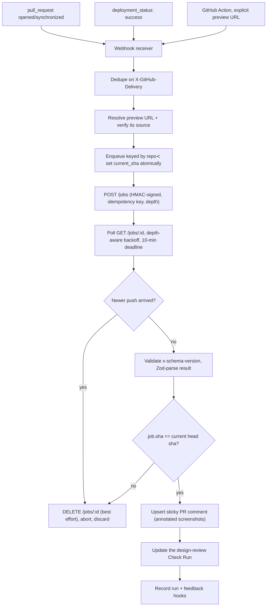

# Gate

**Gate runs a pull request's preview build inside a hardened sandbox and publishes a design review back to GitHub as one sticky comment plus a Check Run.**

It is for two audiences. If you want automated UI review on your pull requests, Gate is the GitHub-facing half: preview-URL discovery, provenance checks, review delivery, Check Run mapping, annotated screenshots. If you are building any GitHub Action that has to execute untrusted pull request code inside a runner, the sandbox supervisor in `packages/action` is the part worth stealing, and it runs standalone with no credentials and no network.

Gate judges and reports. It never edits code, never commits, never opens fix PRs, and never requests `contents: write`.

```bash
git clone https://github.com/apatureai/gate.git && cd gate
pnpm install --frozen-lockfile
pnpm demo          # sandbox supervisor, live, against a hostile fixture app
pnpm demo:review   # a full design review comment written to ./out
```

## Why it is interesting

**Supervising untrusted preview code is harder than `spawn()`, and there is no good public reference for it.** `packages/action/src/local-serve.ts` is that reference:

- **Process group, not process.** The child is spawned `detached` so it owns a process group; teardown is `process.kill(-pid, SIGTERM)`, a grace window, then `SIGKILL` to the survivors. Liveness is gated on the *group*, because with `shell: true` the direct child is the shell, and the shell can exit while a trapped grandchild lives on. The demo's fixture forks a worker that traps `SIGTERM` and refuses to die, so you watch this happen rather than take it on faith.
- **Default-deny environment.** Only `PATH`, `HOME`, `LANG`, `LC_ALL`, `TMPDIR`, `TERM`, `CI`, `NODE_ENV`, `GITHUB_WORKSPACE`, `RUNNER_OS`, `RUNNER_TEMP` and a derived `PORT` cross the boundary. Runner secrets never reach pull request code.
- **`ulimit` caps that hostile code cannot raise.** `ulimit -u` and `ulimit -v` are set hard (no `-S`) and inherited by everything the dev server forks. The capped command runs under `/bin/bash` when it exists, because `/bin/sh` on Debian and Ubuntu is dash, whose `ulimit` has no `-u`; without that detail the pids half of the cap silently does nothing on the exact runners it was written for.
- **Loopback-only readiness with redirect refusal.** The probe uses `redirect: "manual"`, and a 3xx whose `Location` leaves loopback is refused, never followed.

Three more ideas earn their keep beyond the sandbox:

- **Two identities, deliberately different.** The queue supersession key is `repo#pr` (a newer push replaces whatever is in flight). The durable identity of a *completed* review is `(repo_owner, repo_name, pr_number, head_sha)`, enforced by a unique constraint. Conflating them either double-posts or drops reviews.
- **A publish-time SHA guard that does not trust cancellation.** On a new push Gate aborts the poll and best-effort cancels the remote job, but that race can be lost. So immediately before writing to GitHub the publisher re-reads the current head SHA and discards the result if it no longer matches. Stale publishing is a correctness bug with a target rate of exactly zero, not a tunable SLO.
- **Fail closed, never fail the PR.** Every remote response is version-checked and Zod-parsed; a drifted or malformed result publishes *nothing* rather than a comment full of nulls. And no failure mode is allowed to red a pull request: every one of them ends in a neutral Check Run with an explanation.

## Quickstart

### Requirements

| Need | Check | Notes |
|---|---|---|
| Node 24 or newer | `node -v` | `.node-version` pins `24`, `engines` requires `>=24`; verified on v24.14.0 |
| pnpm 10.34.3 | `pnpm -v` | `corepack enable && corepack prepare pnpm@10.34.3 --activate` |
| macOS or Linux | n/a | verified on macOS 15.6 and Linux (`node:24-slim`); Windows is not supported yet |
| Docker (optional) | `docker --version` | only for the Linux resource-cap check below |

No credentials, API keys or network access are needed for anything in this section.

### Install

```bash
git clone https://github.com/apatureai/gate.git
cd gate
pnpm install --frozen-lockfile
```

On a fresh clone you will see exactly **eight** `designreview` bin warnings: two each for `packages/action`, `engine`, `service` and `dashboard`, because `@gate/secrets` declares a workspace bin (`dist/cli/auth.js`) that only exists after a build, and pnpm tries both the workspace path and the linked copy. They disappear after `pnpm build` and nothing below depends on that bin.

Both demos compile what they need (`tsc -b packages/action`) before running, so no separate build step is required. To build everything: `pnpm build`.

### The sandbox supervisor

`pnpm demo` points the supervisor at a fixture app in `packages/action/fixtures/` that forks two child workers, one of which traps `SIGTERM` and refuses to die, then reports what the supervisor did to it.

```bash
pnpm demo
```

```
Gate sandbox supervisor demo
platform darwin · node v24.14.0 · shell /bin/sh (platform default)

[1/4] supervised start and process-group teardown
  command       node "./packages/action/fixtures/preview-app.mjs" serve
  ready         http://127.0.0.1:63725 in 181 ms (pid 14814, process group 14814)
  GET /         200 · Gate fixture preview app
  build facts   1 parsed from the dev-server log
                hydration: preview-app: Warning: Hydration failed because the server-rendered HT…
  process group 3 processes before stop()
                  14814  node ./packages/action/fixtures/preview-app.mjs serve
                  14815  node ./packages/action/fixtures/preview-worker.mjs well-behaved
                  14816  node ./packages/action/fixtures/preview-worker.mjs stubborn
  stop()        SIGTERM to the group → 2000 ms grace → SIGKILL to whatever survived
                +    0 ms  3 left  (preview-app.mjs serve; preview-worker.mjs well-behaved; preview-worker.mjs stubborn)
                +   54 ms  1 left  (preview-worker.mjs stubborn)
                + 2106 ms  0 left
  result        group gone after 2106 ms · orphans: 0

[2/4] environment allowlist
  offered       GITHUB_TOKEN, JUDGMENT_ENGINE_API_KEY, JUDGMENT_ENGINE_HMAC_SECRET (fake runner secrets)
  passed in     HOME, LANG, PATH, TERM, TMPDIR
  child saw     HOME, LANG, PATH, PORT, PWD, SHLVL, TERM, TMPDIR, _, __CF_USER_TEXT_ENCODING  (PORT comes from the supervisor caller, PWD/SHLVL/_ from the shell)
  leaked        none

[3/4] resource cap
  limits        512 processes, 4096 MiB address space
  spawned as    node "./packages/action/fixtures/preview-app.mjs" serve
  applied       no — the ulimit prologue is Linux-only, this is darwin
  on Linux      ulimit -u 512 2>/dev/null; ulimit -v 4194304 2>/dev/null; node "./packages/action/fixtures/preview-app.mjs" s…
  child reports max processes:   soft 2666, hard 4000
                address space:  soft unlimited, hard unlimited

[4/4] off-loopback redirect refused
  fixture       302 → https://preview.attacker.example/pwn
  supervisor    redirected_off_loopback: preview redirected to preview.attacker.example

PASS — fixture app served, contained, and torn down with no orphaned processes.
```

**Success looks like:** the last line reads `PASS`, the teardown census ends in `0 left`, `orphans: 0`, and `leaked  none`. Exit code 0. Ports, pids and timings will differ.

If it fails: `Error: Cannot find module` means the build did not run, so use `pnpm demo` rather than invoking `dist/` directly. A `not_ready` failure means something else grabbed the port the fixture picked; rerun.

### Seeing the resource cap actually bite (optional, needs Docker)

The `ulimit` prologue is Linux-only (`ulimit -v` is unsupported on macOS), so on a Mac the demo honestly reports `applied  no`. To watch the kernel enforce it, run the same built CLI on Linux. `pnpm demo` above already produced `dist/`, and Docker must be allowed to share the repository's path:

```bash
docker run --rm -v "$PWD":/repo -w /repo node:24-slim \
  node packages/action/dist/supervisor-demo-cli.js
```

```
Gate sandbox supervisor demo
platform linux · node v24.19.0 · shell /bin/bash
...
  stop()        SIGTERM to the group → 2000 ms grace → SIGKILL to whatever survived
                +    0 ms  3 left  (preview-app.mjs serve; preview-worker.mjs well-behaved; preview-worker.mjs stubborn)
                +   56 ms  1 left  (preview-worker.mjs stubborn)  +1 zombie
                + 2076 ms  0 left  +2 zombie
  result        group gone after 2086 ms · orphans: 0
                2 zombie pid(s) await reaping — this process is PID 1 here and reaps nothing;
                a CI runner's init does. They run no code.
...
[3/4] resource cap
  limits        512 processes, 4096 MiB address space
  spawned as    ulimit -u 512 2>/dev/null; ulimit -v 4194304 2>/dev/null; node "./packages/…
  applied       yes
  child reports max processes:   soft 512, hard 512
                address space:  soft 4294967296, hard 4294967296
```

Two things to read there. The child's own rlimits now match the cap, so the kernel is enforcing it, and the shell line says `/bin/bash`, which is what makes `ulimit -u` take effect at all. And the killed processes linger as zombies, because in a bare container this process is PID 1 and reaps nothing; a zombie holds a pid but runs no code, so it is reported separately from an orphan. (`node:24-slim` ships no `ps`; the census falls back to reading `/proc`.)

### A design review, end to end

`pnpm demo:review` runs the Action path's review orchestration against a **recorded** critique (the golden fixture in `packages/types/fixtures/`) and writes what a pull request would have received.

```bash
pnpm demo:review
```

```
Gate review demo (recorded engine response, no model call, no network)

  PR              example-org/gate-demo#7 @ 0123456
  engine result   needs_work · 3 findings · 2 areas not reviewed
  action status   reviewed · comment created
  check run       neutral — Needs work

  wrote
    ./out/review-comment.md  (1186 bytes — the sticky PR comment, verbatim)
    ./out/check-run.json  (the Check Run payload)
    ./out/annotated-f_001.png  (26154 bytes — finding f_001 boxed on the fixture page)
    ./out/annotated-f_002.png  (26878 bytes — finding f_002 boxed on the fixture page)
```

**Success looks like:** four files in `out/`. `out/review-comment.md` opens with the hidden sticky marker `<!-- apature-gate:sticky -->` and lists *"Primary CTA uses an off-brand color on mobile"*. `out/annotated-f_001.png` is a 390x844 fixture pricing page with a red box drawn around the call-to-action button and the label `f_001 CTA off-palette`.

What is real in that run: `runAction`, the engine client and its schema checking, finding validation and degradation, the sticky-comment renderer, the Check Run mapping, and `annotateScreenshot`'s SVG compositing. What is substituted: the engine's HTTP responses (replayed), the base screenshot (drawn locally from an SVG), and the element geometry the boxes come from (a real run gets it from the engine's capture geometry map). Nothing in the demo judges a UI; it replays a recorded judgment through the real delivery path.

Both demos are covered by the test suite (`packages/action/test/supervisor-demo.test.ts`, `packages/action/test/review-demo.test.ts`), so they cannot rot silently while the tests stay green.

## Who this is for

- **Anyone writing a GitHub Action that executes untrusted pull request code.** Preview builds, e2e suites, benchmark harnesses, screenshot jobs. Lift `local-serve.ts` and `resource-cap.ts`, or just read them before writing your own `spawn()`.
- **Platform and DevEx teams** who want design and UI regressions caught in CI without a reviewer having to click through a preview deploy by hand.
- **People building GitHub Apps.** The App path is a worked example of webhook dedupe on `X-GitHub-Delivery`, a BullMQ queue with supersession, Postgres row-level tenant isolation actually tested against a non-superuser role, least-privilege permission assertions, and sticky-comment upsert with conflict retry.
- **Contributors** who want a well-tested TypeScript monorepo (project references, ESM, 573 tests, no live network anywhere in the suite) with clearly marked unfinished seams. See the roadmap below.

## Status

What runs today, from a clean clone, with no credentials:

| Component | Status | Notes |
|---|---|---|
| Sandbox supervisor | **Works** | `pnpm demo`; resource cap applies on Linux only |
| Review delivery (comment, Check Run, annotation) | **Works** | `pnpm demo:review` |
| Engine client (async jobs, HMAC, schema checks) | **Works** | Exercised against a mock engine |
| Action path orchestration (`runAction`) | **Works** | Covered end to end in `@gate/e2e` |
| Preview login sealing (`designreview auth`) | **Works** | Runs offline against a bundled fixture |
| GitHub Action, live | **Needs an endpoint** | Code complete; needs a reachable critique service and a published action ref |
| App path (webhooks, queue, Postgres, RLS) | **Needs provisioning** | Tested against PGlite and in-memory fakes |
| Dashboard | **Builds** | Core logic tested; the Next.js shell carries npm advisories, see roadmap |
| Billing | **Untested against Stripe** | Stripe plumbing and tier limits are unit-tested; no real charge has ever run |
| Screenshot capture and model critique | **Not implemented here** | Lives behind the HTTP contract in `packages/types`; see roadmap item 1 |
| Screenshot object store | **Not implemented** | The finding browser signs URLs through `GATE_SCREENSHOT_OBJECT_URL_TEMPLATE`; no adapter ships |
| Baseline before/after comparison | **Built, unwired** | `packages/delivery/src/baseline.ts` builds the pairs; nothing on the review path calls it |

Verified on 2026-08-09, macOS 15.6, Node 24.14.0, pnpm 10.34.3:

```
pnpm build       tsc -b, clean, exit 0
pnpm lint        eslint . --max-warnings=0, exit 0
pnpm test        Test Files  92 passed (92)
                      Tests  573 passed (573)
                   Duration  27.90s
```

## Roadmap

Concrete, pickup-able work. Each one names the seam it plugs into.

1. **A reference critique service.** This is the biggest single unlock. Gate calls out over HTTP for browser capture and the model critique; the transport seam is `createHttpEngineTransport` in `packages/engine/src/http.ts`, the wire contract is `packages/types` (`GateReviewRequest` / `GateReviewResult`), and `packages/types/fixtures/` holds the golden fixture that anchors both sides. A minimal implementation is Playwright capture plus one vision-model call returning a `GateReviewResult`. Nothing else on this list matters as much.
2. **A fixture-backed transport people can import.** The review demo replays a recorded response, but that replay lives inside the demo CLI rather than being exported. A `createFixtureEngineTransport` on `@gate/engine`'s public surface would let anyone run the whole Action path against their own repository with no endpoint at all. Small, high leverage, good first issue.
3. **Wire up baseline before/after comparison.** `packages/delivery/src/baseline.ts` already builds `ComparisonPair`s and `BeforeAfterArtifact`s behind a `BaselineStore` interface, and it is tested, but no caller exists on the review path. Deciding where the base capture comes from is the interesting half.
4. **Ship an object-store adapter for screenshots.** `GATE_SCREENSHOT_OBJECT_URL_TEMPLATE` expects a `{objectKey}` template today, and `packages/dashboard` already mints short-lived capability tokens. An S3 or R2 signed-GET signer implementing the same interface would close the loop.
5. **Clear the dependency advisories.** As of 2026-08-09, `pnpm audit` at the root reports 7 (1 moderate, 6 high): `fast-uri` and `find-my-way` reach runtime through `fastify` in `packages/service`, the rest are dev-tooling only (`brace-expansion` via eslint, `postcss` and `nanoid` via vitest/vite). Separately, `apps/dashboard` reports 4 high (`next`, `postcss`, `nanoid`, `sharp` via libvips). Do not blind-run `npm audit fix` on the dashboard, it pulls a major Next bump; the `overrides.postcss` pin in `apps/dashboard/package.json` needs revisiting at the same time.
6. **Aggregate cgroup-v2 caps for the supervisor.** The `ulimit` caps are per-process. `pids.max` and `memory.max` on a cgroup would make containment aggregate rather than per-process, which is the difference between a mitigation and a sandbox. Needs host setup, so it wants a design discussion first.
7. **Windows support.** The supervisor relies on POSIX process groups. A Job Object based implementation behind the same `startLocalServer` signature would be a substantial and self-contained contribution.
8. **Publish the Action.** `uses: apatureai/gate@v1` does not resolve yet; the Action is a Docker action defined by `action.yml` and `Dockerfile.action`, so this is a release-tag and Marketplace step.
9. **A scheduled live-pipeline smoke test.** `packages/e2e/test/golden-path.test.ts` asserts the full Action path against a mock engine. The scheduled variant that runs it against a real deployment was specified and never wired.
10. **Restore the image-and-SBOM CI job.** Both Dockerfiles build today, but the job that built them, generated SBOMs and failed on fixable medium-or-higher vulnerabilities is not in `.github/workflows/ci.yml`. It needs a policy for base-image CVE drift so it does not go permanently red.

Longer-horizon design changes, each with the trigger that would justify it, are in [Deferred by design](#deferred-by-design).

## Usage

### The three surfaces

One contract, three ways to reach it, all behind `critique(images, context) → Findings`.

1. **GitHub Action** (`@gate/action`, [`action.yml`](action.yml)) runs inside your own runner. Takes an explicit `preview-url`, discovers one, or runs a `preview-command` under the supervisor. Needs no hosted install; requires only `checks: write` and `pull-requests: write` in the calling workflow.
2. **GitHub App** (`@gate/service`): a Fastify webhook receiver in front of a BullMQ queue and an orchestrator. Reacts to `pull_request` and `deployment_status`, and owns the durable state: run history, feedback, billing, tenant isolation. Requests exactly `checks: write`, `pull_requests: write`, `contents: read`, `deployments: read`, and never `contents: write`.
3. **Dashboard** (`@gate/dashboard` + `apps/dashboard`) covers OAuth, sessions, run history, a finding browser, feedback stats, config UI, Stripe billing. The logic lives in a tested, UI-agnostic core package; the Next.js app-router shell only renders it.

### Using the Action in a workflow

```yaml
permissions:
  contents: read        # NEVER contents: write
  pull-requests: write  # post the sticky comment
  checks: write         # post the Check Run

on: pull_request        # NOT pull_request_target, see the threat model below

jobs:
  design-review:
    runs-on: ubuntu-latest
    steps:
      - uses: apatureai/gate@v1
        with:
          preview-url: ${{ steps.deploy.outputs.preview-url }}
          # or: preview-command: "pnpm build && pnpm preview"
          config-path: .designreview.yml
          gate-mode: none   # none | nits | blockers
```

`apatureai/gate@v1` does not resolve yet (roadmap item 8), so for now point `uses:` at your own fork or a commit SHA.

### Running the Action locally

The Action's entrypoint (`packages/action/src/main.ts`) reads its inputs from the runner environment, so it can be driven by hand: build the image and give it an event payload.

Write the payload **inside the repository working directory**, not `/tmp`. Docker Desktop on macOS shares only a fixed set of host paths (`/Users` among them, `/tmp` and `/private/tmp` not). A bind mount of an unshared path silently becomes an empty *directory* inside the container, and the Action then dies on `EISDIR`. If your clone is under your home directory, `$PWD` is shared; if you cloned somewhere exotic, add that path under Docker Desktop → Settings → Resources → File sharing. One command tells you which you have, and it must print a file, not a directory listing:

```bash
docker run --rm -v "$PWD/README.md":/tmp/probe node:24-slim ls -la /tmp/probe
```

```bash
docker build -f Dockerfile.action -t gate-action .
cat > ./event.json <<'JSON'
{"pull_request":{"number":7,"title":"Refresh the pricing page","body":null,
 "head":{"sha":"0123456789abcdef0123456789abcdef01234567","repo":{"full_name":"acme/web"}},
 "base":{"sha":"fedcba9876543210fedcba9876543210fedcba98","repo":{"full_name":"acme/web"}}}}
JSON
docker run --rm -v "$PWD/event.json":/tmp/event.json \
  -e GITHUB_REPOSITORY=acme/web \
  -e GITHUB_EVENT_PATH=/tmp/event.json \
  -e INPUT_PREVIEW_URL=https://acme-web-pr7.vercel.app \
  -e INPUT_GITHUB_TOKEN=<a token with checks:write and pull-requests:write> \
  -e JUDGMENT_ENGINE_ENDPOINT=<your critique service base URL> \
  -e JUDGMENT_ENGINE_API_KEY=<your key> \
  -e JUDGMENT_ENGINE_HMAC_SECRET=<your HMAC secret> \
  gate-action
```

**What you get depends on the token.** The angle-bracketed values are placeholders, so the command is not runnable as printed.

- **With no valid `INPUT_GITHUB_TOKEN`**, the first GitHub call fails and you see one line, then exit 0:

  ```
  Apature Gate action error: list comments failed: 401
    GitHub rejected the token. Set INPUT_GITHUB_TOKEN (or GITHUB_TOKEN) to a token with checks:write and pull-requests:write. Nothing was published; the run still exits 0 so the pull request is not failed.
  ```

  GitHub is contacted before the critique service, so no Check Run is published and the service is never reached. Exit 0 still holds (a broken reviewer never fails someone's pull request), but nothing is delivered.
- **With a real token on a real pull request and no reachable service**, the run exits 0 after logging an error and publishing a neutral Check Run.

That is the honest local story for the full Action: it is a thin wrapper whose two dependencies (GitHub and the critique service) are both remote, so running it by hand needs at least one of them for real. To exercise the orchestration itself with neither, use `pnpm demo:review`, which drives the same `runAction` function.

### The sandbox supervisor API

`packages/action/src/local-serve.ts` and `resource-cap.ts`. Used when a repository has no hosted preview and sets `preview-command`; also the piece most worth lifting into another project.

```
startLocalServer(command, { url, cwd, env, readyPath, readyStatus, resourceLimits })
  → { ok: true, server: { url, pid, output(), stop() } }
  | { ok: false, reason: "spawn_failed" | "early_exit" | "not_ready" | "redirected_off_loopback", detail, tail }
```

The four containment properties are described under [Why it is interesting](#why-it-is-interesting). Two more details:

- **Readiness, bounded.** Polls the base URL (or `ready_path`) until an accepted status, with a 120 s ceiling and early abort if the command exits. The accepted set is Playwright's `webServer` set (2xx/3xx plus 400/401/402/403), because an auth-gated dev server is still "up".
- **Output as evidence, not as an echo.** stdout and stderr drain into a bounded ring buffer. `parsePreviewBuildFacts` turns known patterns (compile errors, hydration mismatches, chunk 404s, deprecations) into structured facts for the critique; anything surfaced on the pull request is secret-scrubbed and length-capped first.

### Sealing a preview login (`designreview auth`)

A repository whose preview deployment sits behind a login supplies a Playwright `storageState` JSON: the file `browserContext.storageState({ path })` writes, or `npx playwright open --save-storage=storageState.json <url>` after logging in by hand. It is never stored raw. The CLI in `@gate/secrets` origin-scopes it and seals it under a tenant key (envelope encryption; a deployment resolves a managed KMS key, the CLI uses a passphrase-derived local key).

You do not need Playwright to try it. `packages/secrets/fixtures/storageState.example.json` is a minimal, made-up one. This runs offline, after `pnpm build`:

```bash
node packages/secrets/dist/cli/auth.js \
  --input packages/secrets/fixtures/storageState.example.json \
  --origins https://app.acme.com \
  --out storageState.sealed.json
```

```
Sealed storageState -> storageState.sealed.json (1 cookies, 1 origins, origin-scoped).
```

**Success looks like:** `storageState.sealed.json` exists, contains `keyId`, `wrappedDek`, `iv`, `authTag` and `ciphertext`, and does **not** contain the fixture's cookie value:

```bash
grep -c example-not-a-real-session-value storageState.sealed.json  # 0
```

Cookies and localStorage outside `--origins` are dropped before sealing. Pass `--origins https://other.example` instead and the CLI seals `0 cookies, 0 origins` and warns. `--help` prints the full flag list. Set `GATE_KMS_PASSPHRASE` to control the local key; on fork pull requests the sealed state is dropped before any handoff regardless.

### Threat model: Action-path hostile-PR capture

On the Action path, capture runs inside **your** runner, which means attacker-authored code from a fork pull request executes on a network with reachable internal services. This is the same class of risk as any "build untrusted PR code in CI" step, but rendering a page makes it explicit.

**Why the App path differs.** On the App path, capture does not run in your runner: Gate hands the verified preview URL to the critique service, which is where the isolation belongs. The companion `judgment-engine` service is specified to capture inside a Firecracker microVM with an egress policy, internal-IP deny and DNS-rebind rechecks. The Action path cannot offer that isolation, because the runner is yours.

**Gate-owned (this repository):**

- **Provenance.** A preview URL is forwarded only from a verified origin: `deployment_status`, explicit input, `url_template`, an allowlisted provider-bot comment, or local serve. Free-text URLs are rejected as `unverified_preview_source` (`verifyPreviewHandoff`).
- **Fork gating.** `storageState`/auth and preview-bypass secrets are disabled on fork pull requests *before* any capture or handoff. Local serve is disabled on forks unless the repository opts in with `preview: { fork_preview: true }`.
- **Least privilege.** The Action requests no `contents: write` (`GATE_GITHUB_PERMISSIONS`); it posts comments and Check Runs only.
- **Containment of the local server.** Environment allowlist, `ulimit` caps, loopback-only, redirect refusal, guaranteed teardown. The quickstart demonstrates every one of them live.

**Engine-owned (whatever critique service you wire in):** sandbox egress policy, internal-IP egress deny, SSRF protection, DNS-rebind rechecks, screenshot encryption and retention, prompt-injection controls. Gate does not duplicate these; on the Action path they are simply unavailable, which is why the residual risk is gated and documented rather than eliminated.

**Operator guidance.** Do not run capture on `pull_request_target` (or a fork-triggered `workflow_run`) with repository secrets in scope: it runs in the base repository's context, with secrets, while checking out fork code, which is the worst combination. Use the default `pull_request` trigger. For untrusted forks prefer the App path, where capture happens outside your runner. Treat the runner as compromisable and minimise what it can reach.

### The critique service contract

`packages/types` is the single source of this contract and evolves additive-only; its golden fixture is the anchor shared with the service implementation.

- **Async jobs, not a long-held call.** `POST /jobs` → `202` + job id, then `GET /jobs/:id` with depth-aware backoff to a 10-minute deadline. A proxy's idle timeout would kill a 90-second synchronous request, and the seam also means a restart mid-review loses only a poll loop.
- **Idempotency.** Requests carry a repository-scoped key (`gate-review-v2:sha256:<digest>` over owner, name, PR number and head SHA), so a retry resumes the existing job instead of paying for a second capture.
- **Versioned and parsed.** The service returns `x-schema-version`; Gate checks it, then Zod-parses the body. A drifted or malformed response produces a typed error and *no* published review.
- **Two identities, deliberately different.** See [Why it is interesting](#why-it-is-interesting).
- **A publish-time SHA guard that does not trust cancellation.** Same.
- **Depth.** At most one *deep* review per PR per 10 minutes, tracked in Postgres (`runs.last_full_review_at`, not a Redis timer, so a restart cannot reset the cap); pushes inside that window get the cheaper *triage* pass.

### Failure modes

Nothing about a broken reviewer is allowed to fail someone's pull request: every row below ends in a neutral Check Run with an explanation.

| Failure | Behaviour |
|---|---|
| No preview URL found | Neutral Check Run with setup guidance |
| Unverified preview source | "not reviewed (unverified preview source)"; never forwarded |
| Preview returns an auth wall | Not reviewed; link to bypass/auth setup |
| Poll timeout (10 min) | Best-effort `DELETE`, then neutral Check Run, reason `review_timed_out` |
| 409 on submit (duplicate idempotency key) | Poll the existing job; never re-run capture |
| 429/503 | Honour `Retry-After`; if the circuit is open, neutral "temporarily unavailable" |
| Malformed result (schema or version mismatch) | Zod parse fails → do not publish; never post a null-grade review |
| Invalid element refs in a result | Publish only validated findings; show a capture warning |
| An older job finishes late | Discarded by the publish-time SHA guard |
| Redelivered webhook (duplicate `X-GitHub-Delivery`) | Deduped in `webhook_log`; 200 and skip |
| Comment update conflict | Re-read the sticky comment, retry against the newest node id |
| GitHub secondary rate limit | Honour `Retry-After`; exponential backoff with jitter |
| Annotated artifact past retention | `/i/<id>.png` returns a 410 tombstone, not a broken redirect |
| Blocking finding while in advisory mode | Check Run stays neutral |

### Repository configuration (`.designreview.yml`)

A repository opts in with an optional `.designreview.yml`. Every field has a working default and the schema is strict, so a typo like `viewport:` is a validation error rather than a silently ignored key.

```yaml
preview:
  source: vercel          # vercel | netlify | cloudflare | render | explicit | local
  environment: Preview
  url_template: null      # e.g. https://myapp-pr-{pr}.example.dev
  wait_seconds: 0
  ready_selector: null    # wait for this selector before capture
  ready_path: null        # poll this path for readiness instead of the base URL
  ready_status: null      # acceptable readiness status codes
  protection_bypass: null # name of the stored Vercel bypass secret
  auth: null              # name of the stored auth storageState secret
  fork_preview: false     # run preview-command on fork PRs (off by default: it runs untrusted code)

routes:
  always: ["/"]
  max_per_pr: 5
  map: {}                 # glob -> route, to review the pages a diff actually touches

viewports: [mobile, desktop]   # mobile | tablet | desktop
dark_mode: false
brand: null

rules:
  gate: none                    # none | nits | blockers, merge-blocking is opt-in
  min_severity_to_comment: nit  # nit | minor | major | blocker
  suppress: []                  # finding ids or element selectors to mute (exact match, no globs)

tokens:
  source: null            # path to design tokens
  values: {}
```

Severity and suppression filter what the comment *lists*; they never change the grade or the Check Run conclusion, which reflect the holistic verdict.

### Configuration (environment variables)

Every variable the code actually reads, by path. Neither demo needs any of them.

| Variable | Required | Default | Effect |
|---|---|---|---|
| `JUDGMENT_ENGINE_ENDPOINT` | Action + App | none | Critique service `/jobs` base URL. Unset → every review ends in a neutral "unavailable" Check Run. |
| `JUDGMENT_ENGINE_API_KEY` | Action + App | none | Service auth. Unset → the job is rejected. |
| `JUDGMENT_ENGINE_HMAC_SECRET` | Action + App | none | Signs job requests. Unset → requests are unsigned and refused. |
| `GITHUB_TOKEN` / `INPUT_GITHUB_TOKEN` | Action | none | Posts the sticky comment and Check Run. Unset → nothing is published. |
| `GITHUB_REPOSITORY`, `GITHUB_EVENT_PATH` | Action | none | Runner-supplied context. Missing → the entrypoint throws `missing GitHub Action context`. |
| `GITHUB_DEFAULT_BRANCH` | Action | `main` | Default branch reported with the request. |
| `GATE_LOCAL_SERVE_URL` | Action | `http://127.0.0.1:3000` | Where the `preview-command` server is expected to listen. |
| `GITHUB_APP_ID`, `GITHUB_APP_PRIVATE_KEY`, `GITHUB_WEBHOOK_SECRET` | App | none | GitHub App identity and webhook verification. |
| `DATABASE_URL` | App | none | Postgres: runs, findings, feedback, billing. |
| `REDIS_URL` | App | none | Redis: supersession keys, token buckets, quotas. |
| `STRIPE_SECRET_KEY`, `STRIPE_WEBHOOK_SECRET` | App | none | Billing API and webhook verification. |
| `GATE_SCREENSHOT_OBJECT_URL_TEMPLATE` | App | none | Signed-read template containing `{objectKey}`, used by the `/i/:artifactId.png` redirect. |
| `SCREENSHOT_CAPABILITY_SECRET` | App | none | Verifies private screenshot capability tokens. |
| `FEEDBACK_TOKEN_SECRET` | App | none | Verifies one-time feedback POST tokens. |
| `GATE_KMS_PASSPHRASE` | App | none | Local key-provider passphrase for the secret store. |
| `GATE_ARTIFACT_BASE_URL`, `GATE_RESULT_OBJECT_URL_TEMPLATE`, `DASHBOARD_BASE_URL`, `PORT` | App | see code | Artifact and dashboard URL construction; server port. |
| `OTEL_EXPORTER_OTLP_ENDPOINT` | optional | none | OpenTelemetry export target. |

The App path fails fast at boot: `assertProductionEnv` throws one aggregated error naming *every* missing required variable, rather than failing deep inside a request.

## How it works


*(The poster's editable source is [`poster_gate.html`](poster_gate.html), which loads the logos in [`icons/`](icons).)*



pnpm workspace, TypeScript project references, Vitest, ESLint. Roughly 10k lines of non-test TypeScript and 9k lines of tests across 12 packages.

| Package | What it is |
|---|---|
| `packages/types` | The boundary contract: `GateReviewRequest`/`GateReviewResult`, config types, feedback events, the golden fixture loader, `deriveArtifactId`. Carries no model-specific fields by design. |
| `packages/config` | `.designreview.yml`: Zod schema, validation, defaults, normalization. |
| `packages/engine` | Client for the async job API: submit/poll/cancel, HMAC signing, preview-handoff verification, `x-schema-version` parsing, rate limiting, per-account endpoint routing. |
| `packages/delivery` | Sticky comment upsert, Check Run conclusion mapping, finding validation and degradation decisions, SVG+sharp screenshot annotation, baseline before/after pairs. |
| `packages/service` | App path: Fastify server, GitHub App auth and webhook verification, permission assertions, deployment-preview discovery, BullMQ queue, supersession, orchestrator, fail-fast env check. |
| `packages/action` | Action path: entrypoint, GitHub API client, preview discovery, dev-server output parsing into build facts, the resource-capped local-serve supervisor, and both demos. |
| `packages/dashboard` | Hosted-tier core logic, UI-agnostic and tested: OAuth, signed sessions, installation-scoped access, run history, finding browser, feedback stats, config UI, Stripe billing. |
| `packages/db` | Postgres: idempotent migrations, pg/PGlite executors, RLS tenant-isolation runners. Owns `installations`, `runs`, `feedback_events`, `billing_customers`, `webhook_log`, `screenshot_artifacts`, `feedback_consumed_tokens`. |
| `packages/redis` | Key namespaces (BullMQ, supersession, token buckets), connection handling, and a no-eviction assertion, because evicting a supersession key would break the guard. |
| `packages/secrets` | KMS envelope encryption, app/tenant secret stores, the canonical secret→env-var map, log redaction and output scrubbing, fork-PR storageState handling. |
| `packages/observability` | OpenTelemetry spans and metrics for the review pipeline, including the stale-publish invariant. Ships `observability/alerts.yaml` and `observability/dashboard.json`. |
| `packages/e2e` | Acceptance harness asserting the Action-path criteria end to end against a mock engine. |

| App | What it is |
|---|---|
| `dashboard` | Next.js (app-router) shell over the `@gate/dashboard` core. Standalone: outside the root `tsc -b`/vitest/eslint harness, own lockfile, own CI job. |

`spikes/elixir-supersession/` is a property-tested BEAM model of the supersession queue, kept for its verdict ("we are not adopting it"). It is an Elixir mix project, outside this workspace's toolchain, and nothing in the build references it.

## Development

```bash
pnpm install --frozen-lockfile
pnpm lint        # eslint --max-warnings=0
pnpm typecheck   # tsc -b across all project references
pnpm test        # vitest
pnpm build       # tsc -b, emits dist/
```

One file at a time: `pnpm exec vitest run packages/action/test/local-serve.test.ts`.

There are no live model calls and no live network in the suite; the critique service is always mocked, including in the `@gate/e2e` acceptance harness. Keep that rule. The suites that boot PGlite (in-process WASM Postgres) are slow enough to race vitest's default 5s/10s timeouts on a loaded machine, so `vitest.config.ts` raises `testTimeout` and `hookTimeout` to 30s; do not lower them.

`packages/e2e/test/golden-path.test.ts` is the demo-as-test: the full Action path against a mock engine, asserting an annotated, screenshot-grounded review in under 90 seconds and a green Check Run after the fix.

`apps/dashboard` is **not** part of this root gate. The Next.js shell keeps its own React/Next tree, its own `package-lock.json`, and is built with its own isolated `next build` CI job:

```bash
pnpm build
cd apps/dashboard
npm ci
npm run build
```

`next build` rewrites `apps/dashboard/next-env.d.ts` and reformats `apps/dashboard/tsconfig.json` (it adds the generated route types and flips `jsx` to `react-jsx`). Both files are committed **in their post-build form**, so a build on a clean tree leaves `git status` clean; if you upgrade Next, expect one commit of regenerated churn.

More in [`CONTRIBUTING.md`](CONTRIBUTING.md): conventions, the three edits adding a package requires, and the two Postgres details that cost real time.

## Running a live review

The code seam is done; provisioning is an operator action. Beyond the environment variables above you need: a Postgres instance whose app role is a non-superuser without `BYPASSRLS` (otherwise the row-level-security tenant isolation is decorative), a Redis with `maxmemory-policy=noeviction`, a KMS key bound to the secret store, an object store for screenshots, a GitHub App created from `buildAppManifest` with its webhook pointed at your `/webhook`, and, above all, a reachable critique service implementing the job protocol above (roadmap item 1).

Enterprise-style accounts can route to an in-VPC service instead: each account has an optional KMS-encrypted `engineEndpoint`, and `createAccountEngineTransport` targets **only** that endpoint. There is no fallback path to a shared service, so an in-VPC outage surfaces as `not_reviewed` rather than sending screenshots to a third party.

## Known limitations

Stated up front, because finding them after you have wired Gate in is worse.

- **Half the system is behind an HTTP contract you have to implement.** Every claim about screenshot quality, model behaviour, prompt design or finding accuracy belongs to the critique service. Gate's tests prove Gate's orchestration and delivery against a *mock*; they prove nothing about review quality. Roadmap item 1.
- **The Action path constrains hostile pull request code; it does not sandbox it.** The `ulimit` caps, environment allowlist, loopback-redirect refusal and fork gating are real mitigations. The aggregate cgroup-v2 caps that would make them airtight are roadmap item 6. Read the threat model before running the Action path on a repository that accepts fork pull requests.
- **The resource cap is Linux-only, and one half of it depends on the shell.** `ulimit -v` does not apply on macOS; `ulimit -u` does not exist in dash, so Gate runs the capped command under `/bin/bash` when present and falls back to the memory cap alone when it is not.
- **Windows is not supported.** The supervisor relies on POSIX process groups. Roadmap item 7.
- **Dependency advisories are open.** Root and dashboard counts, with the exact packages, are in roadmap item 5.
- **Billing has never processed a real charge.** The Stripe plumbing and tier limits are unit-tested against fakes.
- **Some source comments cite documents that are not in this repository.** Issue numbers (`#70`, `#79`, …) point at this repository's tracker, and section references like `TRD §7` or `ARCHITECTURE §6` point at design documents that were not published. The load-bearing parts of both are absorbed into this README; the citations are left in place as the record of why each piece exists.

### Deferred by design

Each of these was a considered decision with a named trigger, not an oversight. The hard invariants that hold across every one of them: Gate is judgment-only (no `contents: write`), the supersession identity `repo#pr` and the durable completed-review identity `(repo_owner, repo_name, pr_number, head_sha)`, the publish-time SHA guard, and `stale_publish_rate = 0`.

- **A completion-webhook callback instead of polling.** Today Gate polls with depth-aware backoff to a 10-minute deadline. **Trigger:** poll cost or time-to-first-comment regresses at scale.
- **Pact consumer-driven contract tests instead of a shared golden fixture.** Today a golden fixture plus `x-schema-version` plus a Zod runtime parse keeps the two sides from drifting. **Trigger:** the critique service starts deploying independently of Gate.
- **Short-lived JWT and a JWKS endpoint instead of a shared HMAC secret.** Today requests are HMAC-SHA256 signed and scoped to `installationId`. **Trigger:** more than one independent service calls it.
- **Inngest `singleton: { key: "repo#pr", mode: "cancel" }` instead of BullMQ.** Today BullMQ sits behind a `ReviewJobWorker` interface with cooperative cancellation; BullMQ cannot preempt an active job, which is why the publish-time guard exists. **Trigger:** stale-publish rate non-zero for two consecutive weeks.
- **Transactional outbox plus a REST reconciliation sweep.** Today delivery is at-least-once webhook dedupe on `X-GitHub-Delivery` plus rate-limit backoff. **Trigger:** an observed crash-window inconsistency (a delivered review with no database record, or the reverse).
- **Service-side request-digest validation on idempotency conflicts.** Today Gate domain-separates its caller key (`gate-review-v2`) and refuses a mismatched client-outcome identity before publication. **Trigger:** a second independently deployed caller, or enabling blocking mode.

## Contributing

Contributions are welcome, and the [roadmap](#roadmap) is the list of things most worth doing. Read [`CONTRIBUTING.md`](CONTRIBUTING.md) for setup, the test rules, and the conventions that keep the monorepo predictable. Issues and pull requests are read.

One boundary is load-bearing across the whole codebase: **Gate judges and verifies, it never edits code.** `assertNoContentsWrite` fails the build if a permission set ever tries to grant it.

## Security

Report vulnerabilities privately through GitHub private vulnerability reporting on this repository (Security tab → "Report a vulnerability"). [`SECURITY.md`](SECURITY.md) has the policy, the supported version, and what to check before pointing this at anything real. If you plan to run the Action path on untrusted forks, start with the threat model above.

## License

MIT. See [`LICENSE`](LICENSE).
