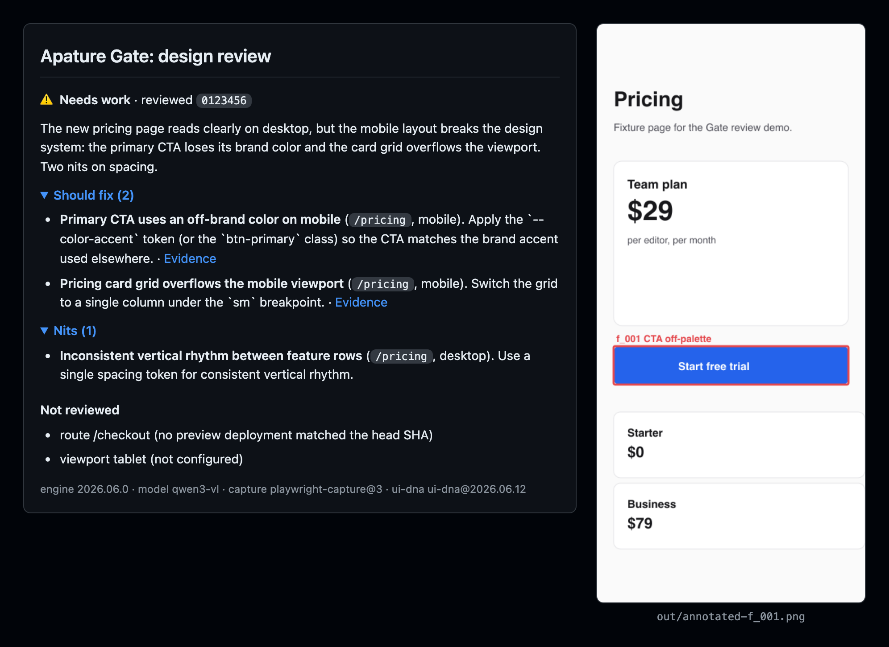

<div align="center">

<picture>
  <source media="(prefers-color-scheme: dark)" srcset="docs/assets/banner-dark.svg">
  
</picture>

<p>design review on every pull request</p>

<p>
  <a href="https://github.com/apatureai/gate/releases"></a>
  <a href="https://github.com/apatureai/gate/actions/workflows/ci.yml"></a>
  <a href="LICENSE"></a>
</p>

<p>Part of the <a href="https://github.com/apatureai">Apature stack</a> — automated design review for rendered UI. The <a href="https://github.com/apatureai/.github/blob/main/profile/README.md">org profile</a> maps how the pieces compose.</p>

</div>



Gate runs a pull request's preview build inside a hardened sandbox, hands the verified preview URL to a critique service you supply, and publishes that service's design review back to GitHub as one sticky comment plus a Check Run — and it never shows a passing review for a page nothing judged. It judges and reports only: it never edits code, never commits, never opens fix PRs, and never requests `contents: write`. Screenshot capture and the vision model are the other half of the system, behind an HTTP contract (`packages/types`) that no implementation in this repository ships — [`verdict`](https://github.com/apatureai/verdict) is one, and [`pnpm demo:live`](#running-your-own-critique-service-and-pointing-gate-at-it) drives Gate against it end to end.

Worth your time if you are:

- Writing a GitHub Action that executes untrusted pull request code — lift `packages/action/src/local-serve.ts` and `resource-cap.ts`, the sandbox supervisor `pnpm demo` runs against a fixture that fights teardown.
- A platform or DevEx team wanting design and UI regressions caught in CI without a reviewer clicking through a preview by hand.
- Building a GitHub App — the App path is a worked example of webhook dedupe on `X-GitHub-Delivery`, a BullMQ queue with `repo#pr` supersession, Postgres tenant isolation tested against a non-superuser role, and sticky-comment upsert with conflict retry.

## Quickstart

Needs Node 24+ (`.node-version` pins `24`, `engines` requires `>=24`; `corepack enable && corepack prepare pnpm@10.34.3 --activate`) on macOS or Linux. No credentials, API keys or network are needed for anything here except `pnpm demo:live`, which wants a critique service you run locally (below).

```bash
git clone https://github.com/apatureai/gate.git && cd gate
pnpm install --frozen-lockfile
pnpm demo          # the sandbox supervisor, live, against a hostile fixture app
pnpm demo:review   # a full design review comment, from a recorded critique, written to ./out
pnpm demo:live     # the whole chain against a critique service you are running (see Usage)
```

Both `pnpm demo` and `pnpm demo:review` compile what they need (`tsc -b packages/action`) first, so no separate build step is required; `pnpm build` builds everything. On a fresh clone you will see exactly eight `gate` bin warnings that disappear after a build — harmless, explained in [docs/demo-walkthrough.md](docs/demo-walkthrough.md).

- `pnpm demo` passes when the last line reads `PASS`, the teardown census ends in `0 left`, `orphans: 0`, and `leaked  none`, exit 0. On Linux (`docker run … node:24-slim`) you also watch the `ulimit` cap bite.
- `pnpm demo:review` writes four files to `out/` in about a second with no network:

```
Gate review demo (recorded engine response, no model call, no network)

  PR              example-org/gate-demo#7 @ 0123456
  engine result   needs_work · 3 findings · 2 areas not reviewed
  action status   reviewed · comment created
  check run       neutral — Needs work

  wrote
    ./out/review-comment.md  (1260 bytes — the sticky PR comment, verbatim)
    ./out/check-run.json  (the Check Run payload)
    ./out/annotated-f_001.png  (26154 bytes — finding f_001 boxed on the fixture page)
    ./out/annotated-f_002.png  (26878 bytes — finding f_002 boxed on the fixture page)
```

Full annotated transcripts of every demo command, the Docker resource-cap run, and running the Action by hand are in [docs/demo-walkthrough.md](docs/demo-walkthrough.md).

### A design review, end to end

The hero above is `pnpm demo:review`'s real output: `out/review-comment.md` rendered as GitHub would, beside `out/annotated-f_001.png`. The full transcript and the substitution boundary (what is real, what is replayed) are in [docs/demo-walkthrough.md](docs/demo-walkthrough.md#a-design-review-end-to-end).

## What you get

`pnpm demo:review` runs the Action path's review orchestration against a **recorded** critique (the golden fixture in `packages/types/fixtures/`) and writes what a pull request would have received:

- **`out/review-comment.md`** (1260 bytes) — the sticky comment, opening with the hidden marker `<!-- apature-gate:sticky -->` that lets the next push upsert it in place. It leads with a grade, lists *"Primary CTA uses an off-brand color on mobile"* under *Should fix*, and ends in a *Not reviewed* block naming the route and viewport it skipped.
- **`out/check-run.json`** — the Check Run payload: `conclusion: "neutral"`, `title: "Needs work"`, a coverage line, and the same *Not reviewed* list, so the two surfaces can never disagree.
- **`out/annotated-f_001.png`** (26154 bytes) — a 390×844 fixture pricing page with a red box drawn around the call-to-action and the label `f_001 CTA off-palette`, composited by `annotateScreenshot` from the recorded finding's geometry. It is byte-identical to the committed [`docs/assets/gate_review_demo.png`](docs/assets/gate_review_demo.png).

The demo's comment **shows** a grade because the golden fixture carries `provenance.model_backed: true` — the stamp a critique service puts on a result a model actually produced. Strip that block and the same command writes a *Judgment not stated* Check Run with no grade. That is the one guarantee Gate will not trade for a nicer demo: a result nothing judged never shows a passing review. A run that reviewed **none** of its routes gets a neutral *Nothing reviewed* Check Run rather than the `ship` grade an empty result always carries, and a partial review stays green while naming what it skipped, on the Check Run as well as in the comment. What is real in the run and what is substituted is spelled out in [docs/demo-walkthrough.md](docs/demo-walkthrough.md#a-design-review-end-to-end).

## Usage

One contract, three ways to reach it, all behind `critique(images, context) → Findings`:

1. **GitHub Action** (`@gate/action`, [`action.yml`](action.yml)) runs inside your own runner. Takes an explicit `preview-url`, discovers one, or runs a `preview-command` under the supervisor. Requires only `checks: write` and `pull-requests: write`.
2. **GitHub App** (`@gate/service`): a Fastify webhook receiver in front of a BullMQ queue and an orchestrator. Reacts to `pull_request`, `deployment_status`, `push` (a default-branch commit is measured, and only measured, to record its baseline), and `installation` events. Owns the durable state, and requests exactly `checks: write`, `pull_requests: write`, `contents: read`, `deployments: read`, never `contents: write`.
3. **Dashboard** (`@gate/dashboard` + `apps/dashboard`): OAuth, sessions, run history, a finding browser, feedback stats, config UI, Stripe billing. The logic is a tested, UI-agnostic core; the Next.js shell only renders it.

The naming scheme (`.gate.yml`, bin `gate`, `GATE_*`), including the 2026-08-09 renames and their still-read deprecated aliases, is in [docs/how-it-works.md](docs/how-it-works.md#naming).

### Using the Action in a workflow

```yaml
permissions:
  contents: read        # NEVER contents: write
  pull-requests: write  # post the sticky comment
  checks: write         # post the Check Run

on: pull_request        # NOT pull_request_target, see the threat model below

jobs:
  design-review:
    runs-on: ubuntu-latest
    steps:
      # Required whenever you use config-path or preview-command: both read
      # files from the workspace, and without a checkout the workspace is empty
      # and .gate.yml is silently ignored. It is also what lets Gate read your
      # package.json and tell the engine which component library to judge
      # against; without it the review runs, one rubric note lighter.
      - uses: actions/checkout@v7

      # Your own deploy step, whatever it is. It has to expose the preview URL
      # as an output for the next step to read.
      - id: deploy
        run: echo "preview-url=https://your-preview-host" >> "$GITHUB_OUTPUT"

      - uses: apatureai/gate@v1
        with:
          preview-url: ${{ steps.deploy.outputs.preview-url }}
          # or: preview-command: "pnpm build && pnpm preview"
          config-path: .gate.yml
          # gate-mode: blockers  # none | nits | blockers. Omit it and .gate.yml decides.
        env:
          # Where your critique service listens, and the secret it verifies
          # signatures with (the same value as its own ENGINE_HMAC_SECRET).
          # Both are required. Without them the step publishes a neutral
          # "Engine not configured" Check Run and reviews nothing.
          GATE_ENGINE_ENDPOINT: ${{ secrets.GATE_ENGINE_ENDPOINT }}
          GATE_ENGINE_HMAC_SECRET: ${{ secrets.GATE_ENGINE_HMAC_SECRET }}
```

This same workflow is committed as [`examples/gate.yml`](examples/gate.yml), ready to lift into `.github/workflows/`.

`apatureai/gate@v1` is a moving major tag, per the Actions convention: it is re-pointed at each `v1.x` release rather than pinned to one. Pin a commit SHA instead if you want the reference to be immutable.

**`gate-mode` is an override, and an omitted one overrides nothing.** Leave it out and `rules.gate` in `.gate.yml` decides; write it and it wins over the file on every pull request. A value that is not one of the three modes is refused with a neutral "Action setup failed" Check Run rather than cast through to a comparison it can never satisfy. (Until 2026-08-19 the input carried `default: "none"`, which silently overrode the file on every run — if you copied an older example, delete any `gate-mode: none` line.)

**This reviews pull requests from branches of your own repository, not from forks.** On a public repository GitHub gives a fork-triggered `pull_request` run a read-only token and no secrets, so the step goes green having published nothing; absence of a Gate check on a fork PR is not a pass. That is [a known limitation](docs/roadmap.md#known-limitations) with its own entry, and contributors' forks need the App path. Before wiring this into CI, run [`pnpm demo:live`](#running-your-own-critique-service-and-pointing-gate-at-it) against the same endpoint and secret — a workflow is a slow place to discover a wrong shared secret. If you accept fork pull requests, read the [threat model](docs/threat-model.md) first.

### Running your own critique service, and pointing Gate at it

`pnpm demo:live` runs the whole chain against a critique service genuinely running on your machine: real HMAC signing, a real `POST /jobs`, a real headless-Chromium capture of a page the supervisor really started, and the real schema check on the way back. Only GitHub is substituted. [`verdict`](https://github.com/apatureai/verdict) is the reference implementation of the contract.

**One terminal for the engine:**

```bash
git clone https://github.com/apatureai/verdict.git && cd verdict
pnpm install --frozen-lockfile
pnpm browser:install          # downloads the Chromium the capture needs
pnpm build
export ENGINE_HMAC_SECRET="$(openssl rand -hex 32)"   # required; never defaulted
node packages/serve/dist/main.js --port 8791 --model mock
```

**A second terminal for Gate, with the same secret:**

```bash
cd gate
export GATE_ENGINE_ENDPOINT=http://127.0.0.1:8791
export GATE_ENGINE_HMAC_SECRET=<the same value you exported above>
export GATE_LOCAL_SERVE_URL=http://127.0.0.1:3311
pnpm demo:live
```

With the `mock` model above, the engine captures and measures the page for real but has no model, so it stamps `model_backed: false`; Gate reads that and refuses to let the result's `grade` speak — the Check Run is neutral and titled *Not judged*. Give the engine a real model (`--model live` with `MODEL_BASE_URL`/`MODEL_API_KEY`) and the same command produces a real review of the fixture page. `GATE_ENGINE_API_KEY` is optional: a self-hosted engine authenticates on the HMAC signature alone. The model-configured run, the wrong-secret and idempotency-conflict error paths, and the full transcripts are in [docs/demo-walkthrough.md](docs/demo-walkthrough.md#running-your-own-critique-service-and-pointing-gate-at-it).

### The critique service contract

`packages/types` is the single source of this contract and evolves additive-only; its golden fixture is the anchor shared with the service implementation.

`packages/types` is the single source of this contract and evolves additive-only; its golden fixture is the anchor shared with the service implementation.

- **Async jobs, not a long-held call.** `POST /jobs` → `202` + job id, then `GET /jobs/:id` with depth-aware backoff to a 10-minute deadline. A proxy's idle timeout would kill a 90-second synchronous request, and the seam also means a restart mid-review loses only a poll loop.
- **Idempotency.** Requests carry a repository-scoped key (`gate-review-v2:sha256:<digest>` over owner, name, PR number and head SHA), so a retry resumes the existing job instead of paying for a second capture.
- **Versioned and parsed.** The service returns `x-schema-version`; Gate checks it, then Zod-parses the body. A drifted or malformed response produces a typed error and *no* published review. The schema is intentionally not strict, so an additive field from a newer service is tolerated; that also means an unnamed field is *stripped*, which is why `provenance` is named explicitly below.
- **Judgment provenance, in the payload.** A result may carry `provenance: { model_backed, source, engine, model, detail }`. Gate treats anything other than `model_backed: true` as "not judged" and withholds the grade, **and that includes a result that omits the field**. Silence is read as "not stated", not as "probably fine": the older rule let an unstamped result keep its grade, which meant the no-green-Ship guarantee held only for the one service that stamps, and inverted for every third-party service implementing the same published contract. A service that judges with a model states so with `provenance.model_backed: true`, and the neutral Check Run names that field. The prose form (`notReviewed` lines beginning `[verdict] no model judged this page`) is honoured too, so a service that discloses in only one of the two places is still believed; it is a refinement of the disclosure, never the thing that catches a silent service.
- **Error envelopes.** Every non-2xx carries `{"error": "<code>"}`; Gate puts that code on the thrown error and then **on the Check Run**, so a wrong shared secret reads `Review not submitted ... HTTP 401 signature_mismatch` on the pull request rather than a bare `401` in a log nobody opened. A 4xx that is not a 429 is reported as a rejection, which does not promise a retry, because nothing about the next push would be different.
- **Two identities, deliberately different.** See [Why it is interesting](docs/design-notes.md#why-it-is-interesting).
- **A publish-time SHA guard that does not trust cancellation.** Same.
- **Depth.** At most one *deep* review per PR per 10 minutes, tracked in Postgres (`runs.last_full_review_at`, not a Redis timer, so a restart cannot reset the cap); pushes inside that window get the cheaper *triage* pass.

### Sealing a preview login (`gate auth`)

A repository whose preview sits behind a login supplies a Playwright `storageState` JSON, which Gate origin-scopes and seals under a tenant key (envelope encryption) — it is never stored raw. You do not need Playwright to try it; `packages/secrets/fixtures/storageState.example.json` is a minimal one. After `pnpm build`:

```bash
node packages/secrets/dist/cli/auth.js \
  --input packages/secrets/fixtures/storageState.example.json \
  --origins https://app.acme.com \
  --out storageState.sealed.json
# Sealed storageState -> storageState.sealed.json (1 cookies, 1 origins, origin-scoped).
```

It passes when `storageState.sealed.json` contains `keyId`/`wrappedDek`/`iv`/`authTag`/`ciphertext` and **not** the fixture cookie value (`grep -c example-not-a-real-session-value storageState.sealed.json` prints `0`). Cookies outside `--origins` are dropped before sealing; on fork pull requests the sealed state is dropped before any handoff.

## Configuration

### Repository configuration (`.gate.yml`)

```yaml
preview:
  source: vercel          # vercel | netlify | cloudflare | render | explicit | local
  environment: Preview
  url_template: null      # e.g. https://myapp-pr-{pr}.example.dev
  default_branch_url: null # where the DEFAULT BRANCH is deployed, e.g. https://myapp.example.com or
                        # https://{short_sha}.myapp.example.com. A push to the default branch is
                        # measured here to record that commit's baseline. Unset -> pushes record
                        # nothing. Not url_template: that one's {pr} has no value on a branch.
  default_branch_renders_like_preview: false # does the address above render the way your PR previews
                        # do? Default false, and false means a baseline measured there is compared,
                        # reported, and never gated: production differs from a preview in ways no pull
                        # request caused. Set it true only if default_branch_url points at a
                        # preview-equivalent deployment, which turns gating back on for those merges.
  wait_seconds: 0
  ready_selector: null    # wait for this selector before capture
  ready_path: null        # poll this path for readiness instead of the base URL
  ready_status: null      # acceptable readiness status codes
  protection_bypass: null # name of the stored Vercel bypass secret
  auth: null              # name of the stored auth storageState secret
  fork_preview: false     # run preview-command on fork PRs (off by default: it runs untrusted code)

routes:
  always: ["/"]
  max_per_pr: 5           # cost ceiling; routes over it are reported as skipped, never silently dropped
  map: {}                 # glob -> route, to review the pages a diff actually touches

viewports: [mobile, desktop]   # mobile | tablet | desktop
dark_mode: false
verify_stability: false # capture every page twice and compare the bytes, so the review can say the
                        # capture was verified deterministic instead of merely uncontradicted.
                        # Doubles the screenshot work per route and viewport, so it is opt-in.
brand: null

rules:
  gate: none                    # none | nits | blockers, merge-blocking is opt-in
  min_severity_to_comment: nit  # nit | minor | major | blocker
  suppress: []                  # finding ids or element selectors to mute (exact match, no globs)
  measurements: advisory        # off | advisory | block, what the engine's MEASURED facts may do
  measurement_suppress: []      # a kind ("contrast"), an element ("#hero"), or "contrast:#hero",
                                # to mute (exact match, no globs)

tokens:
  source: null            # path to design tokens
  values: {}
```

Severity and suppression filter what the comment *lists*; they never change the grade or the Check Run conclusion, which reflect the holistic verdict. `rules.gate` is the only key a workflow can overrule — the Action's `gate-mode` input replaces it when set, and leaves it alone when not (see [Using the Action in a workflow](#using-the-action-in-a-workflow)).

### The measured half

The engine produces two independent things, and only one is a judgment: text contrast against WCAG AA, horizontal overflow and touch-target sizes are computed from the captured DOM with **no model involved**, and Gate renders them on every path — graded, unjudged, nothing-reviewed alike. `rules.measurements` (`off` | `advisory` | `block`) is what a repository lets them do, and `block` acts only on violations this pull request **introduced or made worse**, scoped against a recorded baseline. The full mechanism — baselines, merge carry-forward, default-branch measuring, severity bands, and cross-environment attribution — is in [docs/measured-half.md](docs/measured-half.md).

### Environment variables

Every variable the code actually reads, by path. Neither demo needs any of them.

| Variable | Required | Default | Effect |
|---|---|---|---|
| `GATE_ENGINE_ENDPOINT` | Action + App | none | Critique service base URL, scheme included: Gate appends `/jobs` to it, and on the App path appends `/measurements` for default-branch baseline captures (a service that does not implement that path answers 404, which records no baseline and spends nothing). Unset → a neutral "Engine not configured" Check Run naming what to set. Set but not an absolute http/https URL (a bare `verdict-acme.fly.dev`, the form a hosting dashboard shows you) → a neutral "Engine endpoint invalid" Check Run showing the value and a corrected one. Either way the review is not attempted and neither is called an outage. Deprecated alias: `JUDGMENT_ENGINE_ENDPOINT`. |
| `GATE_ENGINE_HMAC_SECRET` | Action + App | none | Signs job requests; must equal the service's own `ENGINE_HMAC_SECRET`. Unset → same "Engine not configured" Check Run, because an unsigned job is refused with `401 signature_mismatch`. Deprecated alias: `JUDGMENT_ENGINE_HMAC_SECRET`. |
| `GATE_ENGINE_API_KEY` | optional | none | Bearer token, when the service wants one on top of the signature. A self-hosted `verdict` authenticates on the HMAC alone, so this stays unset. Deprecated alias: `JUDGMENT_ENGINE_API_KEY`. |
| `GITHUB_TOKEN` / `INPUT_GITHUB_TOKEN` | Action | none | Posts the sticky comment and Check Run. Unset → nothing is published. |
| `GITHUB_REPOSITORY`, `GITHUB_EVENT_PATH` | Action | none | Runner-supplied context. Missing → the entrypoint throws `missing GitHub Action context`. |
| `GITHUB_DEFAULT_BRANCH` | Action | `main` | Default branch reported with the request. |
| `GATE_LOCAL_SERVE_URL` | Action | `http://127.0.0.1:3000` | Where the `preview-command` server is expected to listen. |
| `GITHUB_APP_ID`, `GITHUB_APP_PRIVATE_KEY`, `GITHUB_WEBHOOK_SECRET` | App | none | GitHub App identity and webhook verification. |
| `DATABASE_URL` | App | none | Postgres: runs, findings, feedback, billing. |
| `REDIS_URL` | App | none | Redis: supersession keys, token buckets, quotas. |
| `STRIPE_SECRET_KEY`, `STRIPE_WEBHOOK_SECRET` | App | none | Billing API and webhook verification. |
| `GATE_SCREENSHOT_OBJECT_URL_TEMPLATE` | App | none | Signed-read template containing `{objectKey}`, used by the `/i/:artifactId.png` redirect. |
| `SCREENSHOT_CAPABILITY_SECRET` | App | none | Verifies private screenshot capability tokens. |
| `FEEDBACK_TOKEN_SECRET` | App | none | Verifies one-time feedback POST tokens. |
| `GATE_KMS_PASSPHRASE` | App | none | Local key-provider passphrase for the secret store. |
| `GATE_ARTIFACT_BASE_URL`, `GATE_RESULT_OBJECT_URL_TEMPLATE`, `DASHBOARD_BASE_URL`, `PORT` | App | see code | Artifact and dashboard URL construction; server port. |

The App path fails fast at boot: `assertProductionEnv` throws one aggregated error naming *every* missing required variable, rather than failing deep inside a request.

## Design notes

The long-form writing moved out of this README, each doc answering one question:

- [docs/design-notes.md](docs/design-notes.md) — why supervising untrusted preview code is harder than `spawn()`, and why the two review identities and the publish-time SHA guard exist.
- [docs/how-it-works.md](docs/how-it-works.md) — the request path (with diagrams), the naming scheme, the failure-mode table, the sandbox supervisor API, and the repository map.
- [docs/measured-half.md](docs/measured-half.md) — the model-free measurements, how baselines are recorded and carried, and how `block` scopes to what a pull request introduced.
- [docs/threat-model.md](docs/threat-model.md) — the Action-path hostile-PR capture risk, what Gate owns, and what the critique service owns.
- [docs/demo-walkthrough.md](docs/demo-walkthrough.md) — the full annotated transcript of every demo command.
- [docs/development.md](docs/development.md) — build, test, and the poster/hero regeneration commands.

## Status

What runs today from a clean clone with no credentials: the sandbox supervisor (`pnpm demo`), review delivery — comment, Check Run, annotation — (`pnpm demo:review`), the engine client driven against a real `verdict` over HTTP (`pnpm demo:live`), Action-path orchestration, and preview-login sealing. The live GitHub Action needs a critique service you host; the App path needs provisioning (Postgres, Redis, KMS, object store); billing has never processed a real charge. Verified on 2026-08-24 (macOS 15.6, Node 24.14.0): `pnpm lint`, `pnpm typecheck`, `pnpm test` (1336 passed), and `pnpm audit` all clean. The full component table and verification log are in [docs/roadmap.md](docs/roadmap.md#status).

## Roadmap

Concrete, pickup-able work — the biggest single unlock is a reference critique service implementing the `packages/types` contract — is in [docs/roadmap.md](docs/roadmap.md#roadmap), with the longer-horizon [deferred-by-design](docs/roadmap.md#deferred-by-design) decisions.

## Contributing

Read [`CONTRIBUTING.md`](CONTRIBUTING.md) for setup, the test rules, and the conventions that keep the monorepo predictable; the [roadmap](docs/roadmap.md#roadmap) is the list of things most worth doing. One boundary is load-bearing: Gate judges and verifies, it never edits code — `assertNoContentsWrite` fails the build if a permission set ever tries to grant `contents: write`.

## Security

Report vulnerabilities privately through GitHub private vulnerability reporting (Security tab → "Report a vulnerability"). [`SECURITY.md`](SECURITY.md) has the policy and what to check before pointing this at anything real; if you plan to run the Action path on untrusted forks, start with the [threat model](docs/threat-model.md).

## License

MIT — see [LICENSE](LICENSE).
