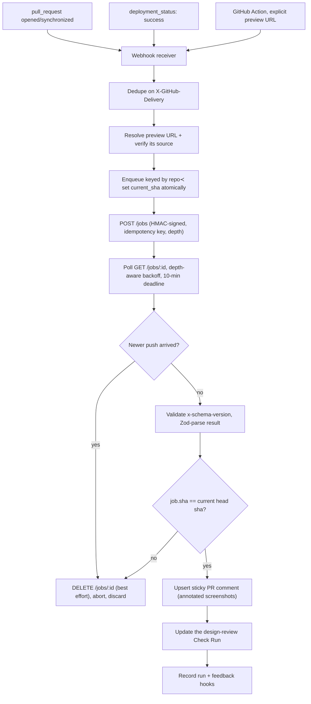
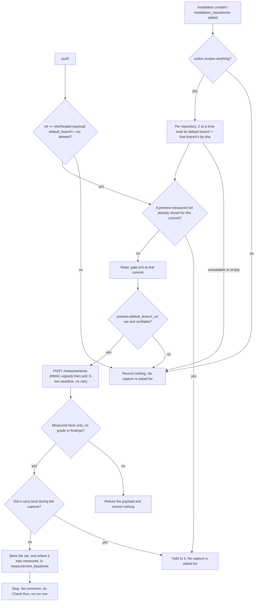

Part of [gate](../README.md). Moved from the README on 2026-08-24; anchors preserved.

### Naming

One product, one word: **Gate**. The repository is `apatureai/gate`, the packages are `@gate/*`, the config file is `.gate.yml`, the CLI bin is `gate`, and the environment variables are `GATE_*`.

Three of those are renames landed on 2026-08-09, deliberately taken while this has no users and the change is therefore free rather than left to break someone later. The deprecated names are still read, with a warning, as of 2026-08-10. If you saw an earlier revision of this repository, translate:

| Was | Is now | Why |
|---|---|---|
| `.designreview.yml` | `.gate.yml` | The config file named a category, not the tool reading it. |
| bin `designreview` | bin `gate` | Same, and `gate auth` matches how every other surface is spelled. |
| `JUDGMENT_ENGINE_ENDPOINT` / `_API_KEY` / `_HMAC_SECRET` | `GATE_ENGINE_ENDPOINT` / `_API_KEY` / `_HMAC_SECRET` | These configure *Gate's* client for whatever critique service you point it at. `verdict` is one such service, not the only one, so it should not own the variable names. The rest of the App's variables were already `GATE_*`. |

**The old names still work, and say so.** If `.gate.yml` is absent and `.designreview.yml` is present, Gate reads the old file and logs `Apature Gate: .designreview.yml is the pre-rename config filename and will be dropped; rename it to .gate.yml.` Each `JUDGMENT_ENGINE_*` variable is read the same way when its `GATE_ENGINE_*` counterpart is unset, with the same one-line warning naming both variables and never the value. The new name always wins when both are set, and a named `config-path` that does not exist never silently falls back to the repository root. This is a deprecation, not a supported alias: migrating is renaming one file and three variables, and the fallback goes away once it has nothing left to catch. Behaviour is pinned by `packages/config/test/config-path.test.ts` and `packages/secrets/test/engine-env.test.ts`.

The reason to have a fallback at all is that the failure it replaces was silent. A leftover `.designreview.yml` used to be simply not found, so Gate ran on default config and reviewed the wrong thing without ever saying that it had ignored your settings.

One deliberate exception, so it does not read as drift: what Gate publishes into *your* repository is titled **"Apature Gate"**, not "Gate". That is the Check Run name, the sticky comment heading, the `user-agent`, and the prefix on the Action's error lines. In a checks list next to twenty other entries, a bare "Gate" says nothing about who published it. The publisher name is qualified on purpose; everything you type stays short.


### The sandbox supervisor API

`packages/action/src/local-serve.ts` and `resource-cap.ts`. Used when a repository has no hosted preview and sets `preview-command`; also the piece most worth lifting into another project.

```
startLocalServer(command, { url, cwd, env, readyPath, readyStatus, resourceLimits })
  → { ok: true, server: { url, pid, output(), stop() } }
  | { ok: false, reason: "spawn_failed" | "early_exit" | "not_ready" | "redirected_off_loopback", detail, tail }
```

The four containment properties are described under [Why it is interesting](design-notes.md#why-it-is-interesting). Two more details:

- **Readiness, bounded.** Polls the base URL (or `ready_path`) until an accepted status, with a 120 s ceiling and early abort if the command exits. The accepted set is Playwright's `webServer` set (2xx/3xx plus 400/401/402/403), because an auth-gated dev server is still "up".
- **Output as evidence, not as an echo.** stdout and stderr drain into a bounded ring buffer. `parsePreviewBuildFacts` turns known patterns (compile errors, hydration mismatches, chunk 404s, deprecations) into structured facts for the critique; anything surfaced on the pull request is secret-scrubbed and length-capped first.


### Failure modes

Nothing about a broken reviewer is allowed to fail someone's pull request: every row below ends in a neutral Check Run with an explanation.

| Failure | Behaviour |
|---|---|
| No critique service configured | Neutral "Engine not configured" Check Run naming `GATE_ENGINE_ENDPOINT` / `GATE_ENGINE_HMAC_SECRET`; the review is never attempted, and the summary says in words that this is not a pass |
| `GATE_ENGINE_ENDPOINT` set to something that is not a URL | Neutral "Engine endpoint invalid" Check Run showing the value it could not parse and a corrected form; no promise of a retry, because a bare hostname does not become a URL on the next push |
| Service returned a result nothing judged | Neutral "Not judged" Check Run; the grade, the narrative and any findings are withheld, and the comment leads with the service's own disclosure |
| Service returned a result with no judgment stamp at all | Neutral "Judgment not stated" Check Run; same withholding, and the summary names `provenance.model_backed` as the field that would restore the grade |
| Service rejected the request (wrong shared secret, unknown installation, wrong endpoint) | Neutral "Review not submitted" Check Run carrying the service's own `HTTP <status> <code>`, what to check for that code, and no promise of a retry |
| Workflow set `gate-mode` to something that is not a gate mode | Neutral "Action setup failed" Check Run naming `gate-mode`, the value, and the three accepted modes; the review is not attempted, because the alternative is a typo that silently reads as "do not gate" |
| No preview URL found | Neutral Check Run with setup guidance |
| Unverified preview source | "not reviewed (unverified preview source)"; never forwarded |
| Preview returns an auth wall | Not reviewed; link to bypass/auth setup |
| Poll timeout (10 min) | Best-effort `DELETE`, then neutral Check Run, reason `review_timed_out` |
| 409 on submit, with a job id (exact retry) | Poll the existing job; never re-run capture |
| 409 on submit, with no job id (the key was reused by a *different* request) | Typed conflict error naming the caller's mistake; never a poll of `/jobs/undefined`. Neutral "Review not submitted (duplicate key)" Check Run whose remedy is a push, not a wait: the usual cause is a preview redeploying at a new URL under an unchanged head SHA, and the key stays spent until the SHA changes |
| 429/503 | Honour `Retry-After`; if the circuit is open, neutral "temporarily unavailable" |
| Malformed result (schema or version mismatch) | Zod parse fails → do not publish; never post a null-grade review |
| Invalid element refs in a result | Publish only validated findings; show a capture warning |
| An older job finishes late | Discarded by the publish-time SHA guard |
| Redelivered webhook (duplicate `X-GitHub-Delivery`) | Deduped in `webhook_log`; 200 and skip |
| Comment update conflict | Re-read the sticky comment, retry against the newest node id |
| GitHub secondary rate limit | Honour `Retry-After`; exponential backoff with jitter |
| Annotated artifact past retention | `/i/<id>.png` returns a 410 tombstone, not a broken redirect |
| Blocking finding while in advisory mode | Check Run stays neutral |


## How it works

The [architecture poster](../gate_architecture.png) renders the whole system; its editable source is [`poster_gate.html`](../poster_gate.html), which loads the logos in [`icons/`](../icons), and regenerating `gate_architecture.png` after editing it is one command, in [Development](development.md). The request path in detail:



The baseline path is a different and much shorter one, and it deliberately shares
none of the publishing half. Two events enter it, and they differ only in how
they answer "which commit?":



pnpm workspace, TypeScript project references, Vitest, ESLint. Roughly 10k lines of non-test TypeScript and 9k lines of tests across 12 packages.

| Package | What it is |
|---|---|
| `packages/types` | The boundary contract: `GateReviewRequest`/`GateReviewResult`, the measure-only `GateMeasurementRequest`/`GateMeasurementResult`, config types, feedback events, the golden fixture loader, `deriveArtifactId`. Carries no model-specific fields by design. |
| `packages/config` | `.gate.yml`: Zod schema, validation, defaults, normalization. Also component-library detection from a repository's `package.json`, which is grounding the engine's hosted path cannot work out for itself. |
| `packages/engine` | Clients for the async job API: submit/poll/cancel, HMAC signing, preview-handoff verification, `x-schema-version` parsing, rate limiting, per-account endpoint routing. Also the measure-only client (`POST /measurements`) a default-branch push records its baseline through, which refuses any answer carrying a judgment. |
| `packages/delivery` | Sticky comment upsert, Check Run conclusion mapping, finding validation and degradation decisions, SVG+sharp screenshot annotation, baseline before/after pairs. |
| `packages/service` | App path: Fastify server, GitHub App auth and webhook verification, permission assertions, deployment-preview discovery, BullMQ queue, supersession, orchestrator, fail-fast env check. |
| `packages/action` | Action path: entrypoint, GitHub API client, preview discovery, dev-server output parsing into build facts, the resource-capped local-serve supervisor, and both demos. |
| `packages/dashboard` | Hosted-tier core logic, UI-agnostic and tested: OAuth, signed sessions, installation-scoped access, run history, finding browser, feedback stats, config UI, Stripe billing. |
| `packages/db` | Postgres: idempotent migrations, pg/PGlite executors, RLS tenant-isolation runners. Owns `installations`, `runs`, `feedback_events`, `billing_customers`, `webhook_log`, `screenshot_artifacts`, `feedback_consumed_tokens`. |
| `packages/redis` | Key namespaces (BullMQ, supersession, token buckets), connection handling, and a no-eviction assertion, because evicting a supersession key would break the guard. |
| `packages/secrets` | KMS envelope encryption, app/tenant secret stores, the canonical secret→env-var map, log redaction and output scrubbing, fork-PR storageState handling. |
| `packages/observability` | OpenTelemetry spans and metrics for the review pipeline, including the stale-publish invariant, plus the published-review recorder both delivery paths call: it writes `gate.review.green_over_measured` to OTel and to one greppable `[gate.metric]` line. Ships `observability/alerts.yaml` and `observability/dashboard.json`. |
| `packages/e2e` | Acceptance harness asserting the Action-path criteria end to end against a mock engine. |

| App | What it is |
|---|---|
| `dashboard` | Next.js (app-router) shell over the `@gate/dashboard` core. Standalone: outside the root `tsc -b`/vitest/eslint harness, own lockfile, own CI job. |

`spikes/elixir-supersession/` is a property-tested BEAM model of the supersession queue, kept for its verdict ("we are not adopting it"). It is an Elixir mix project, outside this workspace's toolchain, and nothing in the build references it.

